# LangChain vs LangGraph: guia completo em português com Python, diagramas e arquitetura

## 1. Visão geral

Quando falamos de **IA generativa com Python**, especialmente com LLMs, geralmente começamos com fluxos simples:

> Receber uma pergunta → montar prompt → chamar modelo → retornar resposta.

Esse tipo de fluxo é bem atendido pelo **LangChain**.

Mas, quando a aplicação começa a precisar de:

- múltiplas etapas;
- tomada de decisão;
- memória;
- ferramentas;
- ciclos de tentativa e correção;
- múltiplos agentes;
- persistência de estado;
- execução longa;
- possibilidade de pausar, revisar e continuar;

aí entra o **LangGraph**.

De forma simples:

> **LangChain é excelente para construir componentes e cadeias de IA. LangGraph é excelente para orquestrar fluxos agenticos, com estado, ciclos, decisões e memória.**

---

# 2. Diferença entre LangChain e LangGraph

## 2.1 LangChain

O **LangChain** é um framework para criar aplicações com LLMs. Ele fornece abstrações para trabalhar com:

- modelos de linguagem;
- prompts;
- ferramentas;
- chains;
- retrievers;
- RAG;
- parsers;
- agentes;
- integrações com bancos vetoriais, APIs e serviços externos.

### Exemplo mental

Imagine o LangChain como uma **caixa de ferramentas**:

```text
PromptTemplate
ChatModel
OutputParser
Retriever
Tool
Agent
Chain
```

Você usa essas peças para montar aplicações de IA.

---

## 2.2 LangGraph

O **LangGraph** é mais focado em **orquestração de agentes e workflows com estado**.

Ele permite modelar a aplicação como um grafo:

```text
Estado compartilhado
        ↓
Node A → Node B → Node C
          ↑       ↓
          ← decisão
```

---

## 2.3 Comparação direta

| Critério | LangChain | LangGraph |
|---|---|---|
| Foco principal | Criar aplicações com LLMs | Orquestrar workflows e agentes com estado |
| Estrutura | Chains, components, agents | Grafos, nodes, edges, state |
| Fluxo | Mais linear | Linear, condicional, cíclico e recursivo |
| Estado | Pode existir, mas não é o núcleo | Estado é conceito central |
| Ciclos | Menos natural | Nativo para loops e workflows agenticos |
| Multiagente | Possível | Muito mais adequado |
| Memória curta | Possível com histórico | Nativa via estado e checkpoints |
| Persistência | Depende da implementação | Checkpoints e threads integrados |
| Casos ideais | RAG, chatbot simples, chain sequencial | agentes complexos, workflows empresariais, revisão, planejamento, automação |

---

# 3. Analogia simples

## 3.1 LangChain como linha de produção

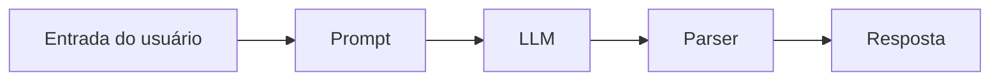

Esse fluxo é ótimo quando o processo é previsível.

Exemplo:

> “Leia um texto, resuma e retorne em JSON.”

---

## 3.2 LangGraph como sistema operacional de agentes

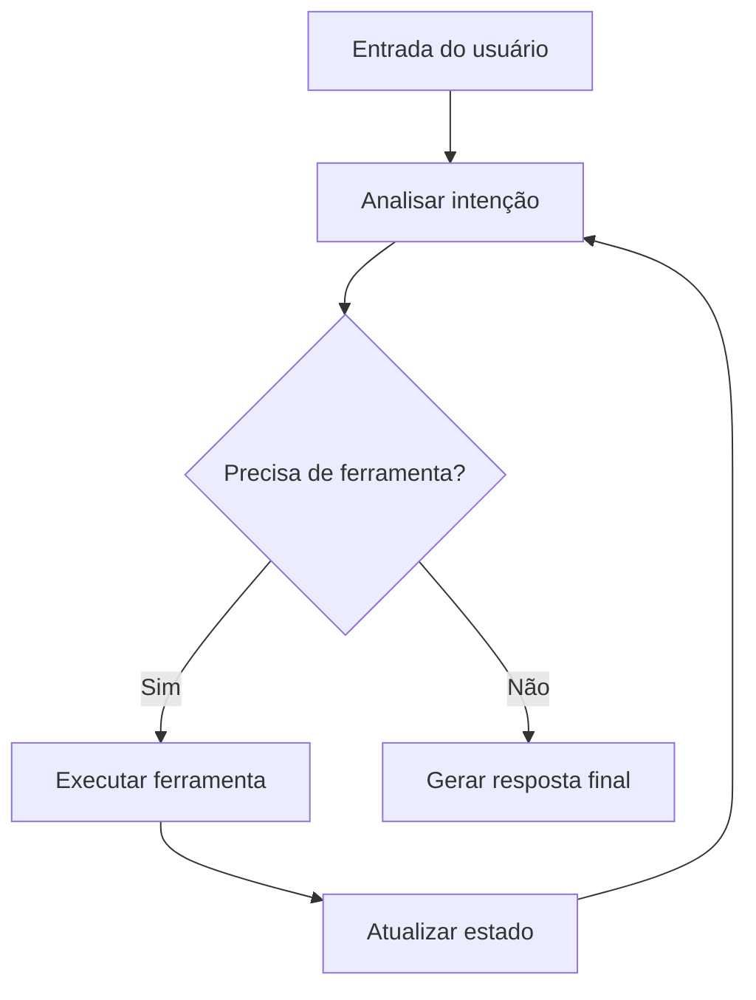

Aqui o agente pode:

- decidir;
- voltar;
- corrigir;
- usar ferramenta;
- salvar contexto;
- consultar memória;
- pausar;
- continuar depois.

---

# 4. O que é LangGraph em termos técnicos?

LangGraph trabalha com três conceitos fundamentais:

1. **State**
2. **Nodes**
3. **Edges**

---

# 5. Graph State: o coração do LangGraph

## 5.1 O que é Graph State?

O **Graph State** é o estado compartilhado do grafo.

Pense nele como uma mochila que acompanha o agente durante a execução.

Essa mochila pode carregar:

- mensagens da conversa;
- pergunta original;
- contexto recuperado;
- resultado de ferramentas;
- decisões intermediárias;
- erros;
- tentativas;
- plano de execução;
- resposta final.

---

## 5.2 Exemplo de State em Python

```python
from typing import TypedDict, List, Optional


class AgentState(TypedDict):
    user_question: str
    classification: Optional[str]
    context: List[str]
    answer: Optional[str]
    attempts: int
```

Esse estado diz que o grafo vai carregar:

```text
user_question  → pergunta do usuário
classification → tipo da pergunta
context        → informações recuperadas
answer         → resposta final
attempts       → número de tentativas
```

---

## 5.3 Como um node modifica o state

Em LangGraph, normalmente um node recebe o estado atual e retorna uma atualização parcial.

```python
def classify_question(state: AgentState) -> dict:
    question = state["user_question"]

    if "contrato" in question.lower():
        classification = "juridico"
    elif "vendas" in question.lower():
        classification = "comercial"
    else:
        classification = "geral"

    return {
        "classification": classification
    }
```

Observe que o node não precisa retornar o estado inteiro.

Ele retorna apenas o que mudou.

---

# 6. Nodes: as etapas do grafo

## 6.1 O que são nodes?

**Nodes** são unidades de trabalho.

Um node pode ser:

- uma função Python;
- uma chamada a LLM;
- uma consulta a banco;
- uma ferramenta;
- um classificador;
- um agente;
- um subgrafo.

Exemplo:

```python
def retrieve_context(state: AgentState) -> dict:
    question = state["user_question"]

    fake_database = {
        "juridico": ["Cláusulas contratuais, LGPD, obrigações legais."],
        "comercial": ["Histórico de vendas, funil, CRM, proposta comercial."],
        "geral": ["Base geral de conhecimento da empresa."]
    }

    classification = state["classification"]
    context = fake_database.get(classification, [])

    return {
        "context": context
    }
```

---

# 7. Edges: as conexões entre nodes

## 7.1 O que são edges?

**Edges** definem o caminho entre os nodes.

Existem dois tipos principais:

1. **Edges simples**
2. **Edges condicionais**

---

## 7.2 Edge simples

```text
classificar → buscar contexto → responder
```

```python
builder.add_edge("classify", "retrieve")
builder.add_edge("retrieve", "answer")
```

---

## 7.3 Edge condicional

Uma edge condicional decide o próximo node com base no estado.

```python
def route_by_classification(state: AgentState) -> str:
    if state["classification"] == "juridico":
        return "legal_agent"
    elif state["classification"] == "comercial":
        return "sales_agent"
    return "general_agent"
```

Diagrama:

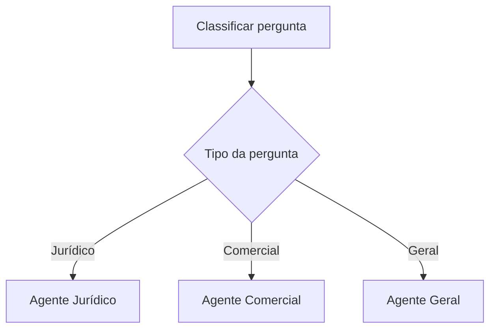

---

# 8. Primeiro exemplo completo com LangGraph

## 8.1 Instalação

```bash
pip install langgraph langchain-core
```

---

## 8.2 Exemplo simples: classificar, buscar contexto e responder

```python
from typing import TypedDict, List, Optional
from langgraph.graph import StateGraph, START, END


class AgentState(TypedDict):
    user_question: str
    classification: Optional[str]
    context: List[str]
    answer: Optional[str]


def classify_question(state: AgentState) -> dict:
    question = state["user_question"].lower()

    if "contrato" in question or "lei" in question:
        classification = "juridico"
    elif "venda" in question or "cliente" in question:
        classification = "comercial"
    else:
        classification = "geral"

    return {"classification": classification}


def retrieve_context(state: AgentState) -> dict:
    knowledge_base = {
        "juridico": [
            "Documentos jurídicos exigem atenção a cláusulas, prazos e obrigações."
        ],
        "comercial": [
            "Perguntas comerciais devem considerar histórico do cliente e proposta de valor."
        ],
        "geral": [
            "Perguntas gerais podem ser respondidas com base no conhecimento institucional."
        ]
    }

    return {
        "context": knowledge_base[state["classification"]]
    }


def generate_answer(state: AgentState) -> dict:
    answer = f'''
Classificação: {state["classification"]}

Contexto usado:
{state["context"]}

Resposta:
Com base na sua pergunta, o melhor caminho é analisar o contexto acima e formular uma resposta direcionada.
'''

    return {"answer": answer}


builder = StateGraph(AgentState)

builder.add_node("classify", classify_question)
builder.add_node("retrieve", retrieve_context)
builder.add_node("answer", generate_answer)

builder.add_edge(START, "classify")
builder.add_edge("classify", "retrieve")
builder.add_edge("retrieve", "answer")
builder.add_edge("answer", END)

graph = builder.compile()

result = graph.invoke({
    "user_question": "Como revisar um contrato de prestação de serviço?",
    "classification": None,
    "context": [],
    "answer": None
})

print(result["answer"])
```

---

## 8.3 Diagrama desse fluxo

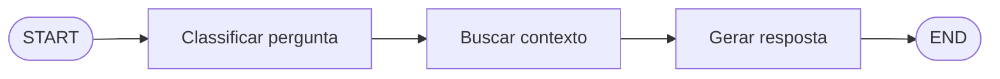

Esse é um workflow linear simples.

---

# 9. O que são workflows?

## 9.1 Definição

Um **workflow** é uma sequência organizada de etapas para resolver uma tarefa.

Em IA generativa, um workflow pode ser:

```text
Receber entrada
→ interpretar intenção
→ buscar dados
→ chamar LLM
→ validar resposta
→ corrigir se necessário
→ retornar resultado
```

No LangGraph, workflows podem ser simples, condicionais, cíclicos ou multiagentes.

---

## 9.2 Workflow linear

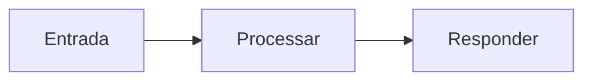

Exemplo:

> Resumir um PDF.

---

## 9.3 Workflow condicional

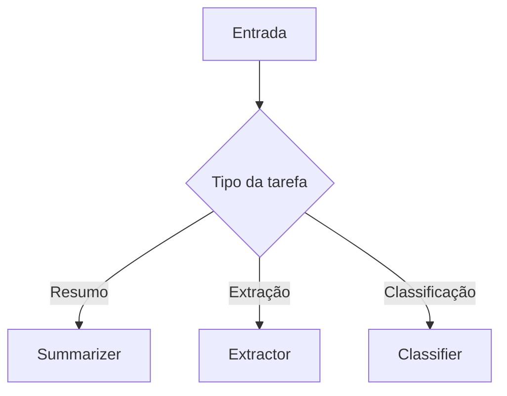

Exemplo:

> Se o usuário pedir resumo, resumir.  
> Se pedir extração, gerar JSON.  
> Se pedir análise, usar outro agente.

---

## 9.4 Workflow cíclico

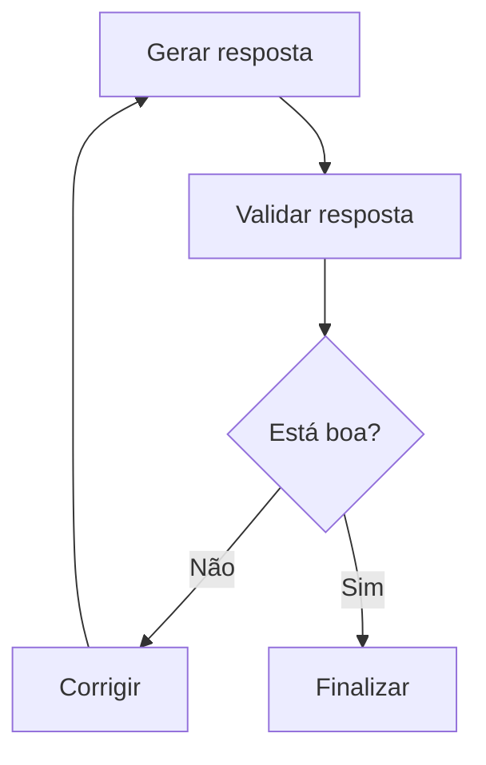

Exemplo:

> Um agente escreve uma proposta cultural, revisa, encontra falhas, reescreve e valida novamente.

Esse tipo de ciclo é uma das grandes vantagens do LangGraph em relação a fluxos lineares tradicionais.

---

# 10. LangChain vs LangGraph na prática

## 10.1 Quando usar LangChain

Use LangChain quando você quer:

- criar um RAG simples;
- conectar LLM a um retriever;
- montar prompts;
- usar tools;
- fazer parsing de saída;
- construir uma chain relativamente linear.

Exemplo:

```text
prompt -> llm -> parser
```

---

## 10.2 Quando usar LangGraph

Use LangGraph quando você precisa de:

- estado persistente;
- decisão entre caminhos;
- loops;
- agentes que usam ferramentas repetidamente;
- múltiplos agentes;
- workflows com validação;
- memória curta e longa;
- execução durável;
- human-in-the-loop.

---

# 11. Agentes em LangGraph

## 11.1 O que é um agente?

Um agente é um sistema que:

1. recebe um objetivo;
2. interpreta o que precisa ser feito;
3. decide o próximo passo;
4. usa ferramentas;
5. observa resultados;
6. continua até finalizar.

Fluxo clássico de agente:

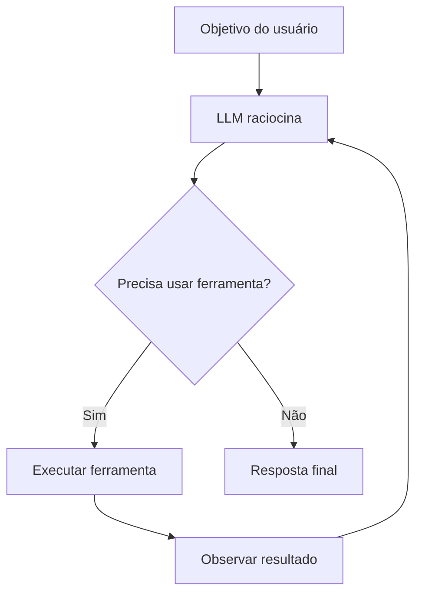

---

## 11.2 Por que LangGraph é bom para agentes?

Porque agentes raramente são lineares.

Um agente real precisa:

- tentar;
- errar;
- repetir;
- mudar de estratégia;
- chamar ferramentas;
- guardar contexto;
- consultar memória;
- pedir validação humana;
- dividir tarefas.

LangGraph permite representar isso como um grafo.

---

# 12. Exemplo de agente com ferramenta em LangGraph

## 12.1 Cenário

Vamos criar um agente simples que responde perguntas financeiras.

Ele pode:

- receber uma pergunta;
- decidir se precisa calcular;
- executar cálculo;
- responder.

---

## 12.2 State

```python
from typing import TypedDict, Optional


class FinanceAgentState(TypedDict):
    question: str
    needs_calculation: bool
    calculation_result: Optional[float]
    answer: Optional[str]
```

---

## 12.3 Nodes

```python
def decide_if_needs_calculation(state: FinanceAgentState) -> dict:
    question = state["question"].lower()

    keywords = ["calcule", "quanto", "percentual", "juros", "total"]

    needs_calculation = any(word in question for word in keywords)

    return {
        "needs_calculation": needs_calculation
    }


def calculate_example(state: FinanceAgentState) -> dict:
    # Exemplo didático fixo:
    # Imagine que a pergunta seja:
    # "Quanto é 10% de 7000?"
    result = 7000 * 0.10

    return {
        "calculation_result": result
    }


def answer_without_calculation(state: FinanceAgentState) -> dict:
    return {
        "answer": "Essa pergunta parece conceitual e não exige cálculo numérico."
    }


def answer_with_calculation(state: FinanceAgentState) -> dict:
    return {
        "answer": f"O resultado do cálculo é R$ {state['calculation_result']:.2f}."
    }
```

---

## 12.4 Roteamento condicional

```python
def route_calculation(state: FinanceAgentState) -> str:
    if state["needs_calculation"]:
        return "calculate"
    return "answer_without_calculation"
```

---

## 12.5 Grafo completo

```python
from langgraph.graph import StateGraph, START, END


builder = StateGraph(FinanceAgentState)

builder.add_node("decide", decide_if_needs_calculation)
builder.add_node("calculate", calculate_example)
builder.add_node("answer_without_calculation", answer_without_calculation)
builder.add_node("answer_with_calculation", answer_with_calculation)

builder.add_edge(START, "decide")

builder.add_conditional_edges(
    "decide",
    route_calculation,
    {
        "calculate": "calculate",
        "answer_without_calculation": "answer_without_calculation"
    }
)

builder.add_edge("calculate", "answer_with_calculation")
builder.add_edge("answer_with_calculation", END)
builder.add_edge("answer_without_calculation", END)

graph = builder.compile()

result = graph.invoke({
    "question": "Quanto é 10% de 7000?",
    "needs_calculation": False,
    "calculation_result": None,
    "answer": None
})

print(result["answer"])
```

---

## 12.6 Diagrama

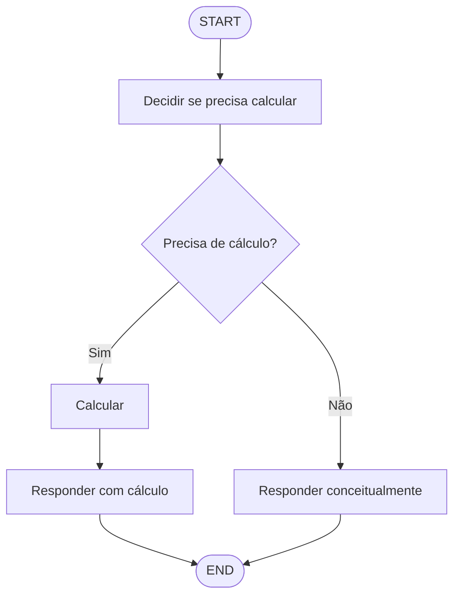

---

# 13. Graph State em profundidade

## 13.1 State não é apenas variável global

O state em LangGraph não deve ser visto como uma variável global qualquer.

Ele é uma estrutura controlada que permite:

- rastrear o progresso;
- armazenar decisões;
- compartilhar informações entre nodes;
- persistir execução;
- retomar conversas;
- depurar o comportamento do agente.

---

## 13.2 O que colocar no state?

Coloque no state aquilo que precisa sobreviver entre etapas.

### Bons exemplos

```python
class ResearchState(TypedDict):
    question: str
    search_results: list[str]
    selected_sources: list[str]
    draft_answer: str
    final_answer: str
    quality_score: float
```

### Maus exemplos

Evite colocar no state:

- objetos gigantes desnecessários;
- conexões abertas de banco;
- arquivos binários grandes;
- dados temporários que só existem dentro de uma função.

---

## 13.3 Regra prática

Use esta pergunta:

> “Essa informação precisa ser usada por outro node ou precisa ser lembrada depois?”

Se sim, coloque no state.

---

# 14. Master LangGraph Fundamentals

Agora vamos organizar os fundamentos principais.

---

## 14.1 State

O **State** responde:

> “O que o agente sabe até agora?”

Exemplo:

```python
class SupportState(TypedDict):
    user_message: str
    intent: str
    customer_id: str
    ticket_priority: str
    answer: str
```

---

## 14.2 Nodes

Os **Nodes** respondem:

> “O que será feito nesta etapa?”

Exemplo:

```python
def classify_intent(state: SupportState) -> dict:
    message = state["user_message"].lower()

    if "erro" in message or "problema" in message:
        intent = "support"
    elif "comprar" in message:
        intent = "sales"
    else:
        intent = "general"

    return {"intent": intent}
```

---

## 14.3 Edges

As **Edges** respondem:

> “Para onde o fluxo vai agora?”

Exemplo:

```python
builder.add_edge("classify_intent", "route_to_department")
```

---

## 14.4 Conditional Edges

As **Conditional Edges** respondem:

> “Qual caminho escolher com base no estado atual?”

Exemplo:

```python
def route_department(state: SupportState) -> str:
    if state["intent"] == "support":
        return "support_agent"
    if state["intent"] == "sales":
        return "sales_agent"
    return "general_agent"
```

---

## 14.5 Cyclic Agentic Workflows

LangGraph permite fluxos cíclicos.

Exemplo:

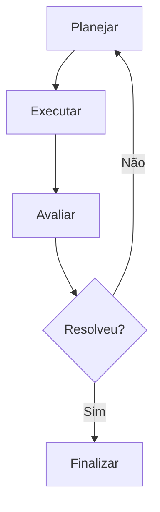

Isso é muito útil para agentes que precisam melhorar uma resposta, revisar código, validar dados ou executar planejamento.

---

# 15. Design Advanced Workflows

## 15.1 O que é um workflow avançado?

Um workflow avançado é aquele em que a aplicação não segue apenas uma linha reta.

Ela pode ter:

- ramificações;
- ciclos;
- validações;
- agentes especializados;
- etapas opcionais;
- fallback;
- retry;
- aprovação humana;
- memória;
- persistência.

---

## 15.2 Padrão 1: Router Workflow

O agente decide qual especialista deve responder.

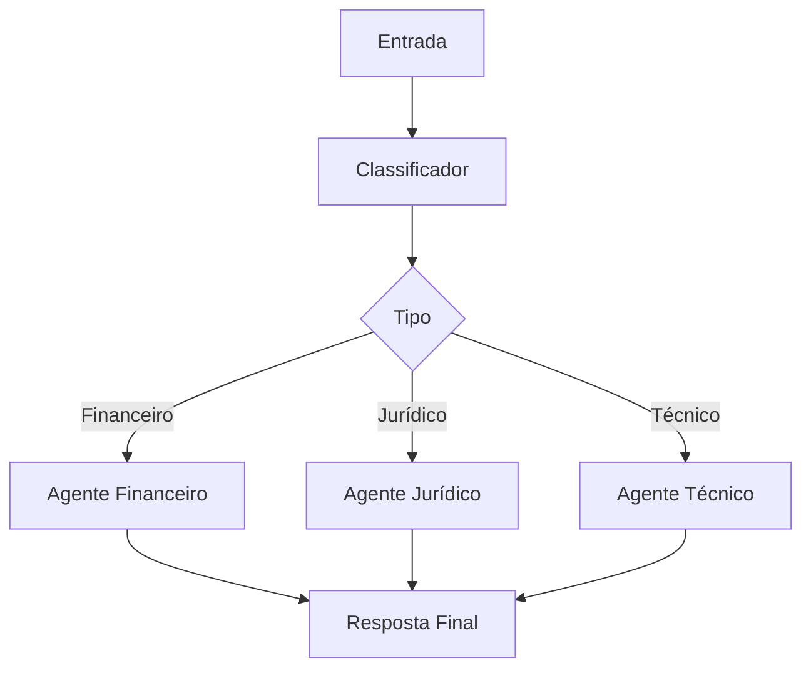

Exemplo de uso:

- chatbot empresarial;
- triagem de chamados;
- análise de documentos;
- atendimento interno.

---

## 15.3 Padrão 2: Validator Workflow

Um agente gera, outro valida.

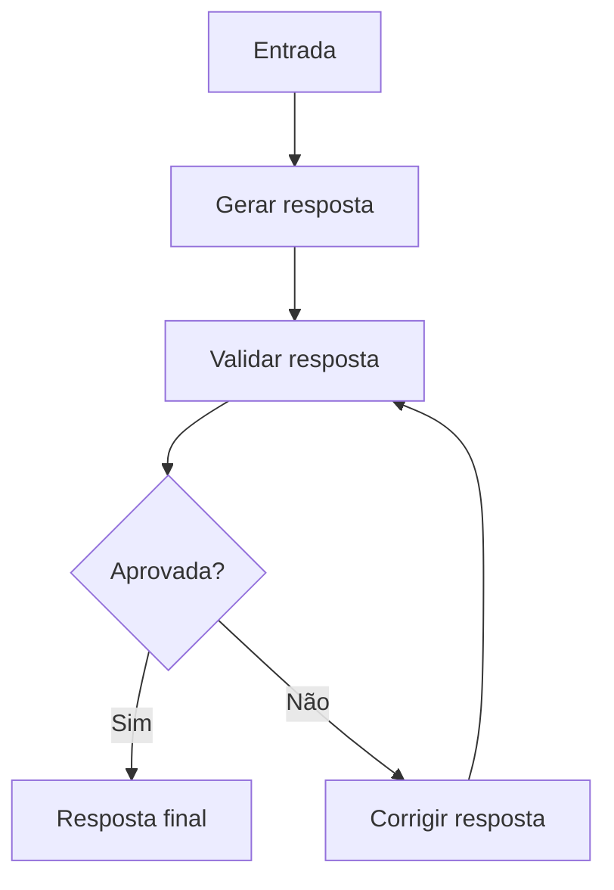

Esse padrão é excelente para:

- revisão de propostas;
- geração de relatórios;
- análise jurídica;
- resposta técnica;
- código gerado por IA.

---

## 15.4 Exemplo de Validator Workflow em Python

```python
from typing import TypedDict


class ReviewState(TypedDict):
    task: str
    draft: str
    feedback: str
    approved: bool
    attempts: int
    final_answer: str


def generate_draft(state: ReviewState) -> dict:
    draft = f"Primeira versão da resposta para a tarefa: {state['task']}"
    return {
        "draft": draft,
        "attempts": state["attempts"] + 1
    }


def validate_draft(state: ReviewState) -> dict:
    draft = state["draft"]

    if len(draft) > 50:
        return {
            "approved": True,
            "feedback": "Resposta aprovada."
        }

    return {
        "approved": False,
        "feedback": "Resposta muito curta. Precisa de mais detalhes."
    }


def improve_draft(state: ReviewState) -> dict:
    improved = state["draft"] + " Agora adicionando mais detalhes, exemplos e justificativas."
    return {
        "draft": improved
    }


def final_response(state: ReviewState) -> dict:
    return {
        "final_answer": state["draft"]
    }


def route_validation(state: ReviewState) -> str:
    if state["approved"]:
        return "final"

    if state["attempts"] >= 3:
        return "final"

    return "improve"
```

---

## 15.5 Montando o grafo

```python
from langgraph.graph import StateGraph, START, END


builder = StateGraph(ReviewState)

builder.add_node("generate", generate_draft)
builder.add_node("validate", validate_draft)
builder.add_node("improve", improve_draft)
builder.add_node("final", final_response)

builder.add_edge(START, "generate")
builder.add_edge("generate", "validate")

builder.add_conditional_edges(
    "validate",
    route_validation,
    {
        "final": "final",
        "improve": "improve"
    }
)

builder.add_edge("improve", "validate")
builder.add_edge("final", END)

graph = builder.compile()

result = graph.invoke({
    "task": "Explique o que é arquitetura hexagonal em uma API com IA.",
    "draft": "",
    "feedback": "",
    "approved": False,
    "attempts": 0,
    "final_answer": ""
})

print(result["final_answer"])
```

---

# 16. Implement Short-Term Memory

## 16.1 O que é memória de curto prazo?

Memória de curto prazo é a capacidade do agente lembrar o contexto dentro de uma mesma conversa ou sessão.

Exemplo:

```text
Usuário: Meu salário é R$ 7.000.
Agente: Entendido.

Usuário: Quanto seria 20% disso?
Agente: 20% de R$ 7.000 é R$ 1.400.
```

O agente só consegue responder porque manteve o contexto da conversa.

---

## 16.2 Threads

Uma **thread** representa uma conversa ou sessão.

Exemplo:

```text
thread_id = "usuario_123_conversa_001"
```

Tudo que acontece nessa conversa pode ser persistido nesse identificador.

---

## 16.3 Checkpoints

Um checkpoint é uma fotografia do estado em determinado momento.

---

## 16.4 Exemplo conceitual com memória curta

```python
from typing import Annotated, TypedDict
from langgraph.graph import StateGraph, START, END
from langgraph.graph.message import add_messages
from langgraph.checkpoint.memory import InMemorySaver


class ChatState(TypedDict):
    messages: Annotated[list, add_messages]


def chatbot_node(state: ChatState) -> dict:
    messages = state["messages"]

    last_message = messages[-1]["content"]

    response = {
        "role": "assistant",
        "content": f"Você disse: {last_message}"
    }

    return {
        "messages": [response]
    }


builder = StateGraph(ChatState)

builder.add_node("chatbot", chatbot_node)
builder.add_edge(START, "chatbot")
builder.add_edge("chatbot", END)

checkpointer = InMemorySaver()

graph = builder.compile(checkpointer=checkpointer)

config = {
    "configurable": {
        "thread_id": "conversa_001"
    }
}

graph.invoke(
    {
        "messages": [
            {"role": "user", "content": "Meu salário é R$ 7000."}
        ]
    },
    config=config
)

result = graph.invoke(
    {
        "messages": [
            {"role": "user", "content": "O que eu falei antes?"}
        ]
    },
    config=config
)

print(result["messages"])
```

---

## 16.5 Diagrama de memória curta

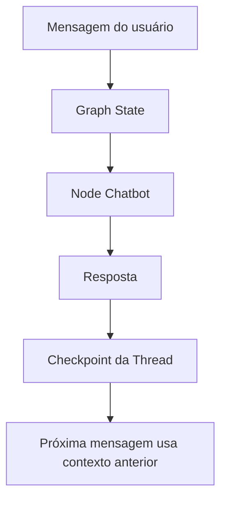

---

# 17. Manage Long-Term Persistence

## 17.1 O que é memória de longo prazo?

Memória de longo prazo é a capacidade do agente lembrar informações entre sessões diferentes.

Exemplo:

```text
Sessão 1:
Usuário: Estou estudando para concurso da Polícia Federal.

Sessão 2, dias depois:
Usuário: Monte um plano de estudos.
Agente: Considerando seu objetivo de estudar para a Polícia Federal...
```

---

## 17.2 Diferença entre memória curta e longa

| Tipo | Escopo | Exemplo | Armazenamento |
|---|---|---|---|
| Curto prazo | Uma conversa/thread | Histórico da conversa atual | Checkpointer |
| Longo prazo | Várias sessões | Preferências, perfil, fatos úteis | Banco externo |
| Semântica | Conhecimento recuperável | Documentos, notas, histórico | Vector DB |
| Estruturada | Dados organizados | Perfil, metas, preferências | PostgreSQL, MongoDB |

---

## 17.3 Arquitetura de memória longa

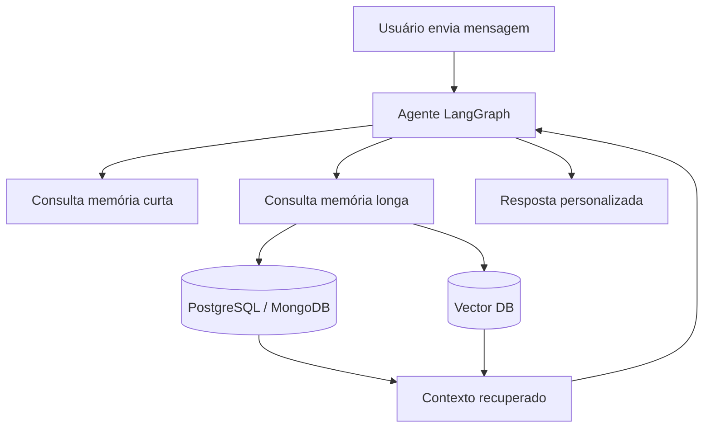

---

## 17.4 Exemplo com memória longa em banco simples

Aqui está um exemplo didático usando um dicionário como se fosse um banco.

```python
long_term_memory = {}


def save_user_memory(user_id: str, key: str, value: str) -> None:
    if user_id not in long_term_memory:
        long_term_memory[user_id] = {}

    long_term_memory[user_id][key] = value


def load_user_memory(user_id: str) -> dict:
    return long_term_memory.get(user_id, {})
```

Uso:

```python
save_user_memory(
    user_id="user_123",
    key="study_goal",
    value="Estudar IA generativa, LangGraph e agentes"
)

memory = load_user_memory("user_123")

print(memory)
```

---

## 17.5 Integrando memória longa ao State

```python
class PersonalizedAgentState(TypedDict):
    user_id: str
    message: str
    long_term_context: dict
    answer: str


def load_memory_node(state: PersonalizedAgentState) -> dict:
    memory = load_user_memory(state["user_id"])

    return {
        "long_term_context": memory
    }


def answer_with_memory_node(state: PersonalizedAgentState) -> dict:
    context = state["long_term_context"]

    answer = f'''
Com base no que sei sobre você:
{context}

Resposta para sua mensagem:
{state["message"]}
'''

    return {
        "answer": answer
    }
```

---

# 18. Orchestrate Multi-Agent Systems

## 18.1 O que são sistemas multiagentes?

Um sistema multiagente é uma arquitetura em que vários agentes especializados colaboram.

Exemplo:

```text
Agente Coordenador
├── Agente de Pesquisa
├── Agente de Código
├── Agente de Revisão
├── Agente de Dados
└── Agente de Escrita
```

---

## 18.2 Por que usar multiagentes?

Porque sistemas complexos exigem especialização.

Um único agente tentando fazer tudo pode:

- perder foco;
- misturar responsabilidades;
- gerar respostas superficiais;
- usar ferramentas erradas;
- dificultar manutenção.

Com multiagentes, cada agente tem um papel claro.

---

## 18.3 Diagrama multiagente

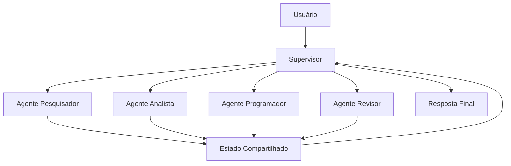

---

## 18.4 Exemplo prático: sistema para edital cultural

Imagine um sistema para produtores culturais.

### Objetivo

Ajudar o usuário a entender e montar projetos para editais.

### Agentes

| Agente | Responsabilidade |
|---|---|
| Supervisor | Decide qual agente chamar |
| Pesquisador | Busca informações do edital |
| Resumidor | Resume o edital |
| Estruturador | Monta esqueleto do projeto |
| Revisor | Avalia clareza, aderência e riscos |
| Orçamentista | Ajuda na estrutura de orçamento |

---

## 18.5 Diagrama

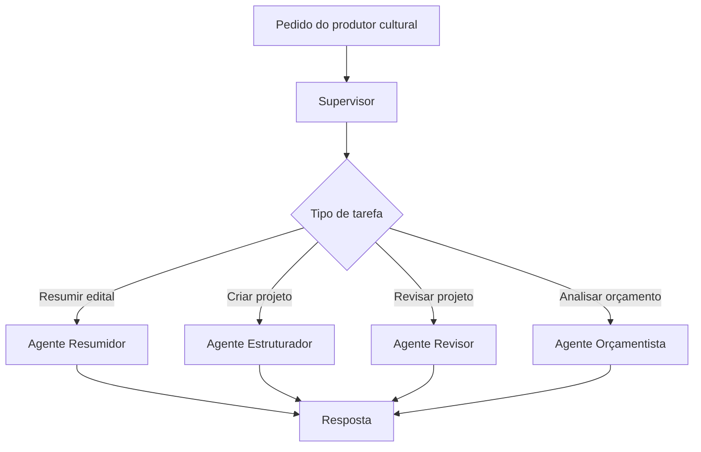

---

## 18.6 State multiagente

```python
from typing import TypedDict, List


class CulturalProjectState(TypedDict):
    user_request: str
    task_type: str
    edital_text: str
    summary: str
    project_outline: str
    review_notes: List[str]
    final_answer: str
```

---

## 18.7 Supervisor

```python
def supervisor_node(state: CulturalProjectState) -> dict:
    request = state["user_request"].lower()

    if "resuma" in request or "resumo" in request:
        task_type = "summarize"
    elif "crie" in request or "esqueleto" in request:
        task_type = "outline"
    elif "revise" in request or "melhore" in request:
        task_type = "review"
    else:
        task_type = "general"

    return {
        "task_type": task_type
    }
```

---

## 18.8 Roteamento

```python
def route_task(state: CulturalProjectState) -> str:
    if state["task_type"] == "summarize":
        return "summarizer_agent"

    if state["task_type"] == "outline":
        return "outline_agent"

    if state["task_type"] == "review":
        return "review_agent"

    return "general_agent"
```

---

## 18.9 Agentes especializados

```python
def summarizer_agent(state: CulturalProjectState) -> dict:
    summary = "Resumo do edital: objetivos, público-alvo, critérios e prazos principais."
    return {
        "summary": summary,
        "final_answer": summary
    }


def outline_agent(state: CulturalProjectState) -> dict:
    outline = '''
Estrutura sugerida:
1. Nome do projeto
2. Justificativa
3. Objetivo geral
4. Objetivos específicos
5. Público-alvo
6. Metodologia
7. Cronograma
8. Orçamento
9. Contrapartidas
'''
    return {
        "project_outline": outline,
        "final_answer": outline
    }


def review_agent(state: CulturalProjectState) -> dict:
    notes = [
        "Verificar se os objetivos estão mensuráveis.",
        "Conferir aderência aos critérios do edital.",
        "Melhorar justificativa com dados locais."
    ]

    return {
        "review_notes": notes,
        "final_answer": "\n".join(notes)
    }


def general_agent(state: CulturalProjectState) -> dict:
    return {
        "final_answer": "Posso ajudar com resumo, estruturação ou revisão de projeto cultural."
    }
```

---

# 19. Subgraphs

## 19.1 O que são subgraphs?

Um **subgraph** é um grafo dentro de outro grafo.

Ele serve para encapsular uma lógica complexa.

Exemplo:

```text
Grafo principal
├── Node simples
├── Subgraph de pesquisa
├── Subgraph de revisão
└── Node final
```

---

## 19.2 Quando usar subgraphs?

Use subgraphs quando:

- um agente tem várias etapas internas;
- você quer reutilizar um fluxo;
- o workflow ficou grande demais;
- há times diferentes cuidando de partes diferentes;
- você quer separar responsabilidades.

---

## 19.3 Diagrama com subgraphs

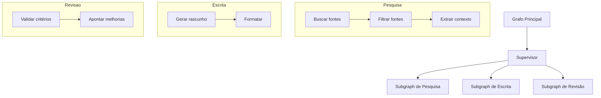

---

# 20. Engineer Deep Agents

## 20.1 O que são Deep Agents?

“Deep Agents” são agentes projetados para tarefas longas, complexas e recursivas.

Eles não apenas respondem.

Eles:

- planejam;
- executam;
- observam;
- revisam;
- corrigem;
- dividem problemas;
- chamam subagentes;
- mantêm memória;
- trabalham por várias etapas;
- lidam com falhas.

---

## 20.2 Diferença entre agente simples e deep agent

| Característica | Agente simples | Deep Agent |
|---|---|---|
| Horizonte | Curto | Longo |
| Planejamento | Pequeno | Estruturado |
| Memória | Limitada | Curta e longa |
| Correção | Básica | Autoavaliação e retry |
| Ferramentas | Poucas | Muitas, com roteamento |
| Tarefas | Perguntas simples | Projetos complexos |
| Controle | Linear | Cíclico e recursivo |

---

## 20.3 Arquitetura de Deep Agent

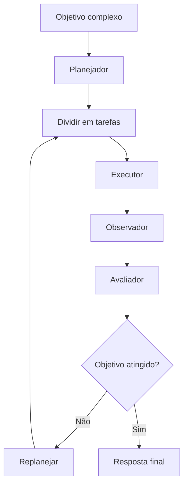

---

## 20.4 State para Deep Agent

```python
from typing import TypedDict, List


class DeepAgentState(TypedDict):
    goal: str
    plan: List[str]
    current_step: int
    observations: List[str]
    errors: List[str]
    final_answer: str
    completed: bool
```

---

## 20.5 Nodes de Deep Agent

```python
def planner_node(state: DeepAgentState) -> dict:
    goal = state["goal"]

    plan = [
        f"Entender o objetivo: {goal}",
        "Coletar informações necessárias",
        "Executar análise",
        "Validar resultado",
        "Gerar resposta final"
    ]

    return {
        "plan": plan,
        "current_step": 0
    }


def executor_node(state: DeepAgentState) -> dict:
    step = state["plan"][state["current_step"]]

    observation = f"Executando etapa: {step}"

    return {
        "observations": state["observations"] + [observation]
    }


def evaluator_node(state: DeepAgentState) -> dict:
    next_step = state["current_step"] + 1

    completed = next_step >= len(state["plan"])

    return {
        "current_step": next_step,
        "completed": completed
    }


def final_node(state: DeepAgentState) -> dict:
    final_answer = f'''
Objetivo:
{state["goal"]}

Plano executado:
{state["plan"]}

Observações:
{state["observations"]}

Resultado:
Tarefa concluída com base nas etapas planejadas.
'''

    return {
        "final_answer": final_answer
    }


def route_deep_agent(state: DeepAgentState) -> str:
    if state["completed"]:
        return "final"

    return "execute"
```

---

## 20.6 Grafo de Deep Agent

```python
from langgraph.graph import StateGraph, START, END


builder = StateGraph(DeepAgentState)

builder.add_node("planner", planner_node)
builder.add_node("execute", executor_node)
builder.add_node("evaluate", evaluator_node)
builder.add_node("final", final_node)

builder.add_edge(START, "planner")
builder.add_edge("planner", "execute")
builder.add_edge("execute", "evaluate")

builder.add_conditional_edges(
    "evaluate",
    route_deep_agent,
    {
        "execute": "execute",
        "final": "final"
    }
)

builder.add_edge("final", END)

graph = builder.compile()

result = graph.invoke({
    "goal": "Criar uma estratégia para estudar LangGraph e construir agentes com memória.",
    "plan": [],
    "current_step": 0,
    "observations": [],
    "errors": [],
    "final_answer": "",
    "completed": False
})

print(result["final_answer"])
```

---

# 21. Exemplo aplicado: agente para economia criativa

Como você trabalha com IA, programação e projetos ligados à economia criativa, um excelente caso de estudo seria um agente para:

> Ler editais culturais, resumir, estruturar projetos, revisar propostas e sugerir melhorias.

---

## 21.1 Arquitetura proposta

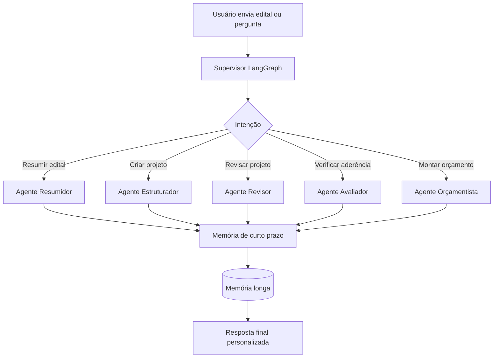

---

## 21.2 State sugerido

```python
class EditalAgentState(TypedDict):
    user_id: str
    user_request: str
    edital_text: str
    intent: str
    edital_summary: str
    project_outline: str
    review_feedback: list[str]
    budget_suggestions: list[str]
    long_term_memory: dict
    final_answer: str
```

---

## 21.3 Possíveis nodes

```text
load_memory
classify_intent
summarize_edital
create_project_outline
review_project
evaluate_alignment
suggest_budget
save_memory
final_answer
```

---

## 21.4 Diagrama de execução

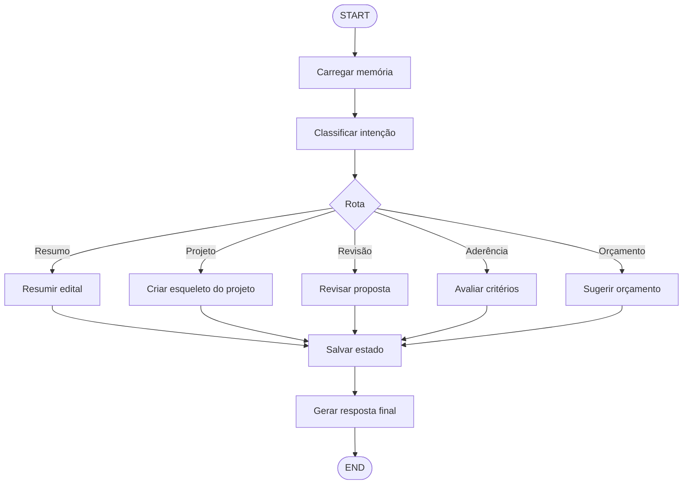

---

# 22. Como pensar em arquitetura com LangGraph

## 22.1 Primeiro: desenhe o processo humano

Antes de escrever código, pergunte:

> Como um especialista humano resolveria isso?

Exemplo para análise de edital:

```text
1. Ler edital
2. Identificar regras
3. Identificar critérios
4. Resumir oportunidades
5. Verificar elegibilidade
6. Montar estrutura do projeto
7. Revisar aderência
8. Sugerir melhorias
```

---

## 22.2 Segundo: transforme etapas em nodes

```text
Ler edital              → node
Identificar regras      → node
Verificar elegibilidade → node
Gerar estrutura         → node
Revisar                 → node
```

---

## 22.3 Terceiro: defina o state

```text
O que precisa passar de uma etapa para outra?
```

Exemplo:

```python
class State(TypedDict):
    edital_text: str
    rules: list[str]
    eligibility: str
    project_outline: str
    review: list[str]
```

---

## 22.4 Quarto: defina edges

```text
Qual etapa vem depois de qual?
```

---

## 22.5 Quinto: defina ciclos

```text
Quando o agente deve tentar novamente?
```

Exemplo:

```mermaid
flowchart TD
    A[Gerar projeto] --> B[Revisar aderência]
    B --> C{Está aderente?}
    C -- Não --> A
    C -- Sim --> D[Finalizar]
```

---

# 23. Padrões arquiteturais importantes

## 23.1 Chain simples

Use quando o fluxo for previsível.

```mermaid
flowchart LR
    A[Input] --> B[LLM] --> C[Output]
```

---

## 23.2 Router

Use quando existem caminhos diferentes.

```mermaid
flowchart TD
    A[Input] --> B{Classificação}
    B --> C[Agente A]
    B --> D[Agente B]
```

---

## 23.3 Evaluator-Optimizer

Use quando precisa melhorar uma resposta.

```mermaid
flowchart TD
    A[Gerar] --> B[Avaliar]
    B --> C{Bom?}
    C -- Não --> A
    C -- Sim --> D[Final]
```

---

## 23.4 Tool-Using Agent

Use quando o agente precisa usar ferramentas.

```mermaid
flowchart TD
    A[Pergunta] --> B[LLM decide]
    B --> C{Usar tool?}
    C -- Sim --> D[Tool]
    D --> B
    C -- Não --> E[Resposta]
```

---

## 23.5 Multi-Agent Supervisor

Use quando há vários especialistas.

```mermaid
flowchart TD
    A[Usuário] --> B[Supervisor]
    B --> C[Especialista 1]
    B --> D[Especialista 2]
    B --> E[Especialista 3]
```

---

# 24. Boas práticas

## 24.1 Mantenha o State claro

Evite states gigantes e confusos.

Prefira:

```python
class State(TypedDict):
    question: str
    context: list[str]
    answer: str
```

Evite:

```python
class State(TypedDict):
    data: dict
```

Quanto mais explícito, melhor para manutenção.

---

## 24.2 Nodes pequenos

Cada node deve ter uma responsabilidade.

Bom:

```text
classificar_intencao
buscar_contexto
gerar_resposta
validar_resposta
```

Ruim:

```text
fazer_tudo
```

---

## 24.3 Use ciclos com limite

Sempre limite loops.

```python
if state["attempts"] >= 3:
    return "final"
```

Sem limite, o agente pode entrar em repetição infinita.

---

## 24.4 Separe decisão de execução

Evite misturar:

```text
decidir caminho
executar tarefa
validar resultado
```

em um único node.

---

## 24.5 Use persistência para produção

Em produção, memória em RAM não basta.

Prefira:

- PostgreSQL;
- Redis;
- MongoDB;
- bancos vetoriais;
- storage durável;
- checkpointers persistentes.

---

# 25. Mapa mental final

```mermaid
mindmap
  root((LangGraph))
    State
      Dados compartilhados
      Mensagens
      Contexto
      Decisões
      Memória
    Nodes
      Funções Python
      LLM
      Tools
      Agentes
      Subgraphs
    Edges
      Fluxo simples
      Fluxo condicional
      Ciclos
    Workflows
      Linear
      Condicional
      Cíclico
      Multiagente
    Memória
      Curto prazo
        Thread
        Checkpoint
      Longo prazo
        Banco externo
        Vector DB
        Perfil do usuário
    Agentes
      Tool use
      ReAct
      Supervisor
      Deep Agents
```

---

# 26. Resumo final

## LangChain

Use para montar componentes de IA:

```text
Prompt → LLM → Parser → Resposta
```

É ótimo para:

- RAG;
- chains simples;
- integração com ferramentas;
- prompts;
- parsers;
- chatbots básicos.

---

## LangGraph

Use para orquestrar sistemas agenticos com estado:

```text
State + Nodes + Edges + Memory + Persistence
```

É ótimo para:

- agentes;
- workflows complexos;
- ciclos;
- validação;
- tomada de decisão;
- multiagentes;
- memória curta;
- memória longa;
- execução persistente.

---

# 27. Uma frase para memorizar

> **LangChain ajuda você a construir as peças da aplicação de IA. LangGraph ajuda você a organizar essas peças em um sistema agentico com estado, decisões, ciclos, memória e múltiplos agentes.**
