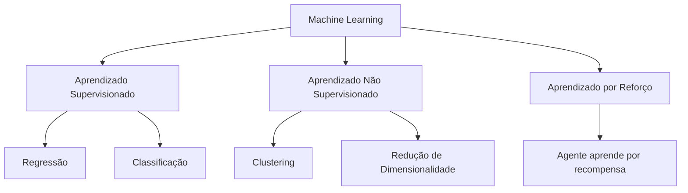
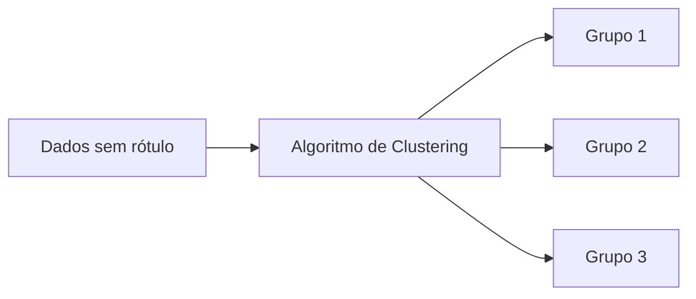
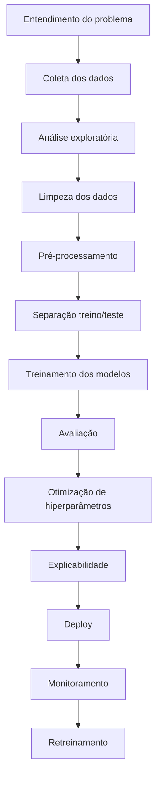
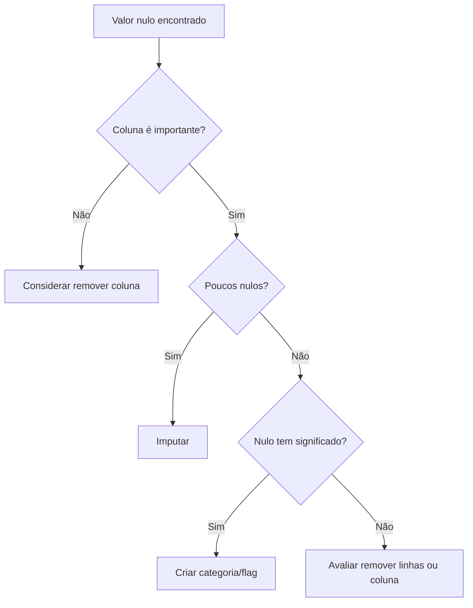
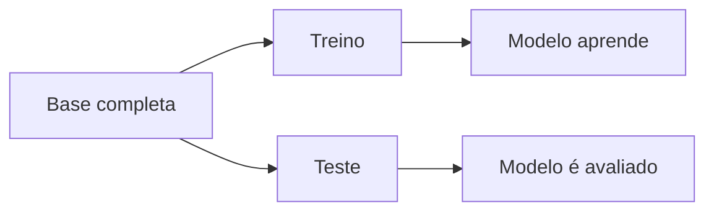
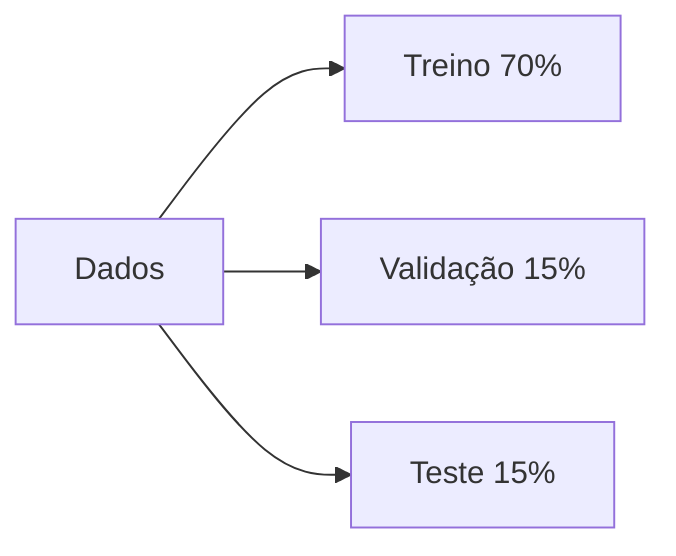
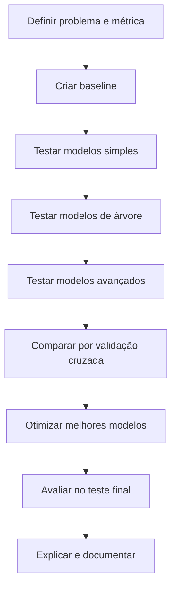
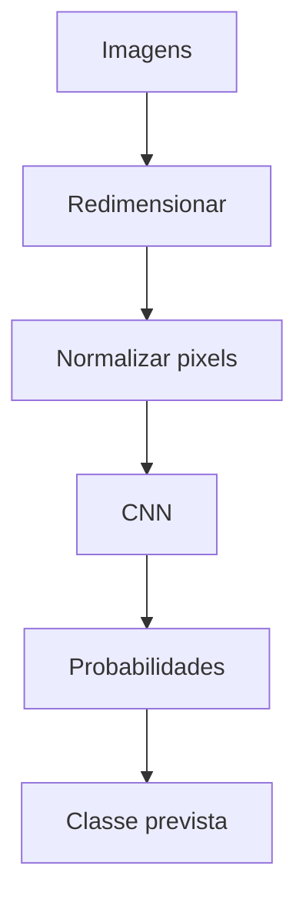

# Modelos Preditivos em Machine Learning

> Guia de estudo prático e didático para aprender **modelos preditivos**, **pré-processamento de dados**, **seleção de atributos**, **avaliação de modelos**, **overfitting**, **hiperparâmetros**, **retreinamento**, **explicabilidade** e aplicações com **Scikit-learn, TensorFlow e Keras**.

---

## 1. Visão geral: o que é Machine Learning?

**Machine Learning**, ou Aprendizado de Máquina, é uma área da Inteligência Artificial em que ensinamos um algoritmo a aprender padrões a partir de dados.

Em vez de programar regras fixas manualmente, entregamos exemplos ao modelo e ele aprende relações entre as variáveis.

### Exemplo simples

Imagine que você quer prever se uma transação de cartão de crédito tem risco alto ou baixo.

Você poderia criar regras manuais:

```text
Se valor > 5.000 e horário for madrugada, então risco alto.
```

Mas isso é limitado. Um modelo de Machine Learning pode aprender padrões mais complexos:

```text
valor + frequência de uso + histórico do cliente + cidade + horário + tipo de estabelecimento + comportamento anterior
```

---

## 2. O que são modelos preditivos?

Modelos preditivos são algoritmos que aprendem a partir de dados históricos para fazer previsões sobre novos dados.

Eles tentam responder perguntas como:

- Esse cliente vai atrasar o pagamento?
- Essa transação é fraude?
- Qual será o faturamento do próximo mês?
- Essa imagem contém um gato, um cachorro ou uma pessoa?
- Esse aluno tem chance de ser aprovado?
- Esse cliente vai cancelar o serviço?

---

## 3. Para que servem modelos preditivos?

Modelos preditivos servem para apoiar decisões quando existe histórico suficiente para aprender padrões.

### Exemplos de uso

| Área | Exemplo de previsão |
|---|---|
| Finanças | risco de crédito, fraude, inadimplência |
| Saúde | risco de doença, triagem, apoio ao diagnóstico |
| Logística | atraso de entrega, previsão de demanda |
| Marketing | churn, propensão de compra |
| RH | rotatividade de funcionários |
| Indústria | falha de máquina, manutenção preditiva |
| Cultura/Eventos | previsão de público, perfil de visitante |
| Imagens | classificação de objetos, OCR, inspeção visual |

---

## 4. Para que modelos preditivos não servem?

Modelos preditivos não são mágicos. Eles não substituem contexto, ética, estratégia e conhecimento de negócio.

Eles **não servem bem** quando:

1. Não há dados suficientes.
2. Os dados são muito ruins ou inconsistentes.
3. O problema muda o tempo todo e o passado não representa mais o presente.
4. A decisão exige julgamento humano profundo.
5. Há risco ético ou legal sem supervisão.
6. O modelo será usado como verdade absoluta.
7. A variável-alvo está mal definida.

### Exemplo

Se você quer prever inadimplência, mas seu histórico só tem clientes de um tipo específico, o modelo pode falhar quando aplicado a outro público.

---

## 5. A fórmula básica de um modelo preditivo

De forma intuitiva, um modelo preditivo aprende uma função:

```text
Entrada → Modelo → Saída
```

Ou matematicamente:

```text
ŷ = f(X)
```

Onde:

- `X` são os atributos de entrada.
- `f` é a função aprendida pelo modelo.
- `ŷ` é a previsão.

### Exemplo em risco de crédito

```text
X = renda, idade, histórico, dívidas, limite usado, atrasos anteriores
ŷ = probabilidade de inadimplência
```

---

## 6. Tipos principais de problemas em Machine Learning



---

# Parte 1 — Regressão, Classificação e Clustering

---

## 7. Regressão

Regressão é usada quando queremos prever um valor numérico contínuo.

### Exemplos

- Prever preço de imóvel.
- Prever faturamento mensal.
- Prever valor gasto por cliente.
- Prever tempo de entrega.
- Prever saldo bancário futuro.

### Fórmula intuitiva

Na regressão linear simples:

```text
y = b0 + b1x
```

Onde:

- `y` é o valor previsto.
- `b0` é o ponto de partida.
- `b1` é o peso da variável.
- `x` é o atributo de entrada.

Com várias variáveis:

```text
y = b0 + b1x1 + b2x2 + b3x3 + ... + bnxn
```

### Exemplo

```text
preço_do_imóvel = base + peso_area * area + peso_quartos * quartos + peso_bairro * bairro
```

---

## 8. Classificação

Classificação é usada quando queremos prever uma categoria.

### Exemplos

- Fraude ou não fraude.
- Cliente inadimplente ou adimplente.
- E-mail spam ou normal.
- Imagem de gato, cachorro ou carro.
- Risco baixo, médio ou alto.

### Saída comum

Em muitos modelos, a saída pode ser uma probabilidade:

```text
Probabilidade de fraude = 0.87
```

Depois transformamos isso em classe:

```text
Se probabilidade >= 0.5 → fraude
Se probabilidade < 0.5 → não fraude
```

Mas esse limite de `0.5` nem sempre é ideal.

Em fraude, por exemplo, talvez seja melhor usar `0.3` para capturar mais casos suspeitos.

---

## 9. Clustering

Clustering é usado quando não temos uma resposta pronta, mas queremos encontrar grupos naturais nos dados.

### Exemplos

- Agrupar clientes por comportamento financeiro.
- Segmentar visitantes de um evento.
- Descobrir perfis de consumo.
- Agrupar imagens semelhantes.

### Diferença importante

Na classificação, você já sabe as classes no treinamento.

No clustering, o próprio algoritmo tenta descobrir os grupos.



---

# Parte 2 — Pipeline de um projeto de Machine Learning

---

## 10. Fluxo geral de um projeto preditivo



---

## 11. Entendimento do problema

Antes de escolher modelo, precisamos entender:

1. Qual decisão será tomada?
2. O que queremos prever?
3. Qual é a variável-alvo?
4. Qual é o custo do erro?
5. Quem usará a previsão?
6. O modelo precisa ser explicável?
7. O problema é regressão, classificação ou clustering?

### Exemplo: risco de crédito

Pergunta ruim:

```text
Quero usar IA para cartão de crédito.
```

Pergunta melhor:

```text
Quero prever a probabilidade de um cliente atrasar o pagamento da próxima fatura nos próximos 30 dias.
```

Essa segunda pergunta é muito mais clara.

---

# Parte 3 — Dados: a base do modelo

---

## 12. O que são atributos?

Atributos são as colunas usadas pelo modelo para aprender.

Também são chamados de:

- Variáveis explicativas.
- Features.
- Entradas.
- Preditores.

### Exemplo

Em um problema de risco de cartão:

| Atributo | Exemplo |
|---|---|
| renda | 7000 |
| idade | 28 |
| limite_cartao | 3500 |
| percentual_limite_usado | 0.82 |
| atrasos_ultimos_12_meses | 2 |
| score_credito | 620 |
| transacoes_mes | 45 |

A variável-alvo poderia ser:

```text
inadimplente = sim ou não
```

---

## 13. O que é variável-alvo?

A variável-alvo é aquilo que queremos prever.

Também pode ser chamada de:

- Target.
- Label.
- Saída.
- Resposta.

### Exemplos

| Problema | Variável-alvo |
|---|---|
| Prever inadimplência | inadimplente |
| Prever preço de imóvel | preço |
| Prever churn | cancelou |
| Prever fraude | fraude |
| Classificar imagem | classe da imagem |

---

## 14. Qualidade dos dados

Um modelo não corrige automaticamente dados ruins.

A frase clássica é:

```text
Garbage in, garbage out.
```

Ou seja:

```text
Se os dados de entrada forem ruins, a previsão tende a ser ruim.
```

---

# Parte 4 — Limpeza dos dados

---

## 15. Valores nulos

Valores nulos são informações ausentes.

Exemplos:

```text
idade = vazio
renda = null
bairro = NaN
```

### O que fazer com valores nulos?

Depende do contexto.



---

## 16. Estratégias para valores nulos

### 16.1 Deletar linhas

Faz sentido quando:

- Existem poucos registros com nulos.
- A remoção não cria viés.
- A base é grande.

Exemplo:

```python
df = df.dropna(subset=["renda"])
```

Cuidado: remover muitas linhas pode distorcer a base.

---

### 16.2 Deletar colunas

Faz sentido quando:

- A coluna tem muitos nulos.
- A coluna não é importante.
- A informação é pouco confiável.

Exemplo:

```python
df = df.drop(columns=["segunda_renda"])
```

---

### 16.3 Imputar com média

Boa para variáveis numéricas sem muitos outliers.

```python
from sklearn.impute import SimpleImputer

imputer = SimpleImputer(strategy="mean")
df[["renda"]] = imputer.fit_transform(df[["renda"]])
```

---

### 16.4 Imputar com mediana

Boa quando existem outliers.

```python
imputer = SimpleImputer(strategy="median")
df[["renda"]] = imputer.fit_transform(df[["renda"]])
```

Exemplo: renda costuma ter valores extremos. Nesse caso, mediana pode ser melhor que média.

---

### 16.5 Imputar com moda

Boa para variáveis categóricas.

```python
imputer = SimpleImputer(strategy="most_frequent")
df[["estado_civil"]] = imputer.fit_transform(df[["estado_civil"]])
```

---

### 16.6 Criar categoria “desconhecido”

Boa quando o nulo pode ter significado.

```python
df["profissao"] = df["profissao"].fillna("desconhecido")
```

---

### 16.7 Criar flag de ausência

Às vezes, o fato de estar faltando já é uma informação.

```python
df["renda_ausente"] = df["renda"].isna().astype(int)
```

Exemplo: se clientes sem renda declarada têm maior risco, essa flag pode ajudar.

---

## 17. Duplicados

Duplicados são registros repetidos.

```python
df.duplicated().sum()
```

### O que fazer?

Depende.

Se for duplicação acidental:

```python
df = df.drop_duplicates()
```

Mas cuidado: em transações financeiras, duas compras iguais podem ser legítimas.

Exemplo:

```text
Compra de R$ 10,00 no mesmo mercado duas vezes no mesmo dia pode ser real.
```

Então não remova duplicados automaticamente sem entender o contexto.

---

## 18. Outliers

Outliers são valores muito diferentes do padrão.

Exemplo:

```text
idade = 250
renda = 999999999
valor_transacao = -500000
```

Nem todo outlier é erro.

Em fraude, por exemplo, outliers podem ser justamente os casos mais importantes.

### Estratégias

1. Corrigir se for erro evidente.
2. Remover se for impossível.
3. Manter se for comportamento real.
4. Aplicar transformação logarítmica.
5. Usar modelos robustos a outliers.

---

# Parte 5 — Pré-processamento de dados

---

## 19. O que é pré-processamento?

Pré-processamento é preparar os dados para que o modelo consiga aprender melhor.

Inclui:

- Tratar nulos.
- Remover duplicados.
- Codificar categorias.
- Normalizar ou padronizar variáveis.
- Separar treino e teste.
- Criar novas variáveis.
- Evitar vazamento de informação.

---

## 20. Dados numéricos e categóricos

### Numéricos

Exemplos:

```text
idade, renda, valor_compra, saldo, quantidade_transacoes
```

### Categóricos

Exemplos:

```text
sexo, cidade, bairro, profissão, tipo_cartao, categoria_produto
```

Modelos matemáticos não entendem texto diretamente. Por isso, precisamos transformar categorias em números.

---

## 21. Dummy variables / One-Hot Encoding

Dummy variables transformam uma coluna categórica em várias colunas binárias.

### Exemplo

Coluna original:

| cidade |
|---|
| Manaus |
| Belém |
| Recife |

Após one-hot encoding:

| cidade_Manaus | cidade_Belem | cidade_Recife |
|---|---|---|
| 1 | 0 | 0 |
| 0 | 1 | 0 |
| 0 | 0 | 1 |

### Quando usar?

Use quando a categoria não tem ordem natural.

Exemplos:

- cidade
- bairro
- profissão
- estado civil
- tipo de loja

### Em Scikit-learn

```python
from sklearn.preprocessing import OneHotEncoder

encoder = OneHotEncoder(handle_unknown="ignore")
```

O parâmetro `handle_unknown="ignore"` evita erro quando aparecer uma categoria nova no teste ou produção.

---

## 22. Label Encoding

Label Encoding transforma categorias em números inteiros.

Exemplo:

| risco | valor |
|---|---|
| baixo | 0 |
| médio | 1 |
| alto | 2 |

### Quando usar?

Faz sentido quando existe ordem natural.

Exemplos:

- baixo, médio, alto
- pequeno, médio, grande
- fundamental, médio, superior

### Cuidado

Não use Label Encoding em categorias sem ordem.

Exemplo ruim:

```text
Manaus = 0
Belém = 1
Recife = 2
```

O modelo pode interpretar que Recife é “maior” que Manaus, o que não faz sentido.

---

## 23. Frequency Encoding

Frequency Encoding substitui cada categoria pela frequência com que ela aparece.

### Exemplo

| cidade | frequência |
|---|---|
| Manaus | 0.50 |
| Belém | 0.30 |
| Recife | 0.20 |

### Quando usar?

Pode ser útil quando:

- Há muitas categorias.
- One-hot encoding criaria colunas demais.
- A frequência da categoria pode carregar informação.

Exemplo:

```python
freq = df["cidade"].value_counts(normalize=True)
df["cidade_freq"] = df["cidade"].map(freq)
```

### Cuidado

Faça o cálculo da frequência apenas no treino e aplique no teste para evitar vazamento de informação.

---

## 24. Normalização

Normalização geralmente coloca os valores em uma escala entre 0 e 1.

Fórmula:

```text
x_norm = (x - mínimo) / (máximo - mínimo)
```

### Exemplo

Se renda varia de 1.000 a 10.000, a normalização transforma tudo para uma escala comum.

### Quando usar?

É útil para modelos sensíveis à escala, como:

- KNN
- Redes neurais
- Regressão logística
- SVM
- PCA
- K-Means

---

## 25. Padronização

Padronização transforma os dados para média 0 e desvio padrão 1.

Fórmula:

```text
z = (x - média) / desvio_padrão
```

### Quando usar?

É muito usada quando os dados têm distribuição aproximadamente normal ou quando o modelo se beneficia de variáveis na mesma escala.

Modelos que costumam precisar:

- Regressão logística
- Regressão linear com regularização
- SVM
- KNN
- Redes neurais
- PCA

---

## 26. Normalização ou padronização?

| Técnica | Resultado | Quando usar |
|---|---|---|
| Normalização | valores entre 0 e 1 | redes neurais, KNN, imagens |
| Padronização | média 0 e desvio 1 | regressão, SVM, PCA, modelos lineares |

Árvores de decisão, Random Forest e XGBoost geralmente não precisam de escala.

---

## 27. Vazamento de informação

Vazamento de informação, ou data leakage, acontece quando o modelo aprende informações que não estariam disponíveis no momento real da previsão.

É um dos erros mais perigosos em Machine Learning.

### Exemplo ruim

Você quer prever inadimplência antes do vencimento da fatura, mas usa uma coluna chamada:

```text
dias_em_atraso
```

Essa informação só existe depois do vencimento. Logo, é vazamento.

---

## 28. Tipos comuns de vazamento

### 28.1 Vazamento por variável futura

Usar informação que só aparece depois da previsão.

Exemplo:

```text
status_pagamento_final
```

para prever inadimplência.

---

### 28.2 Vazamento no pré-processamento

Erro comum:

```python
scaler.fit_transform(X)
train_test_split(...)
```

Nesse caso, você calculou média e desvio usando todos os dados, inclusive teste.

Correto:

```python
scaler.fit(X_train)
X_train_scaled = scaler.transform(X_train)
X_test_scaled = scaler.transform(X_test)
```

Ou melhor ainda: usar `Pipeline`.

---

### 28.3 Vazamento por duplicidade

Se o mesmo cliente ou transação aparece no treino e no teste, o modelo pode memorizar.

---

### 28.4 Vazamento temporal

Em séries temporais, não se deve treinar com dados do futuro para prever o passado.

Errado:

```text
Treinar com dados de 2026 e testar em 2025.
```

Correto:

```text
Treinar com 2024-2025 e testar em 2026.
```

---

# Parte 6 — Treino, validação e teste

---

## 29. Separação entre treino e teste

A separação treino/teste serve para avaliar se o modelo generaliza para dados novos.



### Exemplo comum

```text
80% treino
20% teste
```

---

## 30. Treino, validação e teste

Em projetos mais completos:

```text
Treino → aprende
Validação → escolhe modelo e hiperparâmetros
Teste → avaliação final
```



---

## 31. Cross-validation

Cross-validation divide a base em várias partes para testar o modelo de forma mais confiável.

Exemplo com 5 folds:

```text
Fold 1: treina em 4 partes, testa em 1
Fold 2: treina em 4 partes, testa em 1
...
```

### Vantagem

Reduz a chance de escolher um modelo que foi bem apenas por sorte em uma divisão específica.

---

## 32. Stratified split

Em classificação, especialmente com classes desbalanceadas, use separação estratificada.

Isso mantém a proporção das classes no treino e no teste.

```python
from sklearn.model_selection import train_test_split

X_train, X_test, y_train, y_test = train_test_split(
    X,
    y,
    test_size=0.2,
    random_state=42,
    stratify=y
)
```

---

# Parte 7 — Atributos e seleção de atributos

---

## 33. Importância dos atributos

Importância dos atributos indica quais variáveis mais influenciam o modelo.

### Exemplo

Em risco de crédito, talvez os atributos mais importantes sejam:

1. atrasos anteriores
2. percentual do limite usado
3. renda
4. quantidade de parcelas em aberto
5. score de crédito

---

## 34. Correlação

Correlação mede relação linear entre duas variáveis numéricas.

Varia de `-1` a `1`.

| Valor | Interpretação |
|---|---|
| perto de 1 | relação positiva forte |
| perto de -1 | relação negativa forte |
| perto de 0 | pouca relação linear |

### Exemplo

```python
corr = df.corr(numeric_only=True)
```

### Cuidado

Correlação não significa causalidade.

Se duas variáveis andam juntas, não quer dizer que uma causa a outra.

---

## 35. Informação mútua

Informação mútua mede quanto saber uma variável ajuda a entender outra.

É útil porque consegue capturar relações não lineares.

### Exemplo

Talvez `idade` não tenha relação linear forte com inadimplência, mas certos grupos de idade podem ter risco maior.

```python
from sklearn.feature_selection import mutual_info_classif

scores = mutual_info_classif(X, y)
```

---

## 36. Seleção de atributos

Seleção de atributos é escolher as melhores colunas para o modelo.

### Por que fazer?

- Reduz ruído.
- Diminui overfitting.
- Melhora interpretabilidade.
- Reduz custo computacional.
- Pode melhorar performance.

### Estratégias

| Técnica | Ideia |
|---|---|
| Correlação | remove variáveis redundantes |
| Informação mútua | mede relação com o alvo |
| Importância em árvores | usa modelos como Random Forest |
| RFE | remove atributos menos úteis iterativamente |
| Lasso | reduz pesos de atributos irrelevantes |
| PCA | cria componentes novos |

---

## 37. Adição de atributos

Adição de atributos, ou feature engineering, é criar novas variáveis mais úteis.

### Exemplo financeiro

Atributos originais:

```text
renda = 7000
despesas = 5300
limite_cartao = 3500
fatura = 3000
```

Novos atributos:

```text
comprometimento_renda = despesas / renda
uso_limite = fatura / limite_cartao
saldo_livre = renda - despesas
```

Esses atributos podem ser mais informativos do que os originais.

---

## 38. PCA

PCA significa Principal Component Analysis.

Ele reduz a quantidade de variáveis criando novas combinações das variáveis originais.

### Para que serve?

- Reduzir dimensionalidade.
- Remover redundância.
- Visualizar dados em 2D ou 3D.
- Acelerar treinamento.

### Exemplo intuitivo

Imagine que você tem 100 colunas muito parecidas. O PCA pode resumir boa parte da informação em 10 componentes.

### Cuidado

PCA melhora compactação, mas reduz interpretabilidade.

Depois do PCA, você não tem mais colunas como `renda` ou `idade`, mas componentes como:

```text
PC1, PC2, PC3
```

---

# Parte 8 — Classes desbalanceadas

---

## 39. O que são classes desbalanceadas?

Classes desbalanceadas ocorrem quando uma classe aparece muito mais que outra.

### Exemplo de fraude

```text
99,5% transações normais
0,5% fraudes
```

Se o modelo disser “não fraude” para tudo, terá 99,5% de acurácia, mas será inútil.

---

## 40. Como lidar com classes desbalanceadas?

### 40.1 Métricas adequadas

Evite olhar só para acurácia.

Use:

- precision
- recall
- F1-score
- matriz de confusão
- ROC-AUC
- PR-AUC

---

### 40.2 Ajuste de peso das classes

```python
model = LogisticRegression(class_weight="balanced")
```

---

### 40.3 Undersampling

Reduz exemplos da classe majoritária.

Vantagem: base menor.

Desvantagem: pode perder informação.

---

### 40.4 Oversampling

Aumenta exemplos da classe minoritária.

Exemplo: SMOTE.

```python
from imblearn.over_sampling import SMOTE

smote = SMOTE(random_state=42)
X_res, y_res = smote.fit_resample(X_train, y_train)
```

### Cuidado

Aplique SMOTE somente no treino, nunca antes da separação treino/teste.

---

# Parte 9 — Métricas de classificação

---

## 41. Matriz de confusão

A matriz de confusão mostra acertos e erros do modelo.

| | Previsto negativo | Previsto positivo |
|---|---|---|
| Real negativo | verdadeiro negativo | falso positivo |
| Real positivo | falso negativo | verdadeiro positivo |

### Em fraude

| Situação | Significado |
|---|---|
| Verdadeiro positivo | fraude detectada corretamente |
| Verdadeiro negativo | transação normal aprovada corretamente |
| Falso positivo | transação normal bloqueada por engano |
| Falso negativo | fraude não detectada |

---

## 42. Acurácia

Acurácia mede a proporção total de acertos.

```text
acurácia = acertos / total
```

Boa quando as classes são equilibradas.

Ruim quando há desbalanceamento.

---

## 43. Precision

Precision responde:

```text
Das previsões positivas, quantas estavam corretas?
```

Em fraude:

```text
Das transações que bloqueei como fraude, quantas eram fraude de verdade?
```

Alta precision reduz falsos alarmes.

---

## 44. Recall

Recall responde:

```text
Dos casos positivos reais, quantos eu encontrei?
```

Em fraude:

```text
Das fraudes reais, quantas consegui detectar?
```

Alto recall reduz fraudes perdidas.

---

## 45. F1-score

F1-score equilibra precision e recall.

É útil quando queremos um equilíbrio entre capturar positivos e evitar falsos alarmes.

```text
F1 = 2 * precision * recall / (precision + recall)
```

---

## 46. Curva ROC e AUC

A curva ROC mostra a relação entre:

- taxa de verdadeiros positivos
- taxa de falsos positivos

AUC mede a capacidade geral do modelo separar as classes.

```text
AUC = 1.0 → separação perfeita
AUC = 0.5 → quase aleatório
```

### Cuidado

Em bases muito desbalanceadas, PR-AUC pode ser mais informativa que ROC-AUC.

---

## 47. Threshold

Threshold é o ponto de corte para transformar probabilidade em classe.

Exemplo:

```text
probabilidade >= 0.5 → classe 1
```

Mas em problemas de risco, o threshold deve considerar o custo do erro.

### Exemplo

Em fraude:

- Falso negativo custa caro: fraude passa.
- Falso positivo incomoda cliente: compra legítima bloqueada.

O melhor threshold depende da estratégia do negócio.

---

# Parte 10 — Métricas de regressão

---

## 48. MAE

MAE significa Mean Absolute Error.

Mede o erro médio absoluto.

```text
MAE = média dos erros absolutos
```

Exemplo:

```text
MAE = 150
```

Significa que, em média, o modelo erra R$ 150.

É fácil de interpretar.

---

## 49. MSE

MSE significa Mean Squared Error.

Eleva os erros ao quadrado.

Pune mais fortemente erros grandes.

---

## 50. RMSE

RMSE é a raiz do MSE.

Fica na mesma unidade da variável-alvo.

Exemplo:

```text
RMSE = 250 reais
```

---

## 51. R²

R² mede quanto da variação da variável-alvo é explicada pelo modelo.

```text
R² = 0.80
```

Interpretação simplificada:

```text
O modelo explica cerca de 80% da variação dos dados.
```

### Cuidado

R² alto não garante bom modelo em produção.

---

## 52. MAPE

MAPE mede erro percentual médio.

```text
MAPE = 10%
```

Significa que o modelo erra, em média, 10%.

Cuidado quando há valores reais próximos de zero.

---

# Parte 11 — Como escolher modelos

---

## 53. Não comece pelo modelo

Uma boa ordem é:

```text
Problema → Dados → Métrica → Baseline → Modelos → Comparação → Explicação → Deploy
```

Muitos iniciantes começam escolhendo Random Forest, XGBoost ou Rede Neural sem entender o problema.

Isso é um erro.

---

## 54. Baseline

Baseline é um modelo simples usado como referência.

### Classificação

Baseline simples:

```text
prever sempre a classe mais comum
```

### Regressão

Baseline simples:

```text
prever sempre a média
```

Se um modelo complexo não supera bem o baseline, talvez ele não esteja agregando valor.

---

## 55. Modelos comuns de classificação

| Modelo | Pontos fortes | Cuidados |
|---|---|---|
| Regressão logística | simples, explicável | pode falhar em relações complexas |
| KNN | intuitivo | sensível à escala e lento em bases grandes |
| Árvore de decisão | interpretável | overfitting fácil |
| Random Forest | robusto | menos interpretável que árvore única |
| Gradient Boosting | alta performance | exige tuning cuidadoso |
| SVM | bom em margens complexas | pode ser lento |
| Redes neurais | poderoso | precisa mais dados e cuidado |

---

## 56. Modelos comuns de regressão

| Modelo | Pontos fortes | Cuidados |
|---|---|---|
| Regressão linear | simples, interpretável | assume relação linear |
| Ridge/Lasso | reduz overfitting | precisa escala |
| Árvore de regressão | captura não linearidade | overfitting |
| Random Forest Regressor | robusto | menos explicável |
| Gradient Boosting Regressor | alto desempenho | tuning importante |
| Redes neurais | flexível | exige dados e validação |

---

## 57. Modelos comuns de clustering

| Modelo | Uso | Cuidados |
|---|---|---|
| K-Means | grupos compactos | precisa definir K |
| DBSCAN | encontra grupos e ruídos | sensível a parâmetros |
| Hierárquico | dendrogramas | pode ser caro em bases grandes |
| Gaussian Mixture | grupos probabilísticos | assume distribuições |

---

## 58. Como eu trabalharia com vários modelos em um projeto

Uma estratégia profissional:



### Ordem sugerida

1. Baseline.
2. Regressão logística ou linear.
3. Árvore de decisão.
4. Random Forest.
5. Gradient Boosting.
6. XGBoost/LightGBM/CatBoost se disponíveis.
7. Rede neural se fizer sentido.

---

## 59. Técnica do fórum

A “técnica do fórum” pode ser entendida como comparar vários modelos como se cada um fosse um especialista dando sua opinião.

Cada modelo tenta resolver o problema com uma lógica diferente.

Depois você compara:

- desempenho
- estabilidade
- explicabilidade
- custo computacional
- facilidade de manutenção
- risco de overfitting

### Exemplo

Para risco de crédito:

| Modelo | Papel no fórum |
|---|---|
| Regressão logística | especialista simples e explicável |
| Árvore de decisão | especialista visual e interpretável |
| Random Forest | especialista robusto |
| Gradient Boosting | especialista de alta performance |
| Rede neural | especialista flexível para padrões complexos |

O vencedor não é necessariamente o mais complexo.

O melhor modelo é o que entrega o melhor equilíbrio entre performance, explicação, custo e segurança.

---

# Parte 12 — Overfitting e underfitting

---

## 60. Overfitting

Overfitting acontece quando o modelo decora o treino, mas vai mal em dados novos.

### Sinais

```text
Treino: 99% de acerto
Teste: 70% de acerto
```

O modelo aprendeu detalhes e ruídos do treino.

---

## 61. Underfitting

Underfitting é o inverso: o modelo é simples demais e não aprende nem o treino.

### Sinais

```text
Treino: 65% de acerto
Teste: 64% de acerto
```

O modelo não capturou os padrões relevantes.

---

## 62. Como evitar overfitting

Boas práticas:

1. Usar validação cruzada.
2. Separar treino/teste corretamente.
3. Reduzir complexidade do modelo.
4. Usar regularização.
5. Selecionar atributos relevantes.
6. Aumentar dados quando possível.
7. Usar early stopping em redes neurais.
8. Evitar vazamento de informação.
9. Controlar profundidade de árvores.
10. Monitorar curva de aprendizado.

---

## 63. Como reduzir underfitting

1. Usar modelo mais flexível.
2. Criar atributos melhores.
3. Reduzir regularização excessiva.
4. Treinar por mais épocas em redes neurais.
5. Usar interações entre variáveis.
6. Melhorar qualidade dos dados.

---

## 64. Curva de aprendizado

Curva de aprendizado mostra o desempenho no treino e na validação conforme aumenta a quantidade de dados.

### Interpretação

| Situação | Interpretação |
|---|---|
| treino bom, validação ruim | overfitting |
| treino ruim, validação ruim | underfitting |
| ambos bons e próximos | bom equilíbrio |

---

# Parte 13 — Otimização de hiperparâmetros

---

## 65. O que são hiperparâmetros?

Hiperparâmetros são configurações escolhidas antes do treinamento.

Exemplos:

- profundidade máxima de árvore
- número de árvores
- taxa de aprendizado
- número de vizinhos no KNN
- quantidade de camadas em rede neural
- batch size
- número de épocas

---

## 66. Grid Search

Grid Search testa combinações de hiperparâmetros.

Exemplo:

```python
from sklearn.model_selection import GridSearchCV
from sklearn.ensemble import RandomForestClassifier

params = {
    "n_estimators": [100, 200],
    "max_depth": [3, 5, 10, None],
    "min_samples_split": [2, 5]
}

model = RandomForestClassifier(random_state=42)

grid = GridSearchCV(
    model,
    params,
    cv=5,
    scoring="f1",
    n_jobs=-1
)

grid.fit(X_train, y_train)

print(grid.best_params_)
print(grid.best_score_)
```

---

## 67. Random Search

Random Search testa combinações aleatórias.

É útil quando há muitos hiperparâmetros.

Costuma ser mais rápido que Grid Search.

---

## 68. Bayesian Optimization

É uma forma mais inteligente de buscar hiperparâmetros.

Ela aprende com as tentativas anteriores e escolhe próximas combinações promissoras.

Ferramentas comuns:

- Optuna
- Hyperopt
- Ray Tune
- Keras Tuner

---

# Parte 14 — Como automatizar e melhorar treinamento

---

## 69. Pipeline

Pipeline organiza pré-processamento e modelo em uma sequência segura.

Vantagens:

- Evita vazamento.
- Facilita testes.
- Facilita deploy.
- Garante que treino e produção usem o mesmo processamento.

```python
from sklearn.pipeline import Pipeline
from sklearn.preprocessing import StandardScaler
from sklearn.linear_model import LogisticRegression

pipe = Pipeline([
    ("scaler", StandardScaler()),
    ("model", LogisticRegression())
])

pipe.fit(X_train, y_train)
```

---

## 70. ColumnTransformer

Permite aplicar transformações diferentes em colunas diferentes.

```python
from sklearn.compose import ColumnTransformer
from sklearn.preprocessing import OneHotEncoder, StandardScaler
from sklearn.impute import SimpleImputer
from sklearn.pipeline import Pipeline

numeric_features = ["idade", "renda", "limite"]
categorical_features = ["cidade", "profissao"]

numeric_transformer = Pipeline([
    ("imputer", SimpleImputer(strategy="median")),
    ("scaler", StandardScaler())
])

categorical_transformer = Pipeline([
    ("imputer", SimpleImputer(strategy="most_frequent")),
    ("encoder", OneHotEncoder(handle_unknown="ignore"))
])

preprocessor = ColumnTransformer([
    ("num", numeric_transformer, numeric_features),
    ("cat", categorical_transformer, categorical_features)
])
```

---

## 71. MLflow

MLflow ajuda a registrar experimentos:

- modelo usado
- hiperparâmetros
- métricas
- artefatos
- versão do modelo

É muito útil em projetos reais para não perder histórico.

---

## 72. Retreinamento do modelo

Retreinamento é atualizar o modelo com dados mais recentes.

### Quando retreinar?

1. Quando a performance cair.
2. Quando o comportamento dos dados mudar.
3. Quando houver novos dados relevantes.
4. Em ciclos programados.
5. Após mudança de regra de negócio.

### Exemplo

Um modelo de risco treinado com dados de 2023 pode não funcionar bem em 2026 se o comportamento financeiro dos clientes mudou.

---

## 73. Data drift e concept drift

### Data drift

Os dados de entrada mudaram.

Exemplo:

```text
Antes clientes tinham renda média de R$ 5.000.
Agora a renda média é R$ 9.000.
```

### Concept drift

A relação entre entrada e saída mudou.

Exemplo:

```text
Antes alto uso do limite indicava alto risco.
Agora, por mudança no produto, isso não indica mais tanto risco.
```

---

# Parte 15 — Explicabilidade dos modelos

---

## 74. Por que explicar modelos?

Explicar modelos é importante para:

- confiança
- auditoria
- decisões de negócio
- conformidade regulatória
- identificação de viés
- melhoria do modelo

Em crédito, saúde e decisões sensíveis, explicabilidade é essencial.

---

## 75. Formas de explicar modelos

### 75.1 Coeficientes

Modelos lineares possuem coeficientes.

Exemplo:

```text
quanto maior o atraso anterior, maior o risco
```

---

### 75.2 Importância dos atributos

Modelos de árvore podem indicar importância de variáveis.

```python
model.feature_importances_
```

---

### 75.3 Permutation Importance

Mede o quanto o desempenho piora quando embaralhamos uma variável.

Se embaralhar `renda` piora muito o modelo, então `renda` é importante.

---

### 75.4 SHAP

SHAP explica como cada variável contribuiu para uma previsão individual.

Exemplo:

```text
Cliente recebeu alto risco porque:
+ alto uso do limite aumentou risco
+ atrasos anteriores aumentaram risco
- renda alta reduziu risco
```

---

### 75.5 LIME

LIME cria uma explicação local para uma previsão específica.

É útil para entender uma decisão individual.

---

## 76. Como explicar para uma pessoa não técnica?

Evite dizer:

```text
O modelo maximizou a função objetivo usando regularização L2.
```

Prefira:

```text
O modelo comparou o comportamento desse cliente com milhares de casos anteriores e identificou sinais parecidos com clientes que atrasaram pagamentos no passado.
```

---

# Parte 16 — Visualizações úteis

---

## 77. Matriz de confusão

Ajuda a entender onde o modelo erra.

```python
from sklearn.metrics import ConfusionMatrixDisplay

ConfusionMatrixDisplay.from_estimator(model, X_test, y_test)
```

---

## 78. Curva ROC

```python
from sklearn.metrics import RocCurveDisplay

RocCurveDisplay.from_estimator(model, X_test, y_test)
```

---

## 79. Curva Precision-Recall

Útil em classes desbalanceadas.

```python
from sklearn.metrics import PrecisionRecallDisplay

PrecisionRecallDisplay.from_estimator(model, X_test, y_test)
```

---

## 80. RadViz

RadViz é uma visualização que projeta várias dimensões em um gráfico 2D.

É útil para explorar separabilidade entre classes.

```python
from pandas.plotting import radviz
import matplotlib.pyplot as plt

radviz(df, "classe")
plt.show()
```

### Cuidado

RadViz é bom para exploração visual, não para provar desempenho.

---

# Parte 17 — Como testar modelos

---

## 81. Testes importantes

Em um projeto real, teste:

1. Se o pipeline roda sem erro.
2. Se não há vazamento de informação.
3. Se as colunas esperadas existem.
4. Se os tipos das colunas estão corretos.
5. Se o modelo aceita dados novos.
6. Se categorias desconhecidas não quebram o pipeline.
7. Se as métricas mínimas são atendidas.
8. Se a previsão retorna no formato esperado.

---

## 82. Teste simples de contrato

```python
def test_model_predicts_expected_shape(model, X_test):
    preds = model.predict(X_test)
    assert len(preds) == len(X_test)
```

---

## 83. Teste de categorias desconhecidas

```python
def test_unknown_category_does_not_break_pipeline(pipeline):
    sample = pd.DataFrame({
        "idade": [30],
        "renda": [7000],
        "cidade": ["Cidade Nova Que Nunca Apareceu"]
    })
    pred = pipeline.predict(sample)
    assert pred is not None
```

---

# Parte 18 — Exemplos práticos

---

## 84. Exemplo 1: classificação de risco de cartão de crédito

### Objetivo

Prever se um cliente tem alto risco de atraso no cartão.

### Variável-alvo

```text
risco_alto = 1 ou 0
```

### Atributos possíveis

```text
idade
renda
limite_cartao
fatura_atual
uso_limite
atrasos_12m
score_credito
cidade
profissao
```

---

## 85. Código completo com Scikit-learn

```python
import pandas as pd
from sklearn.model_selection import train_test_split, cross_val_score
from sklearn.compose import ColumnTransformer
from sklearn.pipeline import Pipeline
from sklearn.preprocessing import OneHotEncoder, StandardScaler
from sklearn.impute import SimpleImputer
from sklearn.linear_model import LogisticRegression
from sklearn.ensemble import RandomForestClassifier
from sklearn.metrics import classification_report, confusion_matrix, roc_auc_score

# Exemplo fictício
df = pd.DataFrame({
    "idade": [25, 40, 32, 50, 29, None, 45, 22],
    "renda": [3000, 9000, 6000, 12000, 3500, 5000, None, 2500],
    "limite_cartao": [1500, 8000, 4000, 10000, 2000, 3000, 7000, 1200],
    "fatura_atual": [1400, 2000, 3900, 1000, 1900, 2800, 6500, 1100],
    "atrasos_12m": [2, 0, 1, 0, 3, 2, 1, 4],
    "cidade": ["Manaus", "Manaus", "Belém", "Recife", "Manaus", "Belém", "Recife", "Manaus"],
    "profissao": ["dev", "gerente", "analista", "empresario", "vendedor", "dev", "gerente", "estudante"],
    "risco_alto": [1, 0, 1, 0, 1, 1, 1, 1]
})

# Feature engineering
df["uso_limite"] = df["fatura_atual"] / df["limite_cartao"]

X = df.drop(columns=["risco_alto"])
y = df["risco_alto"]

numeric_features = ["idade", "renda", "limite_cartao", "fatura_atual", "atrasos_12m", "uso_limite"]
categorical_features = ["cidade", "profissao"]

numeric_transformer = Pipeline([
    ("imputer", SimpleImputer(strategy="median")),
    ("scaler", StandardScaler())
])

categorical_transformer = Pipeline([
    ("imputer", SimpleImputer(strategy="most_frequent")),
    ("encoder", OneHotEncoder(handle_unknown="ignore"))
])

preprocessor = ColumnTransformer([
    ("num", numeric_transformer, numeric_features),
    ("cat", categorical_transformer, categorical_features)
])

model = Pipeline([
    ("preprocessor", preprocessor),
    ("classifier", LogisticRegression(class_weight="balanced"))
])

X_train, X_test, y_train, y_test = train_test_split(
    X, y, test_size=0.25, random_state=42, stratify=y
)

model.fit(X_train, y_train)

preds = model.predict(X_test)
probs = model.predict_proba(X_test)[:, 1]

print(confusion_matrix(y_test, preds))
print(classification_report(y_test, preds))
print("ROC-AUC:", roc_auc_score(y_test, probs))
```

---

## 86. Exemplo 2: comparando vários modelos

```python
from sklearn.model_selection import cross_validate
from sklearn.linear_model import LogisticRegression
from sklearn.ensemble import RandomForestClassifier, GradientBoostingClassifier
from sklearn.tree import DecisionTreeClassifier

models = {
    "logistic_regression": LogisticRegression(max_iter=1000, class_weight="balanced"),
    "decision_tree": DecisionTreeClassifier(random_state=42),
    "random_forest": RandomForestClassifier(random_state=42, class_weight="balanced"),
    "gradient_boosting": GradientBoostingClassifier(random_state=42)
}

results = []

for name, clf in models.items():
    pipe = Pipeline([
        ("preprocessor", preprocessor),
        ("model", clf)
    ])

    scores = cross_validate(
        pipe,
        X_train,
        y_train,
        cv=5,
        scoring=["accuracy", "precision", "recall", "f1", "roc_auc"],
        return_train_score=True
    )

    results.append({
        "model": name,
        "accuracy": scores["test_accuracy"].mean(),
        "precision": scores["test_precision"].mean(),
        "recall": scores["test_recall"].mean(),
        "f1": scores["test_f1"].mean(),
        "roc_auc": scores["test_roc_auc"].mean()
    })

pd.DataFrame(results).sort_values(by="f1", ascending=False)
```

### Como decidir?

Se o problema for risco de crédito, eu olharia principalmente:

1. recall, para capturar clientes realmente arriscados.
2. precision, para não bloquear bons clientes em excesso.
3. F1-score, para equilíbrio.
4. ROC-AUC, para separação geral.
5. explicabilidade.

---

## 87. Exemplo 3: regressão para prever valor de fatura

### Objetivo

Prever o valor da próxima fatura do cartão.

```python
from sklearn.ensemble import RandomForestRegressor
from sklearn.metrics import mean_absolute_error, mean_squared_error, r2_score
import numpy as np

X = df[["idade", "renda", "limite_cartao", "atrasos_12m", "uso_limite"]]
y = df["fatura_atual"]

X_train, X_test, y_train, y_test = train_test_split(
    X, y, test_size=0.25, random_state=42
)

reg = Pipeline([
    ("imputer", SimpleImputer(strategy="median")),
    ("model", RandomForestRegressor(random_state=42))
])

reg.fit(X_train, y_train)
preds = reg.predict(X_test)

mae = mean_absolute_error(y_test, preds)
rmse = np.sqrt(mean_squared_error(y_test, preds))
r2 = r2_score(y_test, preds)

print("MAE:", mae)
print("RMSE:", rmse)
print("R²:", r2)
```

---

## 88. Exemplo 4: clustering de perfis financeiros

### Objetivo

Agrupar clientes por comportamento.

```python
from sklearn.cluster import KMeans
from sklearn.preprocessing import StandardScaler

features = df[["renda", "limite_cartao", "fatura_atual", "atrasos_12m", "uso_limite"]]

cluster_pipe = Pipeline([
    ("imputer", SimpleImputer(strategy="median")),
    ("scaler", StandardScaler()),
    ("cluster", KMeans(n_clusters=3, random_state=42, n_init=10))
])

df["grupo"] = cluster_pipe.fit_predict(features)

print(df[["renda", "fatura_atual", "uso_limite", "atrasos_12m", "grupo"]])
```

### Interpretação possível

| Grupo | Perfil |
|---|---|
| 0 | baixa renda, alto uso do limite |
| 1 | alta renda, baixo uso do limite |
| 2 | renda média, atrasos recorrentes |

---

## 89. Exemplo 5: rede neural simples com Keras para classificação tabular

```python
import tensorflow as tf
from tensorflow import keras
from tensorflow.keras import layers

model = keras.Sequential([
    layers.Input(shape=(X_train_processed.shape[1],)),
    layers.Dense(64, activation="relu"),
    layers.Dropout(0.3),
    layers.Dense(32, activation="relu"),
    layers.Dense(1, activation="sigmoid")
])

model.compile(
    optimizer="adam",
    loss="binary_crossentropy",
    metrics=["accuracy", keras.metrics.AUC(name="auc")]
)

history = model.fit(
    X_train_processed,
    y_train,
    validation_split=0.2,
    epochs=50,
    batch_size=32,
    callbacks=[
        keras.callbacks.EarlyStopping(
            patience=5,
            restore_best_weights=True
        )
    ]
)
```

### Observação

Para dados tabulares, modelos como Random Forest, Gradient Boosting, XGBoost, LightGBM e CatBoost frequentemente são mais fortes que redes neurais simples.

Redes neurais brilham mais em:

- imagens
- áudio
- texto
- grandes volumes de dados
- padrões muito complexos

---

## 90. Exemplo 6: classificação de imagem com Keras

### Objetivo

Classificar imagens em categorias, por exemplo:

```text
gato, cachorro, carro
```

### Fluxo



### Código simplificado

```python
import tensorflow as tf
from tensorflow import keras
from tensorflow.keras import layers

img_size = (128, 128)
batch_size = 32

train_ds = keras.utils.image_dataset_from_directory(
    "dados_imagens/train",
    image_size=img_size,
    batch_size=batch_size
)

val_ds = keras.utils.image_dataset_from_directory(
    "dados_imagens/val",
    image_size=img_size,
    batch_size=batch_size
)

normalization_layer = layers.Rescaling(1./255)

model = keras.Sequential([
    layers.Input(shape=(128, 128, 3)),
    normalization_layer,
    layers.Conv2D(32, 3, activation="relu"),
    layers.MaxPooling2D(),
    layers.Conv2D(64, 3, activation="relu"),
    layers.MaxPooling2D(),
    layers.Conv2D(128, 3, activation="relu"),
    layers.MaxPooling2D(),
    layers.Flatten(),
    layers.Dense(128, activation="relu"),
    layers.Dropout(0.5),
    layers.Dense(3, activation="softmax")
])

model.compile(
    optimizer="adam",
    loss="sparse_categorical_crossentropy",
    metrics=["accuracy"]
)

history = model.fit(
    train_ds,
    validation_data=val_ds,
    epochs=20
)
```

---

## 91. Exemplo 7: data augmentation em imagens

Data augmentation cria variações artificiais das imagens para reduzir overfitting.

```python
data_augmentation = keras.Sequential([
    layers.RandomFlip("horizontal"),
    layers.RandomRotation(0.1),
    layers.RandomZoom(0.1)
])
```

Pode ser usado assim:

```python
model = keras.Sequential([
    layers.Input(shape=(128, 128, 3)),
    data_augmentation,
    layers.Rescaling(1./255),
    layers.Conv2D(32, 3, activation="relu"),
    layers.MaxPooling2D(),
    layers.Flatten(),
    layers.Dense(128, activation="relu"),
    layers.Dense(3, activation="softmax")
])
```

---

# Parte 19 — Checklist profissional

---

## 92. Checklist antes de treinar

- [ ] O problema está bem definido?
- [ ] A variável-alvo está clara?
- [ ] Existe risco de vazamento?
- [ ] Dados duplicados foram analisados?
- [ ] Nulos foram tratados com critério?
- [ ] Categóricas foram codificadas corretamente?
- [ ] Variáveis numéricas foram escaladas quando necessário?
- [ ] Treino e teste foram separados corretamente?
- [ ] Classes estão balanceadas ou métricas adequadas foram escolhidas?
- [ ] Existe baseline?

---

## 93. Checklist de avaliação

- [ ] A métrica escolhida faz sentido para o negócio?
- [ ] O modelo supera o baseline?
- [ ] O resultado no treino e teste é parecido?
- [ ] A matriz de confusão foi analisada?
- [ ] Precision e recall foram avaliados?
- [ ] O threshold foi ajustado?
- [ ] A curva ROC ou PR foi analisada?
- [ ] O modelo foi explicado?
- [ ] O desempenho foi validado com cross-validation?

---

## 94. Checklist para produção

- [ ] O pipeline completo foi salvo?
- [ ] O pré-processamento está junto com o modelo?
- [ ] Existem testes automatizados?
- [ ] O modelo registra versão?
- [ ] Há monitoramento de drift?
- [ ] Existe política de retreinamento?
- [ ] Há documentação?
- [ ] Existe explicação para decisões importantes?

---

# Parte 20 — Resumo final

---

## 95. Resumo mental

Um projeto de Machine Learning não é apenas escolher um algoritmo.

É um processo completo:

```text
entender problema → preparar dados → treinar → avaliar → explicar → monitorar → retreinar
```

O modelo é apenas uma parte da solução.

---

## 96. Regra prática para escolha de modelos

### Se o problema é regressão

Comece com:

1. baseline pela média
2. regressão linear
3. Random Forest Regressor
4. Gradient Boosting

### Se o problema é classificação

Comece com:

1. baseline pela classe majoritária
2. regressão logística
3. árvore de decisão
4. Random Forest
5. Gradient Boosting

### Se o problema é clustering

Comece com:

1. análise exploratória
2. escala dos dados
3. K-Means
4. DBSCAN
5. interpretação dos grupos

### Se o problema é imagem

Comece com:

1. CNN simples
2. data augmentation
3. transfer learning
4. ajuste fino

---

## 97. Frase importante

> O melhor modelo não é necessariamente o mais complexo. O melhor modelo é aquele que resolve o problema com boa performance, estabilidade, explicabilidade e segurança.

---

# Apêndice — Mini glossário

| Termo | Significado |
|---|---|
| Feature | atributo usado pelo modelo |
| Target | variável que queremos prever |
| Treino | dados usados para aprender |
| Teste | dados usados para avaliar |
| Overfitting | modelo decorou o treino |
| Underfitting | modelo simples demais |
| Pipeline | sequência de pré-processamento e modelo |
| Encoding | transformar categoria em número |
| Scaling | ajustar escala dos dados |
| Imputação | preencher valores ausentes |
| Data leakage | vazamento de informação |
| Drift | mudança nos dados ou comportamento |
| Threshold | ponto de corte da probabilidade |
| AUC | capacidade de separação das classes |
| PCA | redução de dimensionalidade |
| SHAP | explicação de previsões |
| Grid Search | busca exaustiva de hiperparâmetros |

---

# Próximos estudos recomendados

1. Estatística básica aplicada a Machine Learning.
2. Validação cruzada e métricas.
3. Feature engineering.
4. Modelos lineares.
5. Árvores, Random Forest e Gradient Boosting.
6. XGBoost, LightGBM e CatBoost.
7. Redes neurais com Keras.
8. Explicabilidade com SHAP.
9. MLflow e MLOps.
10. Monitoramento e retreinamento.

