# Modelos Preditivos em Machine Learning — 2ª versão prática com dataset de fraude financeira

**Fonte prática usada como fio condutor:** Kaggle — *Financial Transactions Dataset: Analytics*  
Dataset: `computingvictor/transactions-fraud-datasets`  
Link: <https://www.kaggle.com/datasets/computingvictor/transactions-fraud-datasets>

---

## 1. Objetivo deste material

Este material é uma segunda versão do guia de modelos preditivos, agora usando como exemplo prático um problema realista de **detecção de fraude em transações financeiras**.

A ideia é estudar Machine Learning a partir de uma pergunta concreta:

> Dada uma transação de cartão, é possível estimar se ela tem alta chance de ser fraudulenta?

Esse é um excelente caso de estudo porque envolve quase tudo que aparece em projetos reais:

- dados tabulares;
- variáveis numéricas e categóricas;
- datas;
- junção de várias tabelas;
- valores monetários em formato texto;
- dados sensíveis;
- classes muito desbalanceadas;
- necessidade de explicabilidade;
- risco de vazamento de informação;
- métricas além da acurácia;
- modelos supervisionados e não supervisionados;
- necessidade de retreinamento.

---

## 2. Visão geral do dataset

O dataset combina registros de transações, informações de cartões, dados de usuários, códigos de categorias de comerciantes e rótulos de fraude.

Arquivos principais:

| Arquivo | Papel no projeto |
|---|---|
| `transactions_data.csv` | Base principal de transações. Contém data, cliente, cartão, valor, comerciante, cidade, estado, MCC e erros. |
| `cards_data.csv` | Dados dos cartões: bandeira, tipo, limite, chip, data de abertura, se apareceu na dark web etc. |
| `users_data.csv` | Dados dos clientes: idade, renda, dívida, score de crédito, localização etc. |
| `mcc_codes.json` | Dicionário dos códigos MCC, que indicam o tipo de estabelecimento. |
| `train_fraud_labels.json` | Rótulos supervisionados indicando se a transação foi fraude ou não. |

### 2.1. Exemplo de colunas importantes

#### `transactions_data.csv`

| Coluna | Significado | Uso possível no modelo |
|---|---|---|
| `id` | Identificador da transação | Chave técnica. Não deve ser usada como atributo preditivo. |
| `date` | Data e hora da transação | Criar hora, dia da semana, mês, período do dia etc. |
| `client_id` | Cliente que realizou a transação | Chave para juntar com usuários. Pode gerar agregações históricas. |
| `card_id` | Cartão utilizado | Chave para juntar com cartões. |
| `amount` | Valor da transação | Atributo forte para risco. Precisa limpar `$`. |
| `use_chip` | Tipo de uso: chip, online, swipe | Pode indicar maior ou menor risco. |
| `merchant_id` | Comerciante | Pode gerar risco por comerciante, mas cuidado com vazamento. |
| `merchant_city` | Cidade do comerciante | Pode indicar transação fora do padrão. |
| `merchant_state` | Estado do comerciante | Pode ser nulo em transações online. |
| `zip` | Código postal | Pode ser útil, mas com muitos nulos. |
| `mcc` | Categoria do comerciante | Muito útil para padrões de consumo. |
| `errors` | Erros na transação | Pode ser forte, mas precisa avaliar se existiria no momento da decisão. |

#### `cards_data.csv`

| Coluna | Significado | Cuidado |
|---|---|---|
| `card_brand` | Bandeira do cartão | Pode ser usada. |
| `card_type` | Crédito, débito, pré-pago | Pode ser usada. |
| `credit_limit` | Limite do cartão | Deve limpar `$`. |
| `has_chip` | Cartão tem chip? | Pode ser útil. |
| `card_on_dark_web` | Cartão apareceu na dark web? | Muito forte; verificar disponibilidade temporal. |
| `card_number` | Número do cartão | Não usar. Dado sensível e identificador. |
| `cvv` | Código de segurança | Não usar. Dado sensível. |
| `expires` | Validade | Pode gerar feature, mas cuidado com dado sensível. |

#### `users_data.csv`

| Coluna | Significado | Uso possível |
|---|---|---|
| `current_age` | Idade atual | Pode ser usada com cuidado. |
| `gender` | Gênero | Evitar ou avaliar impacto ético. |
| `per_capita_income` | Renda per capita | Limpar `$`. |
| `yearly_income` | Renda anual | Limpar `$`. |
| `total_debt` | Dívida total | Limpar `$`. |
| `credit_score` | Score de crédito | Pode ser forte. |
| `num_credit_cards` | Número de cartões | Pode indicar perfil financeiro. |
| `latitude`, `longitude` | Localização | Cuidado com privacidade e uso ético. |
| `address` | Endereço | Não usar diretamente. Dado sensível. |

---

## 3. Onde os modelos preditivos entram?

Um modelo preditivo aprende uma relação aproximada entre atributos de entrada e um resultado esperado.

No nosso caso:

```text
Entrada:
valor da transação + tipo de uso + categoria do comerciante + perfil do cartão + perfil do cliente + horário

Saída esperada:
fraude ou não fraude
```

Em forma simples:

\[
\hat{y} = f(X)
\]

Onde:

- `X` representa os atributos da transação;
- `f` é o modelo treinado;
- `ŷ` é a previsão;
- no problema de fraude, `ŷ` pode ser `0` para legítima e `1` para fraude.

---

## 4. Tipos de problemas de Machine Learning no contexto desse dataset

### 4.1. Classificação

É o caso principal.

Pergunta:

> Esta transação é fraude ou não?

Exemplos de modelos:

- Regressão Logística;
- Árvore de Decisão;
- Random Forest;
- Gradient Boosting;
- XGBoost;
- LightGBM;
- Redes neurais com Keras.

Saída típica:

```text
Probabilidade de fraude = 0.87
```

Depois definimos uma regra:

```text
Se probabilidade >= 0.70, sinalizar como suspeita.
```

### 4.2. Regressão

Pode ser usada em problemas derivados.

Perguntas possíveis:

> Qual o valor esperado de perda por fraude?

> Qual o gasto esperado de um cliente no próximo mês?

> Qual o risco financeiro esperado de determinado cartão?

Exemplos de modelos:

- Regressão Linear;
- Ridge;
- Lasso;
- Random Forest Regressor;
- XGBoost Regressor;
- Redes neurais para regressão.

### 4.3. Clustering

Não prevê diretamente fraude, mas agrupa comportamentos semelhantes.

Perguntas possíveis:

> Quais perfis de clientes existem?

> Quais grupos de comerciantes têm padrões parecidos?

> Existe um grupo de transações muito diferente do comportamento normal?

Exemplos de modelos:

- K-Means;
- DBSCAN;
- Gaussian Mixture;
- Hierarchical Clustering.

### 4.4. Detecção de anomalias

Muito importante quando não há rótulos suficientes.

Pergunta:

> Esta transação parece muito diferente do padrão normal?

Exemplos de modelos:

- Isolation Forest;
- One-Class SVM;
- Local Outlier Factor;
- Autoencoder.

---

## 5. Fluxo geral de um projeto de fraude

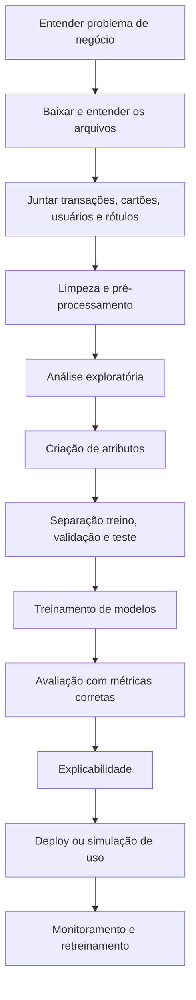

---

## 6. O que o modelo deve e não deve fazer

### 6.1. O que ele deve fazer

Um bom modelo de fraude deve:

- priorizar transações com maior risco;
- ajudar analistas humanos;
- reduzir perdas financeiras;
- produzir uma pontuação de risco;
- permitir auditoria;
- ser monitorado ao longo do tempo;
- explicar minimamente por que uma transação foi marcada.

### 6.2. O que ele não deve fazer sozinho

Um modelo não deve:

- bloquear todas as transações automaticamente sem regra de negócio;
- usar dados sensíveis sem justificativa;
- tomar decisão sem monitoramento;
- ser avaliado apenas por acurácia;
- ser treinado com dados vazados;
- usar `card_number`, `cvv`, endereço completo ou identificadores como se fossem atributos úteis.

---

## 7. Pré-processamento dos dados

Pré-processamento é a etapa em que transformamos dados brutos em dados adequados para o modelo.

Em fraude, isso é uma das etapas mais importantes.

---

## 8. Carregando o dataset no Kaggle ou localmente

### 8.1. No Kaggle Notebook

```python
import pandas as pd
import json

BASE_PATH = "/kaggle/input/transactions-fraud-datasets"

transactions = pd.read_csv(f"{BASE_PATH}/transactions_data.csv")
cards = pd.read_csv(f"{BASE_PATH}/cards_data.csv")
users = pd.read_csv(f"{BASE_PATH}/users_data.csv")

with open(f"{BASE_PATH}/train_fraud_labels.json", "r") as f:
    fraud_json = json.load(f)

with open(f"{BASE_PATH}/mcc_codes.json", "r") as f:
    mcc_codes = json.load(f)
```

### 8.2. Localmente com `kagglehub`

```python
import kagglehub
import pandas as pd
import json
from pathlib import Path

path = kagglehub.dataset_download("computingvictor/transactions-fraud-datasets")
path = Path(path)

# Dependendo da versão do download, os arquivos podem estar em uma subpasta.
print(list(path.rglob("*.csv")))
print(list(path.rglob("*.json")))
```

---

## 9. Criando o rótulo de fraude

O arquivo `train_fraud_labels.json` traz o alvo do problema.

Exemplo genérico:

```python
import pandas as pd
import json

with open(f"{BASE_PATH}/train_fraud_labels.json", "r") as f:
    fraud_json = json.load(f)

fraud_labels = pd.Series(fraud_json["target"], name="is_fraud")
fraud_labels.index = fraud_labels.index.astype(int)
fraud_labels = fraud_labels.map({"Yes": 1, "No": 0})

transactions = transactions.merge(
    fraud_labels,
    left_on="id",
    right_index=True,
    how="left"
)

transactions["is_fraud"] = transactions["is_fraud"].fillna(0).astype(int)
```

### Observação importante

Se uma transação não aparece no arquivo de rótulos, precisamos confirmar se isso realmente significa `não fraude` ou apenas `sem rótulo`.

Em muitos projetos reais, ausência de rótulo não significa ausência de fraude.

---

## 10. Limpeza de valores monetários

Muitas colunas monetárias vêm como texto, por exemplo:

```text
$123.45
```

O modelo precisa de número:

```python
def money_to_float(value):
    if pd.isna(value):
        return None
    if isinstance(value, str):
        value = value.replace("$", "").replace(",", "")
    return float(value)

transactions["amount"] = transactions["amount"].apply(money_to_float)
cards["credit_limit"] = cards["credit_limit"].apply(money_to_float)
users["per_capita_income"] = users["per_capita_income"].apply(money_to_float)
users["yearly_income"] = users["yearly_income"].apply(money_to_float)
users["total_debt"] = users["total_debt"].apply(money_to_float)
```

---

## 11. Junção das tabelas

Para enriquecer a transação, podemos juntar:

```text
transactions + cards + users + mcc_codes + fraud_labels
```

Fluxo:

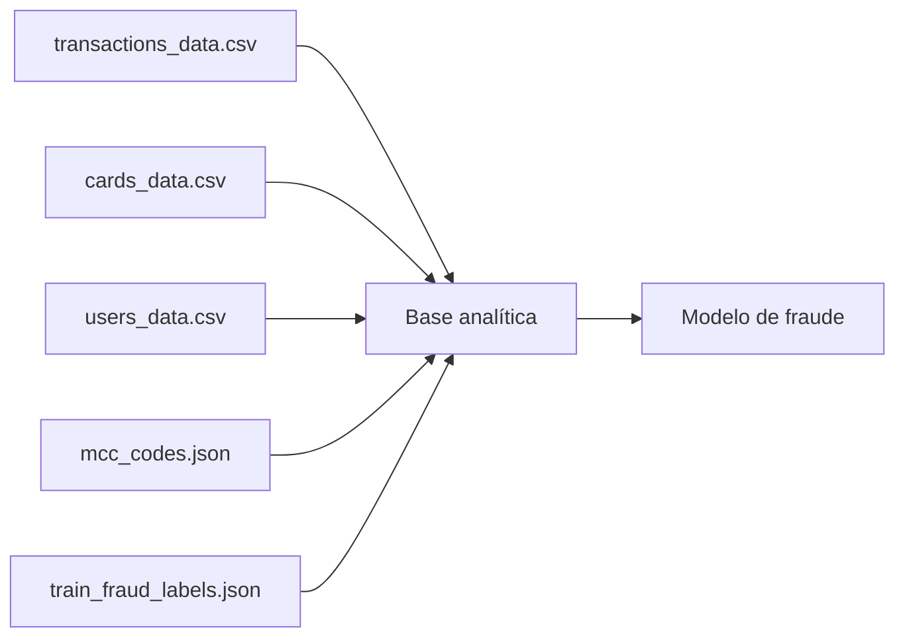

Código:

```python
# Renomeando IDs para evitar conflito
cards_renamed = cards.rename(columns={"id": "card_id"})
users_renamed = users.rename(columns={"id": "client_id"})

# Merge transações + cartões
df = transactions.merge(cards_renamed, on="card_id", how="left", suffixes=("", "_card"))

# Merge com usuários
df = df.merge(users_renamed, on="client_id", how="left", suffixes=("", "_user"))
```

---

## 12. Vazamento de informação

Vazamento de informação acontece quando o modelo aprende usando dados que não estariam disponíveis no momento real da previsão.

Em fraude, isso é muito perigoso.

### 12.1. Exemplos de vazamento nesse projeto

| Situação | Por que é vazamento? |
|---|---|
| Usar uma coluna criada depois da investigação da fraude | Na hora da transação essa informação não existia. |
| Aplicar SMOTE antes de separar treino e teste | O teste fica contaminado por dados sintéticos derivados do treino. |
| Calcular média de fraude por comerciante usando toda a base | O modelo aprende informação do futuro. |
| Normalizar usando toda a base antes do split | O teste influencia os parâmetros da escala. |
| Escolher features olhando o teste várias vezes | O teste deixa de ser uma avaliação honesta. |

### 12.2. Regra de ouro

> Tudo que aprende parâmetros deve ser ajustado apenas no treino.

Exemplos:

- `StandardScaler.fit()` somente no treino;
- `OneHotEncoder.fit()` somente no treino;
- imputação somente no treino;
- seleção de atributos somente no treino;
- balanceamento somente no treino;
- PCA somente no treino.

---

## 13. Separação treino, validação e teste

### 13.1. Separação aleatória simples

Serve para estudo inicial:

```python
from sklearn.model_selection import train_test_split

X = df.drop(columns=["is_fraud"])
y = df["is_fraud"]

X_train, X_temp, y_train, y_temp = train_test_split(
    X,
    y,
    test_size=0.30,
    random_state=42,
    stratify=y
)

X_val, X_test, y_val, y_test = train_test_split(
    X_temp,
    y_temp,
    test_size=0.50,
    random_state=42,
    stratify=y_temp
)
```

### 13.2. Separação temporal

Para fraude, a separação temporal é mais realista.

Exemplo:

```text
Treino: transações de 2010 a 2017
Validação: transações de 2018
Teste: transações de 2019
```

Por quê?

Porque no mundo real você treina com o passado e prevê o futuro.

```python
df["date"] = pd.to_datetime(df["date"])

df_train = df[df["date"] < "2018-01-01"]
df_val = df[(df["date"] >= "2018-01-01") & (df["date"] < "2019-01-01")]
df_test = df[df["date"] >= "2019-01-01"]
```

### 13.3. Qual separação eu usaria?

Para estudo inicial:

- `train_test_split` estratificado.

Para projeto sério de fraude:

- separação temporal;
- validação por janelas de tempo;
- teste final com período mais recente.

---

## 14. Valores nulos

Valores nulos podem significar várias coisas.

Exemplos:

| Coluna | Possível motivo de nulo | O que fazer? |
|---|---|---|
| `merchant_state` | Transação online | Criar categoria `ONLINE_OR_UNKNOWN`. |
| `zip` | Online ou dado ausente | Imputar ou criar indicador de nulo. |
| `errors` | Sem erro | Transformar nulo em `NO_ERROR`. |
| renda | Cadastro incompleto | Imputar pela mediana. |

### 14.1. Quando deletar linhas?

Delete linhas quando:

- a quantidade é pequena;
- o nulo é claramente erro de extração;
- a linha não tem informação suficiente;
- não existe risco de remover seletivamente a classe minoritária.

Em fraude, cuidado: remover linhas pode remover justamente fraudes raras.

### 14.2. Quando imputar?

Impute quando:

- a coluna é importante;
- o nulo tem padrão conhecido;
- a perda de linhas seria grande;
- o modelo consegue se beneficiar da informação.

### 14.3. Imputação recomendada

Para numéricas:

- mediana geralmente é melhor que média quando há outliers.

Para categóricas:

- valor mais frequente;
- ou uma categoria explícita: `UNKNOWN`, `MISSING`, `ONLINE`.

```python
from sklearn.impute import SimpleImputer

num_imputer = SimpleImputer(strategy="median")
cat_imputer = SimpleImputer(strategy="most_frequent")
```

---

## 15. Duplicados

Duplicados podem ser:

- erro de carga;
- transação repetida de verdade;
- múltiplas tentativas de pagamento;
- registros parecidos, mas não iguais.

### 15.1. Como investigar

```python
df.duplicated().sum()
df["id"].duplicated().sum()
```

### 15.2. O que eu faria

- Se `id` repetido com os mesmos dados: remover duplicado.
- Se `id` repetido com dados diferentes: investigar problema de origem.
- Se transações parecidas em sequência: não remover automaticamente, pois pode ser padrão fraudulento.

---

## 16. Variáveis categóricas: dummy, label encoding e frequency encoding

### 16.1. One-Hot Encoding / Dummy

Transforma categorias em colunas binárias.

Exemplo:

```text
use_chip = Online Transaction
```

Vira:

```text
use_chip_Online Transaction = 1
use_chip_Chip Transaction = 0
use_chip_Swipe Transaction = 0
```

Uso recomendado:

- poucas categorias;
- modelos lineares;
- redes neurais simples;
- árvores também aceitam, mas podem gerar muitas colunas.

```python
from sklearn.preprocessing import OneHotEncoder

encoder = OneHotEncoder(handle_unknown="ignore")
```

### 16.2. Label Encoding

Transforma categoria em número.

```text
Visa = 0
Mastercard = 1
Amex = 2
```

Cuidado: o modelo pode interpretar que `2 > 1 > 0`, como se houvesse ordem.

Uso recomendado:

- target `y`;
- modelos que aceitam categorias ordinalmente com cuidado;
- algumas bibliotecas específicas.

Não é minha primeira escolha para `card_brand` em Scikit-learn comum.

### 16.3. Frequency Encoding

Substitui cada categoria pela frequência dela.

Exemplo:

```text
merchant_id 123 aparece em 2% das transações
```

Vira:

```text
merchant_id_freq = 0.02
```

Útil quando:

- existem muitas categorias;
- `merchant_id` tem cardinalidade alta;
- one-hot criaria colunas demais.

```python
freq = X_train["merchant_id"].value_counts(normalize=True)
X_train["merchant_id_freq"] = X_train["merchant_id"].map(freq)
X_val["merchant_id_freq"] = X_val["merchant_id"].map(freq).fillna(0)
X_test["merchant_id_freq"] = X_test["merchant_id"].map(freq).fillna(0)
```

A frequência deve ser calculada apenas no treino.

---

## 17. Normalização e padronização

### 17.1. Padronização

Transforma os dados para média 0 e desvio padrão 1.

\[
z = \frac{x - \mu}{\sigma}
\]

Uso recomendado para:

- Regressão Logística;
- SVM;
- KNN;
- Redes neurais;
- PCA.

### 17.2. Normalização Min-Max

Coloca os dados em uma escala entre 0 e 1.

\[
x' = \frac{x - x_{min}}{x_{max} - x_{min}}
\]

Uso comum:

- redes neurais;
- KNN;
- algoritmos baseados em distância.

### 17.3. Árvores precisam de escala?

Geralmente não.

Modelos como:

- Árvore de Decisão;
- Random Forest;
- XGBoost;
- LightGBM;

não dependem tanto de escala.

Mas se o pipeline tiver PCA, KNN ou rede neural, escala é importante.

---

## 18. Criação de atributos

Feature engineering é transformar dados brutos em sinais úteis.

### 18.1. Atributos de data

```python
df["date"] = pd.to_datetime(df["date"])
df["hour"] = df["date"].dt.hour
df["day_of_week"] = df["date"].dt.dayofweek
df["month"] = df["date"].dt.month
df["is_weekend"] = df["day_of_week"].isin([5, 6]).astype(int)
```

Possíveis interpretações:

- transações de madrugada podem ter risco diferente;
- finais de semana podem ter padrão diferente;
- alguns golpes ocorrem em horários específicos.

### 18.2. Atributos de valor

```python
df["amount_abs"] = df["amount"].abs()
df["amount_to_credit_limit"] = df["amount_abs"] / (df["credit_limit"] + 1)
df["debt_to_income"] = df["total_debt"] / (df["yearly_income"] + 1)
```

Esses atributos podem ser mais úteis que o valor puro.

Exemplo:

```text
R$ 900 pode ser pouco para um cliente com limite de R$ 50.000,
mas muito para um cartão com limite de R$ 1.000.
```

### 18.3. Atributos históricos

Exemplos:

- média de valor por cliente nos últimos 30 dias;
- quantidade de transações do cliente no dia;
- valor atual dividido pela média histórica do cliente;
- primeira transação naquela cidade;
- primeira transação naquele MCC;
- quantidade de erros recentes.

Cuidado: atributos históricos devem ser calculados apenas usando passado.

---

## 19. Correlação, informação mútua e importância de atributos

### 19.1. Correlação

Correlação mede relação linear entre variáveis numéricas.

Exemplo:

```python
corr = df[["amount_abs", "credit_limit", "yearly_income", "total_debt", "credit_score", "is_fraud"]].corr()
print(corr["is_fraud"].sort_values(ascending=False))
```

Limitação:

- só captura relação linear;
- não funciona bem com categóricas sem transformação;
- correlação baixa não significa que a variável é inútil.

### 19.2. Informação mútua

Mede dependência geral, inclusive não linear.

```python
from sklearn.feature_selection import mutual_info_classif

mi = mutual_info_classif(X_train_prepared, y_train, random_state=42)
```

Boa para:

- ranking inicial de atributos;
- detectar variáveis não lineares;
- comparar sinais.

### 19.3. Importância de atributos em árvores

```python
import pandas as pd

importances = model.feature_importances_
feature_importance = pd.Series(importances, index=feature_names).sort_values(ascending=False)
print(feature_importance.head(20))
```

Cuidado:

- importância não é causalidade;
- atributos com muitas categorias podem parecer mais importantes;
- importância pode mudar conforme o modelo.

---

## 20. PCA

PCA reduz dimensionalidade criando componentes que resumem variações dos dados.

Uso possível neste projeto:

- reduzir colunas depois de one-hot;
- visualizar transações em 2D;
- ajudar modelos sensíveis à dimensionalidade.

Mas cuidado:

- perde interpretabilidade;
- não é ideal quando explicação é prioridade;
- deve ser ajustado apenas no treino.

```python
from sklearn.decomposition import PCA

pca = PCA(n_components=2, random_state=42)
X_2d = pca.fit_transform(X_train_scaled)
```

---

## 21. RadViz

RadViz é uma visualização que posiciona cada atributo como uma âncora em círculo e mostra as amostras puxadas por essas variáveis.

Pode ajudar a observar se fraudes e não fraudes se separam visualmente.

```python
from pandas.plotting import radviz
import matplotlib.pyplot as plt

sample = df[["amount_abs", "credit_limit", "credit_score", "num_credit_cards", "is_fraud"]].dropna().sample(2000, random_state=42)
sample["classe"] = sample["is_fraud"].map({0: "legitima", 1: "fraude"})
sample = sample.drop(columns=["is_fraud"])

plt.figure(figsize=(8, 8))
radviz(sample, "classe")
plt.show()
```

Interpretação:

- se as classes aparecem misturadas, o problema é difícil;
- se há agrupamentos, pode haver sinal útil;
- é visualização exploratória, não prova de qualidade do modelo.

---

## 22. Classes desbalanceadas

Fraude normalmente é rara.

Exemplo conceitual:

```text
99,9% transações legítimas
0,1% fraudes
```

Se um modelo disser sempre “não fraude”, ele pode ter 99,9% de acurácia e ainda ser inútil.

### 22.1. Por que acurácia engana?

Imagine:

```text
1.000.000 transações
1.000 fraudes
999.000 legítimas
```

Modelo burro:

```text
prevê tudo como legítimo
```

Resultado:

```text
acurácia = 99,9%
f fraudes encontradas = 0
```

Logo, acurácia não é a métrica principal.

### 22.2. Estratégias

| Estratégia | Explicação | Cuidado |
|---|---|---|
| `class_weight` | Dá mais peso à fraude no treinamento | Simples e eficiente. |
| Undersampling | Reduz a classe majoritária | Pode perder informação. |
| Oversampling | Replica a classe minoritária | Pode overfitar. |
| SMOTE | Cria exemplos sintéticos | Aplicar só no treino. |
| Threshold tuning | Ajusta ponto de corte | Muito importante no negócio. |
| Modelos robustos | Random Forest, XGBoost, LightGBM | Avaliar com PR-AUC e recall. |

---

## 23. Métricas de classificação

### 23.1. Matriz de confusão

```text
                    Previsto: Não fraude    Previsto: Fraude
Real: Não fraude       TN                       FP
Real: Fraude           FN                       TP
```

Onde:

- `TP`: fraude detectada corretamente;
- `FP`: transação legítima marcada como fraude;
- `FN`: fraude que passou despercebida;
- `TN`: legítima reconhecida como legítima.

### 23.2. Precision

Das transações marcadas como fraude, quantas eram fraude de verdade?

\[
Precision = \frac{TP}{TP + FP}
\]

Alta precision significa menos falsos alarmes.

### 23.3. Recall

Das fraudes reais, quantas foram encontradas?

\[
Recall = \frac{TP}{TP + FN}
\]

Alto recall significa encontrar mais fraudes.

### 23.4. F1-score

Combina precision e recall.

\[
F1 = 2 \cdot \frac{Precision \cdot Recall}{Precision + Recall}
\]

### 23.5. ROC-AUC

Mede a capacidade geral do modelo separar classes.

Boa métrica geral, mas pode parecer otimista em datasets muito desbalanceados.

### 23.6. PR-AUC

Área sob a curva Precision-Recall.

Em fraude, costuma ser mais informativa que ROC-AUC.

### 23.7. Métrica de negócio

Em fraude, também podemos calcular:

```text
benefício = valor das fraudes bloqueadas - custo dos falsos positivos - custo operacional de análise
```

Exemplo:

```python
def business_score(y_true, y_pred, amount):
    tp_gain = amount[(y_true == 1) & (y_pred == 1)].sum()
    fp_cost = 5 * ((y_true == 0) & (y_pred == 1)).sum()
    fn_cost = amount[(y_true == 1) & (y_pred == 0)].sum()
    return tp_gain - fp_cost - fn_cost
```

---

## 24. Pipeline completo com Scikit-learn

### 24.1. Selecionando colunas

```python
DROP_COLS = [
    "id",
    "client_id",
    "card_id",
    "card_number",
    "cvv",
    "address",
    "date"
]

TARGET = "is_fraud"

features = [c for c in df.columns if c not in DROP_COLS + [TARGET]]
X = df[features]
y = df[TARGET]
```

### 24.2. Separando numéricas e categóricas

```python
numeric_features = X.select_dtypes(include=["int64", "float64", "int32", "float32"]).columns.tolist()
categorical_features = X.select_dtypes(include=["object", "category", "bool"]).columns.tolist()
```

### 24.3. Pipeline de pré-processamento

```python
from sklearn.compose import ColumnTransformer
from sklearn.pipeline import Pipeline
from sklearn.impute import SimpleImputer
from sklearn.preprocessing import StandardScaler, OneHotEncoder

numeric_transformer = Pipeline(steps=[
    ("imputer", SimpleImputer(strategy="median")),
    ("scaler", StandardScaler())
])

categorical_transformer = Pipeline(steps=[
    ("imputer", SimpleImputer(strategy="most_frequent")),
    ("onehot", OneHotEncoder(handle_unknown="ignore"))
])

preprocess = ColumnTransformer(
    transformers=[
        ("num", numeric_transformer, numeric_features),
        ("cat", categorical_transformer, categorical_features)
    ]
)
```

### 24.4. Modelo baseline: Regressão Logística

```python
from sklearn.linear_model import LogisticRegression

clf = Pipeline(steps=[
    ("preprocess", preprocess),
    ("model", LogisticRegression(
        max_iter=1000,
        class_weight="balanced",
        random_state=42
    ))
])

clf.fit(X_train, y_train)
```

Por que começar com Regressão Logística?

- simples;
- rápida;
- boa baseline;
- interpretável;
- ajuda a validar o pipeline.

---

## 25. Avaliação do modelo

```python
from sklearn.metrics import classification_report, confusion_matrix, roc_auc_score, average_precision_score

proba = clf.predict_proba(X_test)[:, 1]
y_pred = (proba >= 0.5).astype(int)

print(confusion_matrix(y_test, y_pred))
print(classification_report(y_test, y_pred))
print("ROC-AUC:", roc_auc_score(y_test, proba))
print("PR-AUC:", average_precision_score(y_test, proba))
```

---

## 26. Ajuste de threshold

O threshold padrão é `0.5`, mas em fraude raramente isso é ideal.

Exemplo:

```python
import numpy as np
from sklearn.metrics import precision_score, recall_score, f1_score

thresholds = np.arange(0.05, 0.95, 0.05)

for t in thresholds:
    y_pred_t = (proba >= t).astype(int)
    print(
        t,
        precision_score(y_test, y_pred_t, zero_division=0),
        recall_score(y_test, y_pred_t, zero_division=0),
        f1_score(y_test, y_pred_t, zero_division=0)
    )
```

### Interpretação

- Threshold baixo: pega mais fraudes, mas gera mais falsos positivos.
- Threshold alto: gera menos falsos positivos, mas pode deixar fraudes passarem.

Em banco real, a decisão depende do custo:

```text
É pior bloquear uma compra legítima ou deixar uma fraude passar?
```

---

## 27. Curva ROC

```python
from sklearn.metrics import RocCurveDisplay
import matplotlib.pyplot as plt

RocCurveDisplay.from_predictions(y_test, proba)
plt.show()
```

A curva ROC mostra a relação entre:

- taxa de verdadeiros positivos;
- taxa de falsos positivos.

Em fraude, use também Precision-Recall.

```python
from sklearn.metrics import PrecisionRecallDisplay

PrecisionRecallDisplay.from_predictions(y_test, proba)
plt.show()
```

---

## 28. Curva de aprendizado

A curva de aprendizado ajuda a entender se o modelo precisa de mais dados, menos complexidade ou melhores atributos.

```python
from sklearn.model_selection import learning_curve
import numpy as np
import matplotlib.pyplot as plt

train_sizes, train_scores, val_scores = learning_curve(
    clf,
    X_train,
    y_train,
    cv=3,
    scoring="average_precision",
    train_sizes=np.linspace(0.1, 1.0, 5),
    n_jobs=-1
)

plt.plot(train_sizes, train_scores.mean(axis=1), label="Treino")
plt.plot(train_sizes, val_scores.mean(axis=1), label="Validação")
plt.xlabel("Tamanho do treino")
plt.ylabel("PR-AUC")
plt.legend()
plt.show()
```

### Como interpretar

| Situação | Diagnóstico |
|---|---|
| Treino alto, validação baixa | Overfitting. |
| Treino e validação baixos | Underfitting. |
| Validação melhora com mais dados | Coletar mais dados pode ajudar. |
| Curvas próximas e boas | Modelo está generalizando bem. |

---

## 29. Overfitting e underfitting

### 29.1. Overfitting

O modelo decora o treino, mas falha no teste.

Sinais:

- métrica de treino muito alta;
- métrica de validação baixa;
- modelo muito complexo;
- muitas features de alta cardinalidade;
- vazamento acidental.

Como reduzir:

- regularização;
- reduzir profundidade de árvores;
- mais dados;
- validação temporal;
- remover features suspeitas;
- early stopping;
- simplificar modelo.

### 29.2. Underfitting

O modelo é simples demais.

Sinais:

- treino ruim;
- validação ruim;
- modelo não captura padrões.

Como melhorar:

- criar melhores atributos;
- usar modelo mais poderoso;
- reduzir regularização;
- melhorar dados;
- adicionar interações.

---

## 30. Comparando vários modelos

Eu trabalharia com um “fórum de modelos”, ou seja, um conjunto de candidatos competindo sob a mesma regra de avaliação.

Modelos iniciais:

1. Regressão Logística;
2. Random Forest;
3. HistGradientBoosting;
4. XGBoost ou LightGBM, se disponíveis;
5. Isolation Forest para anomalia;
6. Rede neural simples como comparação.

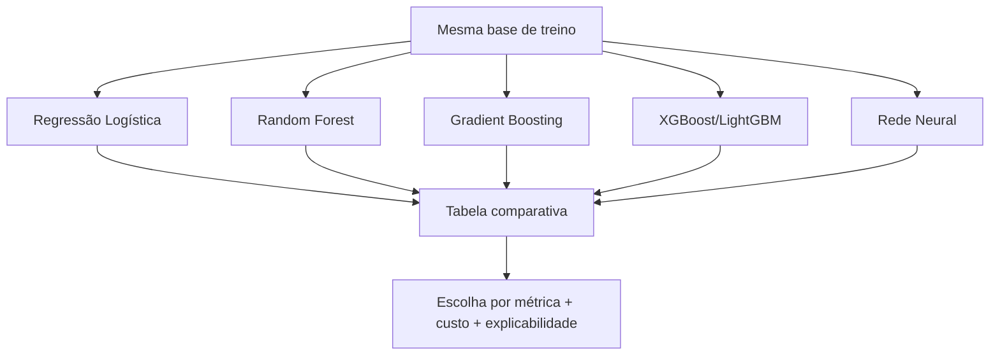

### 30.1. Critérios de escolha

Eu escolheria o modelo considerando:

- PR-AUC;
- recall de fraude;
- precision;
- custo de falso positivo;
- custo de falso negativo;
- estabilidade temporal;
- velocidade de inferência;
- explicabilidade;
- facilidade de manutenção.

---

## 31. Grid Search

Grid Search testa combinações de hiperparâmetros.

Exemplo com Random Forest:

```python
from sklearn.ensemble import RandomForestClassifier
from sklearn.model_selection import GridSearchCV

rf_pipeline = Pipeline(steps=[
    ("preprocess", preprocess),
    ("model", RandomForestClassifier(
        class_weight="balanced",
        random_state=42,
        n_jobs=-1
    ))
])

param_grid = {
    "model__n_estimators": [100, 300],
    "model__max_depth": [5, 10, None],
    "model__min_samples_leaf": [1, 5, 20]
}

grid = GridSearchCV(
    rf_pipeline,
    param_grid=param_grid,
    scoring="average_precision",
    cv=3,
    n_jobs=-1,
    verbose=1
)

grid.fit(X_train, y_train)

print(grid.best_params_)
print(grid.best_score_)
```

### 31.1. Quando usar Grid Search?

Use quando:

- o espaço de busca é pequeno;
- você quer comparação controlada;
- o custo computacional é aceitável.

### 31.2. Quando preferir Random Search ou Optuna?

Prefira quando:

- existem muitos hiperparâmetros;
- o dataset é grande;
- cada treino é caro;
- você quer otimização mais inteligente.

---

## 32. Automatizando e melhorando o treinamento

Um pipeline maduro teria:

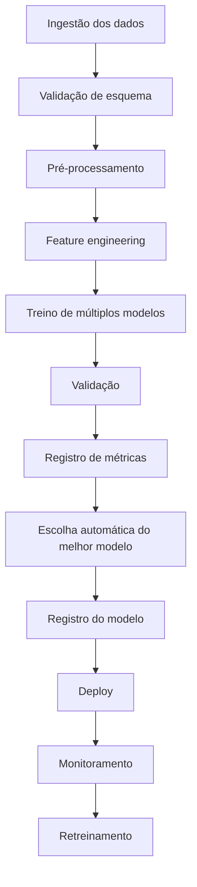

Ferramentas possíveis:

- Scikit-learn Pipeline;
- MLflow;
- Optuna;
- DVC;
- Airflow;
- Prefect;
- Dagster;
- Evidently AI;
- Great Expectations;
- Pandera.

---

## 33. Explicabilidade dos modelos

Em fraude, explicar é essencial.

Perguntas importantes:

> Por que essa transação foi marcada como suspeita?

> Quais atributos mais influenciaram?

> O modelo está usando uma variável indevida?

### 33.1. Explicação global

Mostra o que o modelo considera importante em geral.

Exemplo:

```python
feature_importance.head(20)
```

### 33.2. Explicação local

Explica uma transação específica.

Exemplo conceitual:

```text
Transação 982331 marcada como fraude porque:
- valor muito alto em relação ao limite;
- transação online;
- comerciante incomum para o cliente;
- cartão apareceu na dark web;
- horário fora do padrão.
```

### 33.3. SHAP

SHAP é uma técnica muito usada para explicabilidade.

```python
# Exemplo conceitual
import shap

explainer = shap.Explainer(model)
shap_values = explainer(X_sample)
shap.plots.waterfall(shap_values[0])
```

---

## 34. Testes em projeto de Machine Learning

Testar ML não é só testar código. É testar dados, pipeline e comportamento.

### 34.1. Testes de dados

Exemplos:

```python
assert df["amount"].notna().mean() > 0.99
assert df["is_fraud"].isin([0, 1]).all()
assert df["date"].notna().all()
```

### 34.2. Testes de pipeline

```python
def test_pipeline_fit_predict():
    model.fit(X_train.head(100), y_train.head(100))
    preds = model.predict(X_test.head(10))
    assert len(preds) == 10
```

### 34.3. Testes de vazamento

Verificar se colunas proibidas não estão no treino:

```python
forbidden_cols = ["card_number", "cvv", "address", "id"]
for col in forbidden_cols:
    assert col not in features
```

### 34.4. Testes de performance mínima

```python
assert average_precision_score(y_test, proba) > 0.10
```

O valor mínimo depende do problema e da baseline.

---

## 35. Retreinamento do modelo

Fraude muda com o tempo. Isso se chama **drift**.

Golpistas mudam padrões, clientes mudam hábitos e novos tipos de transação aparecem.

### 35.1. Quando retreinar?

Retreinar quando:

- a métrica caiu;
- o padrão de transações mudou;
- surgiram novas categorias;
- houve mudança de regra de negócio;
- passou um período fixo, como mensal ou trimestral;
- o volume de novas fraudes rotuladas é suficiente.

### 35.2. Estratégia prática

```text
Todo mês:
1. coletar novas transações rotuladas;
2. validar qualidade dos dados;
3. treinar candidatos;
4. comparar com modelo atual;
5. promover novo modelo apenas se melhorar;
6. arquivar modelo anterior para rollback.
```

### 35.3. Monitoramento

Monitorar:

- taxa de transações marcadas como suspeitas;
- precision após investigação;
- recall estimado;
- distribuição de valores;
- distribuição de MCC;
- novos comerciantes;
- drift de atributos;
- tempo de resposta do modelo.

---

## 36. Exemplo prático completo: baseline de fraude

```python
import pandas as pd
import numpy as np
import json

from sklearn.model_selection import train_test_split
from sklearn.compose import ColumnTransformer
from sklearn.pipeline import Pipeline
from sklearn.impute import SimpleImputer
from sklearn.preprocessing import OneHotEncoder, StandardScaler
from sklearn.linear_model import LogisticRegression
from sklearn.metrics import classification_report, confusion_matrix, roc_auc_score, average_precision_score

BASE_PATH = "/kaggle/input/transactions-fraud-datasets"

transactions = pd.read_csv(f"{BASE_PATH}/transactions_data.csv")
cards = pd.read_csv(f"{BASE_PATH}/cards_data.csv")
users = pd.read_csv(f"{BASE_PATH}/users_data.csv")

with open(f"{BASE_PATH}/train_fraud_labels.json", "r") as f:
    fraud_json = json.load(f)

def money_to_float(value):
    if pd.isna(value):
        return np.nan
    if isinstance(value, str):
        value = value.replace("$", "").replace(",", "")
    return float(value)

# Rótulo
fraud_labels = pd.Series(fraud_json["target"], name="is_fraud")
fraud_labels.index = fraud_labels.index.astype(int)
fraud_labels = fraud_labels.map({"Yes": 1, "No": 0})

transactions = transactions.merge(
    fraud_labels,
    left_on="id",
    right_index=True,
    how="left"
)
transactions["is_fraud"] = transactions["is_fraud"].fillna(0).astype(int)

# Limpeza monetária
transactions["amount"] = transactions["amount"].apply(money_to_float)
cards["credit_limit"] = cards["credit_limit"].apply(money_to_float)
users["per_capita_income"] = users["per_capita_income"].apply(money_to_float)
users["yearly_income"] = users["yearly_income"].apply(money_to_float)
users["total_debt"] = users["total_debt"].apply(money_to_float)

# Datas
transactions["date"] = pd.to_datetime(transactions["date"])
transactions["hour"] = transactions["date"].dt.hour
transactions["day_of_week"] = transactions["date"].dt.dayofweek
transactions["month"] = transactions["date"].dt.month
transactions["is_weekend"] = transactions["day_of_week"].isin([5, 6]).astype(int)
transactions["amount_abs"] = transactions["amount"].abs()

# Renomear IDs
cards = cards.rename(columns={"id": "card_id"})
users = users.rename(columns={"id": "client_id"})

# Merge
cards_safe = cards.drop(columns=["card_number", "cvv"], errors="ignore")
users_safe = users.drop(columns=["address"], errors="ignore")

df = transactions.merge(cards_safe, on="card_id", how="left")
df = df.merge(users_safe, on="client_id", how="left")

# Features derivadas
df["amount_to_credit_limit"] = df["amount_abs"] / (df["credit_limit"] + 1)
df["debt_to_income"] = df["total_debt"] / (df["yearly_income"] + 1)

# Remover colunas proibidas ou técnicas
DROP_COLS = [
    "id",
    "client_id",
    "card_id",
    "date",
    "merchant_id",
    "zip"
]

TARGET = "is_fraud"

X = df.drop(columns=DROP_COLS + [TARGET], errors="ignore")
y = df[TARGET]

# Separação estratificada para baseline
X_train, X_test, y_train, y_test = train_test_split(
    X,
    y,
    test_size=0.30,
    random_state=42,
    stratify=y
)

numeric_features = X_train.select_dtypes(include=["int64", "float64", "int32", "float32"]).columns.tolist()
categorical_features = X_train.select_dtypes(include=["object", "category", "bool"]).columns.tolist()

numeric_transformer = Pipeline(steps=[
    ("imputer", SimpleImputer(strategy="median")),
    ("scaler", StandardScaler())
])

categorical_transformer = Pipeline(steps=[
    ("imputer", SimpleImputer(strategy="most_frequent")),
    ("onehot", OneHotEncoder(handle_unknown="ignore"))
])

preprocess = ColumnTransformer(
    transformers=[
        ("num", numeric_transformer, numeric_features),
        ("cat", categorical_transformer, categorical_features)
    ]
)

model = Pipeline(steps=[
    ("preprocess", preprocess),
    ("classifier", LogisticRegression(
        max_iter=1000,
        class_weight="balanced",
        random_state=42
    ))
])

model.fit(X_train, y_train)

proba = model.predict_proba(X_test)[:, 1]
y_pred = (proba >= 0.5).astype(int)

print(confusion_matrix(y_test, y_pred))
print(classification_report(y_test, y_pred))
print("ROC-AUC:", roc_auc_score(y_test, proba))
print("PR-AUC:", average_precision_score(y_test, proba))
```

---

## 37. Exemplo com Random Forest

```python
from sklearn.ensemble import RandomForestClassifier

rf_model = Pipeline(steps=[
    ("preprocess", preprocess),
    ("classifier", RandomForestClassifier(
        n_estimators=300,
        max_depth=12,
        min_samples_leaf=10,
        class_weight="balanced",
        random_state=42,
        n_jobs=-1
    ))
])

rf_model.fit(X_train, y_train)

rf_proba = rf_model.predict_proba(X_test)[:, 1]
rf_pred = (rf_proba >= 0.5).astype(int)

print(classification_report(y_test, rf_pred))
print("ROC-AUC:", roc_auc_score(y_test, rf_proba))
print("PR-AUC:", average_precision_score(y_test, rf_proba))
```

---

## 38. Exemplo com Keras/TensorFlow

Redes neurais podem funcionar bem, mas exigem mais cuidado com escala, desbalanceamento e volume.

```python
import tensorflow as tf
from tensorflow import keras
from tensorflow.keras import layers

# Primeiro transforma X usando o preprocessador do Scikit-learn
X_train_prepared = preprocess.fit_transform(X_train)
X_test_prepared = preprocess.transform(X_test)

input_dim = X_train_prepared.shape[1]

nn = keras.Sequential([
    layers.Input(shape=(input_dim,)),
    layers.Dense(128, activation="relu"),
    layers.Dropout(0.3),
    layers.Dense(64, activation="relu"),
    layers.Dropout(0.2),
    layers.Dense(1, activation="sigmoid")
])

nn.compile(
    optimizer="adam",
    loss="binary_crossentropy",
    metrics=[
        keras.metrics.AUC(name="roc_auc"),
        keras.metrics.AUC(name="pr_auc", curve="PR")
    ]
)

# Peso maior para fraude
class_weight = {
    0: 1.0,
    1: (y_train.value_counts()[0] / y_train.value_counts()[1])
}

history = nn.fit(
    X_train_prepared,
    y_train,
    validation_split=0.2,
    epochs=10,
    batch_size=2048,
    class_weight=class_weight,
    callbacks=[
        keras.callbacks.EarlyStopping(
            monitor="val_pr_auc",
            patience=3,
            mode="max",
            restore_best_weights=True
        )
    ]
)

nn_proba = nn.predict(X_test_prepared).ravel()
```

### Quando eu usaria rede neural nesse caso?

Usaria se:

- houver muitos dados;
- houver padrões não lineares complexos;
- houver embeddings para categorias;
- houver necessidade de combinar transações sequenciais;
- houver intenção de usar autoencoders para anomalia.

Não começaria por rede neural. Começaria por baseline simples e modelos de árvore.

---

## 39. Exemplo de detecção de anomalia com Isolation Forest

Esse exemplo é útil quando queremos detectar transações incomuns sem depender totalmente de rótulos.

```python
from sklearn.ensemble import IsolationForest
from sklearn.metrics import classification_report

# Usando apenas dados preparados
X_train_prepared = preprocess.fit_transform(X_train)
X_test_prepared = preprocess.transform(X_test)

iso = IsolationForest(
    n_estimators=200,
    contamination=0.001,
    random_state=42,
    n_jobs=-1
)

iso.fit(X_train_prepared)

# IsolationForest retorna -1 para anomalia e 1 para normal
iso_pred_raw = iso.predict(X_test_prepared)
iso_pred = (iso_pred_raw == -1).astype(int)

print(classification_report(y_test, iso_pred))
```

### Interpretação

- Não necessariamente toda anomalia é fraude.
- Nem toda fraude parece anomalia.
- O modelo pode ser útil para priorizar investigação.

---

## 40. Exemplo de clustering de perfis de clientes

Podemos segmentar clientes por comportamento financeiro.

```python
from sklearn.cluster import KMeans
from sklearn.preprocessing import StandardScaler

customer_features = users[[
    "current_age",
    "yearly_income",
    "total_debt",
    "credit_score",
    "num_credit_cards"
]].copy()

for col in ["yearly_income", "total_debt"]:
    customer_features[col] = customer_features[col].apply(money_to_float)

customer_features = customer_features.dropna()

scaler = StandardScaler()
X_customers = scaler.fit_transform(customer_features)

kmeans = KMeans(n_clusters=4, random_state=42, n_init="auto")
clusters = kmeans.fit_predict(X_customers)

customer_features["cluster"] = clusters
print(customer_features.groupby("cluster").mean())
```

Possíveis interpretações:

- clientes jovens com baixa renda e alto uso de crédito;
- clientes com alto score e baixa dívida;
- clientes com renda alta e muitos cartões;
- clientes com dívida alta e risco maior.

---

## 41. Exemplo de problema de regressão com o dataset

Podemos prever o valor absoluto da próxima transação ou o gasto mensal do cliente.

Exemplo simples:

```python
from sklearn.ensemble import RandomForestRegressor
from sklearn.metrics import mean_absolute_error, mean_squared_error, r2_score

reg_df = df.copy()
reg_df["amount_abs"] = reg_df["amount"].abs()

X_reg = reg_df.drop(columns=["amount", "amount_abs", "is_fraud"], errors="ignore")
y_reg = reg_df["amount_abs"]

X_train_reg, X_test_reg, y_train_reg, y_test_reg = train_test_split(
    X_reg,
    y_reg,
    test_size=0.30,
    random_state=42
)

num_reg = X_train_reg.select_dtypes(include=["int64", "float64", "int32", "float32"]).columns.tolist()
cat_reg = X_train_reg.select_dtypes(include=["object", "category", "bool"]).columns.tolist()

preprocess_reg = ColumnTransformer([
    ("num", Pipeline([
        ("imputer", SimpleImputer(strategy="median")),
        ("scaler", StandardScaler())
    ]), num_reg),
    ("cat", Pipeline([
        ("imputer", SimpleImputer(strategy="most_frequent")),
        ("onehot", OneHotEncoder(handle_unknown="ignore"))
    ]), cat_reg)
])

reg_model = Pipeline([
    ("preprocess", preprocess_reg),
    ("model", RandomForestRegressor(
        n_estimators=100,
        random_state=42,
        n_jobs=-1
    ))
])

reg_model.fit(X_train_reg, y_train_reg)

pred = reg_model.predict(X_test_reg)

print("MAE:", mean_absolute_error(y_test_reg, pred))
print("RMSE:", mean_squared_error(y_test_reg, pred, squared=False))
print("R2:", r2_score(y_test_reg, pred))
```

### Métricas de regressão

| Métrica | Interpretação |
|---|---|
| MAE | Erro médio absoluto. Fácil de explicar. |
| RMSE | Penaliza erros grandes. |
| R² | Percentual aproximado da variação explicada. |
| MAPE | Erro percentual, mas problemático quando há valores próximos de zero. |

---

## 42. Exemplo com imagem

O dataset principal é tabular, mas podemos estudar o paralelo com imagens.

Problema de imagem:

> Dada uma imagem de recibo, comprovante ou documento, classificar se parece legítimo ou suspeito.

Diferença principal:

| Dados tabulares | Imagens |
|---|---|
| Linhas e colunas | Pixels |
| Scikit-learn funciona bem | CNNs geralmente funcionam melhor |
| Feature engineering manual | Rede aprende padrões visuais |
| Explicação por atributos | Explicação por regiões da imagem |

Exemplo didático com Keras e MNIST:

```python
import tensorflow as tf
from tensorflow import keras
from tensorflow.keras import layers

(x_train, y_train), (x_test, y_test) = keras.datasets.mnist.load_data()

x_train = x_train / 255.0
x_test = x_test / 255.0

model_img = keras.Sequential([
    layers.Input(shape=(28, 28, 1)),
    layers.Conv2D(32, 3, activation="relu"),
    layers.MaxPooling2D(),
    layers.Conv2D(64, 3, activation="relu"),
    layers.MaxPooling2D(),
    layers.Flatten(),
    layers.Dense(64, activation="relu"),
    layers.Dense(10, activation="softmax")
])

model_img.compile(
    optimizer="adam",
    loss="sparse_categorical_crossentropy",
    metrics=["accuracy"]
)

model_img.fit(
    x_train[..., None],
    y_train,
    validation_split=0.2,
    epochs=3,
    batch_size=128
)

model_img.evaluate(x_test[..., None], y_test)
```

### Como isso se conecta ao problema de fraude?

Em bancos, um sistema completo pode combinar:

```text
modelo tabular de transações + modelo de imagem para documentos + modelo de texto para descrições e contestação
```

---

## 43. Modelo final recomendado para esse projeto

Para um projeto de estudo bem feito, eu faria assim:

### Etapa 1 — Baseline

- Regressão Logística;
- Pipeline completo;
- sem feature engineering avançado;
- métricas: PR-AUC, ROC-AUC, recall, precision.

### Etapa 2 — Modelo de árvore

- Random Forest;
- Gradient Boosting;
- comparar com baseline.

### Etapa 3 — Melhorar atributos

- horário;
- dia da semana;
- razão valor/limite;
- dívida/renda;
- categoria MCC;
- frequência de comerciante;
- indicadores de nulo;
- histórico por cliente sem vazamento temporal.

### Etapa 4 — Ajustar threshold

- escolher ponto de corte conforme custo de falso positivo e falso negativo.

### Etapa 5 — Explicabilidade

- importância global;
- exemplos locais;
- SHAP, se possível.

### Etapa 6 — Validação temporal

- simular passado prevendo futuro.

### Etapa 7 — Retreinamento

- script mensal;
- comparação com modelo atual;
- monitoramento de drift.

---

## 44. Projeto final sugerido para portfólio

### Título

**Sistema Inteligente de Detecção de Fraudes em Transações Financeiras com Machine Learning**

### Problema

Instituições financeiras precisam identificar transações fraudulentas rapidamente sem bloquear excessivamente clientes legítimos.

### Objetivo

Construir um pipeline de Machine Learning capaz de classificar transações como legítimas ou suspeitas, com foco em desempenho, explicabilidade e prevenção de vazamento de dados.

### Entregáveis

1. Notebook de EDA.
2. Notebook de feature engineering.
3. Pipeline de treinamento.
4. Comparação de modelos.
5. Análise de métricas.
6. Ajuste de threshold.
7. Explicabilidade.
8. API simples com FastAPI.
9. Dashboard com Streamlit.
10. Relatório final.

### Arquitetura sugerida

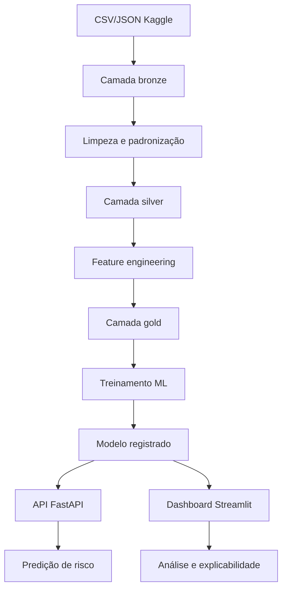

---


## 45. Arquitetura do projeto: como eu faria na prática

Agora vamos transformar o estudo em um **projeto organizado de Machine Learning aplicado à detecção de fraude em transações financeiras**.

A ideia não é apenas treinar um modelo em um notebook. A ideia é pensar como um projeto real, com código reutilizável, camadas claras, testes, rastreabilidade, validação e possibilidade de colocar o modelo em produção.

### 45.1. Objetivo da arquitetura

A arquitetura precisa responder a perguntas como:

- Onde ficam os dados brutos?
- Onde faço limpeza e padronização?
- Onde crio atributos?
- Onde treino modelos?
- Como comparo vários modelos?
- Como salvo o melhor modelo?
- Como disponibilizo a predição?
- Como testo se o pipeline funciona?
- Como retreino o modelo depois?
- Como evito vazamento de dados?
- Como explico por que uma transação foi considerada suspeita?

Em projetos de fraude, essas perguntas são muito importantes porque um erro pode gerar prejuízo financeiro, bloqueio indevido de clientes ou aprovação de transações fraudulentas.

---

## 46. Visão geral da arquitetura sugerida

Eu dividiria o projeto em **camadas**, parecido com uma arquitetura limpa, mas sem exagerar na complexidade.

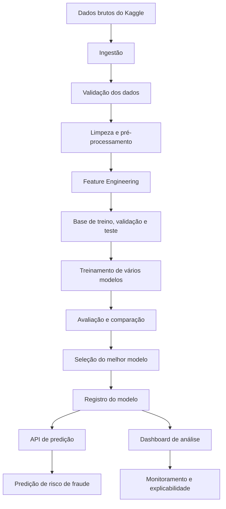

A lógica é simples:

```text
Dados entram → são tratados → viram atributos → modelos são treinados → o melhor modelo é salvo → o modelo é usado para prever novas transações.
```

---

## 47. Estrutura de pastas sugerida

Uma boa estrutura de projeto evita bagunça e facilita manutenção.

```text
fraud-detection-ml/
│
├── README.md
├── pyproject.toml ou requirements.txt
├── .env.example
├── .gitignore
│
├── data/
│   ├── raw/                  # dados originais do Kaggle
│   ├── interim/              # dados intermediários
│   ├── processed/            # dados limpos e prontos
│   └── external/             # dados externos, se houver
│
├── notebooks/
│   ├── 01_exploracao.ipynb
│   ├── 02_preprocessamento.ipynb
│   ├── 03_modelagem.ipynb
│   └── 04_explicabilidade.ipynb
│
├── src/
│   └── fraud_detection/
│       ├── config/
│       │   └── settings.py
│       │
│       ├── domain/
│       │   ├── entities.py
│       │   └── schemas.py
│       │
│       ├── data/
│       │   ├── loaders.py
│       │   ├── validators.py
│       │   └── repositories.py
│       │
│       ├── preprocessing/
│       │   ├── cleaning.py
│       │   ├── encoders.py
│       │   ├── imputers.py
│       │   └── pipelines.py
│       │
│       ├── features/
│       │   ├── builders.py
│       │   └── selectors.py
│       │
│       ├── models/
│       │   ├── baseline.py
│       │   ├── training.py
│       │   ├── evaluation.py
│       │   ├── registry.py
│       │   └── explainability.py
│       │
│       ├── services/
│       │   └── fraud_risk_service.py
│       │
│       └── api/
│           └── main.py
│
├── tests/
│   ├── test_cleaning.py
│   ├── test_features.py
│   ├── test_training.py
│   └── test_api.py
│
├── models/
│   ├── experiments/
│   └── production/
│
├── reports/
│   ├── figures/
│   └── metrics/
│
└── scripts/
    ├── train.py
    ├── evaluate.py
    ├── predict.py
    └── retrain.py
```

### Por que separar assim?

Porque cada pasta tem uma responsabilidade.

| Pasta | Responsabilidade |
|---|---|
| `data/raw` | guardar os dados originais, sem alteração |
| `notebooks` | exploração, estudo e hipóteses |
| `src` | código reutilizável do projeto |
| `preprocessing` | limpeza, imputação, encoding e escala |
| `features` | criação e seleção de atributos |
| `models` | treino, avaliação, comparação e registro |
| `services` | regras de negócio usando o modelo |
| `api` | exposição do modelo via FastAPI |
| `tests` | testes automatizados |
| `reports` | gráficos, métricas e análises |

---

## 48. Padrões de projeto que eu utilizaria

Em um projeto de Machine Learning, nem sempre precisamos aplicar todos os padrões clássicos de software. Mas alguns ajudam muito.

### 48.1. Pipeline Pattern

Esse é o padrão mais importante para Machine Learning.

A ideia é organizar as etapas em sequência:

```text
imputar nulos → codificar categorias → padronizar valores → treinar modelo
```

No Scikit-learn, isso aparece com `Pipeline` e `ColumnTransformer`.

Exemplo:

```python
from sklearn.compose import ColumnTransformer
from sklearn.pipeline import Pipeline
from sklearn.preprocessing import OneHotEncoder, StandardScaler
from sklearn.impute import SimpleImputer
from sklearn.linear_model import LogisticRegression

numeric_features = ["amount", "hour", "user_age"]
categorical_features = ["merchant_city", "use_chip", "mcc"]

numeric_pipeline = Pipeline(steps=[
    ("imputer", SimpleImputer(strategy="median")),
    ("scaler", StandardScaler())
])

categorical_pipeline = Pipeline(steps=[
    ("imputer", SimpleImputer(strategy="most_frequent")),
    ("encoder", OneHotEncoder(handle_unknown="ignore"))
])

preprocessor = ColumnTransformer(transformers=[
    ("num", numeric_pipeline, numeric_features),
    ("cat", categorical_pipeline, categorical_features)
])

model_pipeline = Pipeline(steps=[
    ("preprocessor", preprocessor),
    ("model", LogisticRegression(max_iter=1000, class_weight="balanced"))
])
```

Esse padrão evita um erro muito comum: **aplicar transformação de forma diferente no treino e na produção**.

---

### 48.2. Repository Pattern

Esse padrão separa o acesso aos dados da lógica de treino.

Em vez de espalhar `pd.read_csv()` pelo projeto inteiro, eu criaria uma classe responsável por carregar dados.

```python
import pandas as pd
from pathlib import Path

class TransactionRepository:
    def __init__(self, raw_data_path: str):
        self.raw_data_path = Path(raw_data_path)

    def load_transactions(self) -> pd.DataFrame:
        return pd.read_csv(self.raw_data_path / "transactions_data.csv")

    def load_cards(self) -> pd.DataFrame:
        return pd.read_csv(self.raw_data_path / "cards_data.csv")

    def load_users(self) -> pd.DataFrame:
        return pd.read_csv(self.raw_data_path / "users_data.csv")
```

Vantagem:

```text
Se amanhã os dados vierem do PostgreSQL, MinIO, S3 ou API, você altera o repositório, não o projeto inteiro.
```

---

### 48.3. Strategy Pattern

Esse padrão é útil quando queremos testar vários modelos de forma organizada.

Exemplo de modelos:

- Regressão Logística.
- Random Forest.
- XGBoost ou LightGBM.
- Rede neural com Keras.
- Isolation Forest para anomalias.

A ideia é cada modelo seguir uma mesma interface.

```python
from sklearn.linear_model import LogisticRegression
from sklearn.ensemble import RandomForestClassifier, GradientBoostingClassifier

class ModelFactory:
    @staticmethod
    def create(model_name: str):
        if model_name == "logistic_regression":
            return LogisticRegression(max_iter=1000, class_weight="balanced")

        if model_name == "random_forest":
            return RandomForestClassifier(
                n_estimators=300,
                class_weight="balanced",
                random_state=42
            )

        if model_name == "gradient_boosting":
            return GradientBoostingClassifier(random_state=42)

        raise ValueError(f"Modelo não suportado: {model_name}")
```

Assim, você consegue trocar de modelo sem reescrever o pipeline todo.

---

### 48.4. Factory Pattern

O `ModelFactory` acima também é um exemplo de **Factory Pattern**.

Ele centraliza a criação dos modelos.

Em vez de fazer isso em vários lugares:

```python
model = RandomForestClassifier(...)
```

Você faz:

```python
model = ModelFactory.create("random_forest")
```

Isso deixa o código mais limpo e padronizado.

---

### 48.5. Service Layer

Eu usaria uma camada de serviço para representar a lógica de negócio.

Exemplo: receber uma transação e devolver o risco de fraude.

```python
class FraudRiskService:
    def __init__(self, model, threshold: float = 0.70):
        self.model = model
        self.threshold = threshold

    def predict_risk(self, transaction: dict) -> dict:
        probability = self.model.predict_proba([transaction])[0][1]
        is_fraud = probability >= self.threshold

        return {
            "fraud_probability": float(probability),
            "is_fraud": bool(is_fraud),
            "risk_level": self._risk_level(probability)
        }

    def _risk_level(self, probability: float) -> str:
        if probability >= 0.80:
            return "alto"
        if probability >= 0.50:
            return "médio"
        return "baixo"
```

A API não deveria conter toda a regra de negócio. Ela deveria apenas receber a requisição, chamar o serviço e devolver a resposta.

---

### 48.6. DTO / Schema Pattern

Em APIs, eu usaria schemas com Pydantic para definir a entrada e a saída.

```python
from pydantic import BaseModel

class TransactionInput(BaseModel):
    amount: float
    merchant_city: str
    use_chip: str
    mcc: int
    hour: int
    user_age: int

class FraudPredictionOutput(BaseModel):
    fraud_probability: float
    is_fraud: bool
    risk_level: str
```

Isso evita receber dados bagunçados na API.

---

## 49. Arquitetura em camadas

Eu organizaria o projeto com uma separação simples:

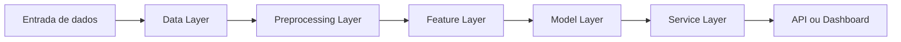

### 49.1. Data Layer

Responsável por carregar dados.

Exemplos:

- CSV do Kaggle.
- Banco PostgreSQL.
- MinIO/S3.
- API externa.
- Data Lake.

Aqui entram classes como:

```text
TransactionRepository
CardRepository
UserRepository
```

---

### 49.2. Preprocessing Layer

Responsável por preparar os dados.

Faz:

- Tratamento de nulos.
- Remoção de duplicados.
- Conversão de datas.
- Conversão de valores monetários.
- Encoding.
- Escalonamento.
- Proteção contra vazamento.

---

### 49.3. Feature Layer

Responsável por criar atributos úteis.

Exemplos para fraude:

- Hora da transação.
- Dia da semana.
- Transação em fim de semana.
- Valor acima da média do usuário.
- Quantidade de transações recentes do cartão.
- Distância entre cidade do usuário e cidade do lojista.
- Frequência do MCC.
- Histórico de transações negadas.

Atenção: atributos históricos precisam respeitar o tempo.

Errado:

```text
Usar dados futuros para calcular média histórica do cliente.
```

Certo:

```text
Para prever uma transação em maio, usar apenas informações disponíveis até antes daquela transação.
```

---

### 49.4. Model Layer

Responsável por:

- Treinar modelos.
- Comparar métricas.
- Salvar modelos.
- Ajustar hiperparâmetros.
- Gerar explicações.

Aqui entram:

```text
train_model()
evaluate_model()
compare_models()
save_model()
load_model()
```

---

### 49.5. Service Layer

Responsável pela regra de negócio.

Exemplo:

```text
Se probabilidade de fraude >= 0.80 → bloquear transação.
Se probabilidade entre 0.50 e 0.80 → pedir validação adicional.
Se menor que 0.50 → aprovar normalmente.
```

Essa camada é importante porque o modelo retorna probabilidade, mas o negócio precisa de decisão.

---

### 49.6. API Layer

Responsável por expor o modelo.

Exemplo com FastAPI:

```python
from fastapi import FastAPI

app = FastAPI(title="Fraud Detection API")

@app.post("/predict")
def predict(transaction: TransactionInput):
    result = fraud_service.predict_risk(transaction.model_dump())
    return result
```

---

## 50. Fluxo de desenvolvimento que eu seguiria

Eu faria o projeto em fases.

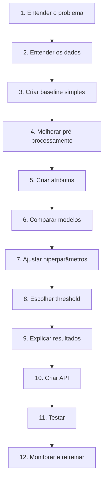

### Fase 1 — Entendimento do problema

Pergunta principal:

```text
Queremos prever se uma transação é fraudulenta antes de aprová-la?
```

Mas também precisamos definir:

- Qual é o custo de bloquear uma transação legítima?
- Qual é o custo de aprovar uma fraude?
- O modelo será usado em tempo real ou análise posterior?
- O objetivo é prevenção, auditoria ou alerta?

---

### Fase 2 — Entendimento dos dados

Eu analisaria:

- Tamanho das tabelas.
- Relação entre transações, cartões e usuários.
- Distribuição da variável alvo.
- Campos com muitos nulos.
- Campos sensíveis.
- Campos que causam vazamento.
- Distribuição dos valores de transação.
- Período histórico dos dados.

---

### Fase 3 — Baseline

Antes de usar modelos complexos, eu criaria um modelo simples.

Exemplo:

```text
Regressão Logística + pré-processamento básico + class_weight='balanced'
```

O baseline serve como ponto de comparação.

Se um modelo complexo não for muito melhor que o baseline, talvez ele não valha a pena.

---

### Fase 4 — Comparação de modelos

Eu treinaria vários modelos com o mesmo conjunto de treino e teste.

| Modelo | Quando usar |
|---|---|
| Regressão Logística | baseline interpretável |
| Random Forest | bom para relações não lineares |
| Gradient Boosting | geralmente forte em dados tabulares |
| LightGBM/XGBoost | excelente para dados tabulares grandes |
| Rede Neural | útil quando há muitos dados e padrões complexos |
| Isolation Forest | útil para anomalias sem rótulo confiável |

---

## 51. Pipeline de treino recomendado

O pipeline de treino deve ser reproduzível.

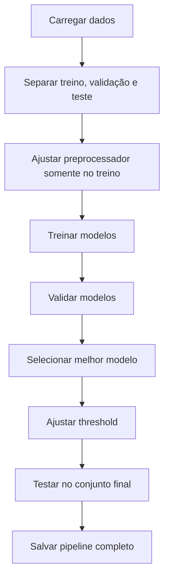

### Regra importante

Nunca faça isso:

```text
1. Normalizar a base inteira.
2. Depois separar treino e teste.
```

Isso causa vazamento de informação.

Faça assim:

```text
1. Separar treino e teste.
2. Ajustar normalização somente no treino.
3. Aplicar a transformação no teste.
```

---

## 52. Como eu compararia vários modelos

Eu criaria uma função de treino padronizada.

```python
from sklearn.metrics import precision_score, recall_score, f1_score, average_precision_score, roc_auc_score


def evaluate_classifier(model, X_test, y_test, threshold=0.5):
    y_proba = model.predict_proba(X_test)[:, 1]
    y_pred = (y_proba >= threshold).astype(int)

    return {
        "precision": precision_score(y_test, y_pred, zero_division=0),
        "recall": recall_score(y_test, y_pred, zero_division=0),
        "f1": f1_score(y_test, y_pred, zero_division=0),
        "pr_auc": average_precision_score(y_test, y_proba),
        "roc_auc": roc_auc_score(y_test, y_proba)
    }
```

E depois avaliaria vários modelos:

```python
models = {
    "logistic_regression": ModelFactory.create("logistic_regression"),
    "random_forest": ModelFactory.create("random_forest"),
    "gradient_boosting": ModelFactory.create("gradient_boosting")
}

results = []

for name, estimator in models.items():
    pipeline = Pipeline(steps=[
        ("preprocessor", preprocessor),
        ("model", estimator)
    ])

    pipeline.fit(X_train, y_train)
    metrics = evaluate_classifier(pipeline, X_valid, y_valid, threshold=0.5)
    metrics["model"] = name
    results.append(metrics)
```

Depois eu colocaria os resultados em um DataFrame:

```python
import pandas as pd

results_df = pd.DataFrame(results).sort_values(by="pr_auc", ascending=False)
print(results_df)
```

Para fraude, eu daria muita atenção a:

- `Recall` da classe fraude.
- `Precision` da classe fraude.
- `F1-score`.
- `PR-AUC`.
- Matriz de confusão.
- Custo financeiro dos erros.

---

## 53. Padrões de MLOps que eu utilizaria

MLOps é a parte que ajuda o modelo a não ser apenas um experimento, mas um sistema mantido com qualidade.

### 53.1. Versionamento de dados

Eu versionaria:

- Dados brutos.
- Dados processados.
- Features.
- Modelo treinado.
- Métricas.
- Código usado no treinamento.

Ferramentas possíveis:

- DVC.
- MLflow.
- LakeFS.
- Delta Lake.
- Git + organização manual no começo.

Para um projeto inicial, eu começaria simples:

```text
models/production/model_2026_06_04.joblib
reports/metrics/metrics_2026_06_04.json
reports/figures/confusion_matrix_2026_06_04.png
```

Depois evoluiria para MLflow.

---

### 53.2. Model Registry

Eu criaria um registro simples de modelos.

```text
Modelo candidato → Modelo aprovado → Modelo em produção → Modelo arquivado
```

Exemplo de metadados:

```json
{
  "model_name": "lightgbm_fraud_detector",
  "version": "1.0.0",
  "trained_at": "2026-06-04",
  "pr_auc": 0.82,
  "recall": 0.76,
  "precision": 0.41,
  "threshold": 0.67,
  "status": "production"
}
```

---

### 53.3. Monitoramento

Depois que o modelo vai para produção, eu monitoraria:

- Mudança na distribuição dos dados.
- Queda nas métricas.
- Aumento de falsos positivos.
- Aumento de falsos negativos.
- Tempo de resposta da API.
- Percentual de transações classificadas como alto risco.
- Diferença entre fraude prevista e fraude confirmada depois.

---

### 53.4. Retreinamento

Eu usaria um fluxo assim:

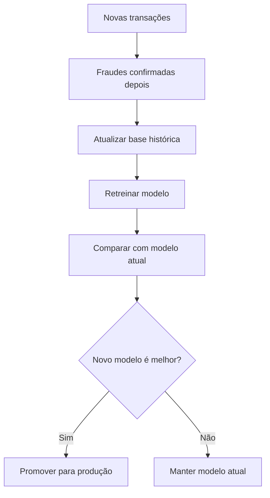

Eu não retreinaria o modelo a cada nova transação. Eu faria isso em ciclos.

Exemplos:

- Semanalmente.
- Mensalmente.
- Quando houver queda de performance.
- Quando houver mudança no comportamento das fraudes.

---

## 54. Como eu pensaria a arquitetura para produção

Para produção, eu separaria o projeto em três partes principais.

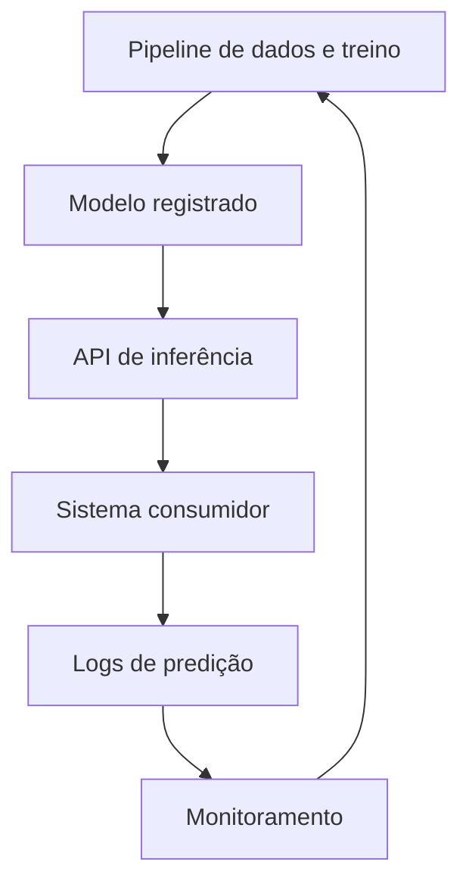

### 54.1. Treinamento offline

Aqui o modelo aprende com dados históricos.

Características:

- Pode demorar mais.
- Pode usar grande volume de dados.
- Pode testar vários modelos.
- Pode rodar em job agendado.

Exemplo:

```text
python scripts/train.py
```

---

### 54.2. Inferência online

Aqui o modelo responde se uma transação nova parece fraude.

Características:

- Precisa ser rápido.
- Precisa usar exatamente as mesmas transformações do treino.
- Deve ter logs.
- Deve lidar com erros.

Exemplo:

```text
POST /predict
```

Entrada:

```json
{
  "amount": 450.90,
  "merchant_city": "Manaus",
  "use_chip": "Swipe Transaction",
  "mcc": 5411,
  "hour": 23,
  "user_age": 31
}
```

Saída:

```json
{
  "fraud_probability": 0.84,
  "is_fraud": true,
  "risk_level": "alto"
}
```

---

### 54.3. Inferência batch

Além da API, eu também criaria uma rotina para avaliar muitas transações de uma vez.

Exemplo:

```text
python scripts/predict.py --input data/new_transactions.csv --output reports/predictions.csv
```

Isso é útil para auditoria, backoffice e investigação.

---

## 55. Testes que eu criaria

Em Machine Learning, testes não são apenas sobre acurácia. Precisamos testar dados, transformações, modelos e API.

### 55.1. Testes de dados

Exemplos:

```text
A coluna amount não pode ser texto.
A coluna amount não pode ter valores absurdamente negativos.
A coluna target precisa ter apenas 0 ou 1.
A coluna transaction_date precisa ser convertível para data.
```

Exemplo com Python:

```python
def test_target_has_only_binary_values(transactions_df):
    assert set(transactions_df["is_fraud"].unique()).issubset({0, 1})
```

---

### 55.2. Testes de pré-processamento

Exemplos:

```text
O pipeline não pode retornar nulos.
O encoder deve aceitar categorias desconhecidas.
O scaler deve ser ajustado apenas no treino.
```

```python
def test_preprocessor_removes_missing_values(preprocessor, X_train):
    transformed = preprocessor.fit_transform(X_train)
    assert transformed is not None
```

---

### 55.3. Testes de modelo

Exemplos:

```text
O modelo precisa treinar sem erro.
O modelo precisa retornar probabilidade entre 0 e 1.
O modelo precisa superar um baseline mínimo.
```

```python
def test_model_predicts_probability(trained_model, sample_transaction):
    probability = trained_model.predict_proba(sample_transaction)[0][1]
    assert 0 <= probability <= 1
```

---

### 55.4. Testes de API

Exemplo:

```python
from fastapi.testclient import TestClient


def test_predict_endpoint(client: TestClient):
    payload = {
        "amount": 120.50,
        "merchant_city": "Manaus",
        "use_chip": "Chip Transaction",
        "mcc": 5411,
        "hour": 14,
        "user_age": 30
    }

    response = client.post("/predict", json=payload)

    assert response.status_code == 200
    assert "fraud_probability" in response.json()
    assert "risk_level" in response.json()
```

---

## 56. Como eu documentaria as decisões do projeto

Eu criaria um arquivo chamado:

```text
docs/model_card.md
```

Esse documento explicaria:

- Qual problema o modelo resolve.
- Quais dados foram usados.
- Quais dados não devem ser usados.
- Quais variáveis foram removidas por vazamento.
- Quais métricas foram priorizadas.
- Qual threshold foi escolhido.
- Quais limitações o modelo possui.
- Quando o modelo deve ser retreinado.
- Quem deve aprovar a entrada em produção.

Exemplo de trecho:

```markdown
# Model Card — Fraud Detection

## Objetivo
Classificar transações financeiras como legítimas ou suspeitas de fraude.

## Métrica principal
PR-AUC, porque a base é altamente desbalanceada.

## Métricas complementares
Recall, precision, F1-score, matriz de confusão e custo financeiro estimado.

## Limitações
O modelo não deve ser usado como única fonte de decisão para bloqueios definitivos.
Transações de alto risco devem passar por validação adicional.
```

---

## 57. Arquitetura mínima viável versus arquitetura madura

Nem todo projeto precisa começar complexo.

### 57.1. Arquitetura mínima viável

Boa para estudo, portfólio e primeira versão.

```text
notebooks/
src/
data/
models/
reports/
```

Componentes:

- Notebook de exploração.
- Script de treino.
- Pipeline Scikit-learn.
- Modelo salvo com `joblib`.
- API FastAPI simples.
- Métricas em JSON/CSV.

### 57.2. Arquitetura madura

Boa para projeto profissional.

```text
Data Lake / Warehouse
Pipeline orquestrado
Feature Store
MLflow
Model Registry
API versionada
Monitoramento
Retreinamento automatizado
Testes automatizados
CI/CD
```

Fluxo maduro:

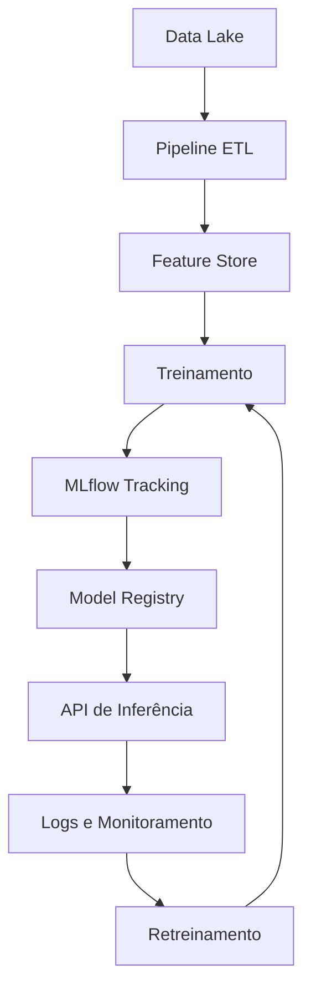

---

## 58. Minha recomendação final de arquitetura para este estudo

Para o seu caso, eu faria em três níveis.

### Nível 1 — Estudo e entendimento

Use:

- Jupyter Notebook.
- Pandas.
- Scikit-learn.
- Matplotlib.
- Seaborn, se quiser exploração visual.

Objetivo:

```text
Entender os dados e criar o primeiro modelo funcional.
```

---

### Nível 2 — Projeto organizado

Use:

- Estrutura `src/`.
- Pipeline com Scikit-learn.
- Scripts de treino.
- Testes com pytest.
- Modelo salvo com joblib.
- API com FastAPI.

Objetivo:

```text
Transformar o notebook em projeto reutilizável.
```

---

### Nível 3 — Projeto com cara de produção

Use:

- MLflow para experimentos.
- DVC ou Delta Lake para versionamento de dados.
- Docker.
- FastAPI.
- Monitoramento.
- Retreinamento programado.
- CI/CD.

Objetivo:

```text
Criar um sistema de Machine Learning confiável e evolutivo.
```

---

## 59. Checklist de arquitetura

Antes de considerar o projeto bem estruturado, verifique:

- [ ] Existe separação entre notebook exploratório e código de produção?
- [ ] O pipeline de pré-processamento está salvo junto com o modelo?
- [ ] O split de treino/teste evita vazamento temporal?
- [ ] Existem testes para dados, features, modelo e API?
- [ ] As métricas são salvas a cada experimento?
- [ ] Existe uma forma clara de comparar modelos?
- [ ] O threshold foi escolhido com base no problema de negócio?
- [ ] O modelo possui documentação?
- [ ] Existe plano de monitoramento?
- [ ] Existe plano de retreinamento?
- [ ] A API trata entradas inválidas?
- [ ] Dados sensíveis foram removidos ou protegidos?
- [ ] As decisões do modelo são explicáveis?
- [ ] Existe controle de versão do código e dos artefatos?

---

## 60. Checklist final de boas práticas

Antes de confiar no modelo, verifique:

- [ ] removi identificadores técnicos inúteis?
- [ ] removi dados sensíveis como `card_number`, `cvv` e `address`?
- [ ] tratei valores monetários corretamente?
- [ ] tratei nulos de forma coerente?
- [ ] fiz split antes de balancear?
- [ ] ajustei preprocessadores apenas no treino?
- [ ] usei métricas adequadas para desbalanceamento?
- [ ] avaliei PR-AUC?
- [ ] analisei matriz de confusão?
- [ ] ajustei threshold?
- [ ] comparei modelos simples e complexos?
- [ ] fiz validação temporal?
- [ ] expliquei o modelo?
- [ ] considerei custo de falso positivo e falso negativo?
- [ ] criei plano de retreinamento?

---

## 61. Resumo mental

Pense assim:

```text
Machine Learning não começa no modelo.
Começa na pergunta certa, nos dados certos e na avaliação correta.
```

Para fraude:

```text
Acurácia é perigosa.
Vazamento é traiçoeiro.
Desbalanceamento é regra.
Explicabilidade é necessária.
Retreinamento é inevitável.
```

O objetivo não é apenas criar um modelo que “acerte bastante”.

O objetivo é criar um sistema confiável que ajude a tomar melhores decisões em ambiente real.

---

## 62. Referências

- Kaggle — Financial Transactions Dataset: Analytics: <https://www.kaggle.com/datasets/computingvictor/transactions-fraud-datasets>
- Scikit-learn — User Guide: <https://scikit-learn.org/stable/user_guide.html>
- TensorFlow/Keras — Guides: <https://www.tensorflow.org/guide>
- Artigo sobre impacto de sampling e data leakage em fraude: <https://arxiv.org/abs/2412.07437>
- Comparação de métodos supervisionados e não supervisionados em fraude: <https://arxiv.org/abs/1904.10604>

---

# PARTE EXTRA — Arquitetura de Código para o Projeto de Detecção de Fraude

A partir daqui, vamos transformar a arquitetura conceitual em uma **arquitetura de código Python**.

A ideia é responder à pergunta:

> Como eu organizaria esse projeto se fosse desenvolver uma solução real de Machine Learning para detecção de fraude com o dataset do Kaggle?

O objetivo não é apenas treinar um modelo em notebook. O objetivo é criar um projeto que possa crescer, ser testado, versionado, executado por linha de comando, integrado a uma API e retreinado no futuro.

---

## 63. Visão geral da arquitetura de código

Um erro muito comum em projetos de Machine Learning é deixar tudo dentro de um único notebook:

```text
notebook.ipynb
├── leitura dos dados
├── limpeza
├── gráficos
├── treino
├── avaliação
├── salvamento do modelo
└── testes manuais
```

Isso é útil para estudo inicial, mas ruim para um projeto maior.

Em um projeto mais profissional, eu separaria o código por responsabilidade:

```text
fraud-detection-ml/
├── data/                  # dados brutos, intermediários e processados
├── notebooks/             # exploração e estudos
├── src/                   # código principal do projeto
├── tests/                 # testes automatizados
├── configs/               # arquivos de configuração
├── models/                # modelos treinados
├── reports/               # métricas, gráficos e relatórios
├── scripts/               # comandos auxiliares
├── pyproject.toml         # dependências e configuração do projeto
└── README.md              # documentação inicial
```

A lógica principal seria:


---

## 64. Estrutura de pastas recomendada

Minha sugestão prática:

```text
fraud-detection-ml/
│
├── configs/
│   ├── base.yaml
│   ├── train.yaml
│   └── inference.yaml
│
├── data/
│   ├── raw/
│   │   ├── transactions_data.csv
│   │   ├── cards_data.csv
│   │   ├── users_data.csv
│   │   ├── mcc_codes.json
│   │   └── train_fraud_labels.json
│   │
│   ├── interim/
│   │   └── transactions_joined.parquet
│   │
│   └── processed/
│       ├── train.parquet
│       ├── validation.parquet
│       └── test.parquet
│
├── models/
│   ├── fraud_model.joblib
│   ├── preprocessor.joblib
│   └── model_metadata.json
│
├── notebooks/
│   ├── 01_eda.ipynb
│   ├── 02_feature_engineering.ipynb
│   └── 03_model_comparison.ipynb
│
├── reports/
│   ├── metrics.json
│   ├── confusion_matrix.png
│   ├── roc_curve.png
│   ├── precision_recall_curve.png
│   └── model_card.md
│
├── scripts/
│   ├── download_data.py
│   ├── train.py
│   ├── evaluate.py
│   └── predict_batch.py
│
├── src/
│   └── fraud_detection/
│       ├── __init__.py
│       │
│       ├── config/
│       │   ├── settings.py
│       │   └── logging_config.py
│       │
│       ├── data/
│       │   ├── ingestion.py
│       │   ├── validation.py
│       │   ├── cleaning.py
│       │   └── splitting.py
│       │
│       ├── features/
│       │   ├── builders.py
│       │   ├── encoders.py
│       │   └── selectors.py
│       │
│       ├── pipelines/
│       │   ├── preprocessing.py
│       │   ├── training.py
│       │   └── inference.py
│       │
│       ├── models/
│       │   ├── factory.py
│       │   ├── trainer.py
│       │   ├── evaluator.py
│       │   └── explainability.py
│       │
│       ├── services/
│       │   ├── fraud_scoring_service.py
│       │   └── retraining_service.py
│       │
│       ├── api/
│       │   ├── main.py
│       │   ├── schemas.py
│       │   └── routes.py
│       │
│       └── utils/
│           ├── io.py
│           ├── dates.py
│           └── money.py
│
└── tests/
    ├── test_cleaning.py
    ├── test_features.py
    ├── test_training_pipeline.py
    ├── test_inference_pipeline.py
    └── test_api.py
```

Essa estrutura ajuda a separar o que é:

- exploração;
- processamento de dados;
- treino;
- avaliação;
- inferência;
- API;
- testes;
- documentação.

---

## 65. Ideia principal: notebook é laboratório, `src/` é produção

O notebook deve ser usado para investigar:

```text
Será que essa variável ajuda?
Existe correlação?
A classe está desbalanceada?
Qual modelo parece melhor?
```

Mas o código reutilizável deve sair do notebook e ir para `src/`.

Exemplo:

```text
notebooks/01_eda.ipynb
```

Serve para análise exploratória.

```text
src/fraud_detection/features/builders.py
```

Serve para guardar funções reutilizáveis de criação de atributos.

Boa prática:

> Quando uma célula do notebook começa a ser usada mais de uma vez, provavelmente ela deveria virar função ou classe dentro de `src/`.

---

## 66. Arquivo de configuração

Em vez de deixar caminhos, colunas e parâmetros espalhados pelo código, eu criaria arquivos YAML.

Exemplo:

```yaml
# configs/train.yaml
paths:
  transactions: data/raw/transactions_data.csv
  cards: data/raw/cards_data.csv
  users: data/raw/users_data.csv
  mcc: data/raw/mcc_codes.json
  labels: data/raw/train_fraud_labels.json
  model_output: models/fraud_model.joblib
  metrics_output: reports/metrics.json

target:
  column: is_fraud

split:
  strategy: temporal
  train_end_date: "2018-12-31"
  validation_end_date: "2019-12-31"

model:
  name: random_forest
  threshold: 0.35

features:
  drop_columns:
    - id
    - card_number
    - cvv
    - address
    - merchant_id
  categorical:
    - use_chip
    - card_brand
    - card_type
    - has_chip
    - merchant_state
    - mcc_description
  numerical:
    - amount
    - credit_limit
    - yearly_income
    - total_debt
    - credit_score
    - num_credit_cards
    - transaction_hour
    - transaction_dayofweek
```

Vantagem:

```text
O código fica mais limpo.
Os experimentos ficam mais fáceis de reproduzir.
Fica simples trocar modelo, threshold ou colunas.
```

---

## 67. Configuração em Python

```python
# src/fraud_detection/config/settings.py

from pathlib import Path
import yaml


class Settings:
    def __init__(self, config_path: str):
        self.config_path = Path(config_path)
        self.data = self._load_yaml()

    def _load_yaml(self) -> dict:
        if not self.config_path.exists():
            raise FileNotFoundError(f"Configuração não encontrada: {self.config_path}")

        with open(self.config_path, "r", encoding="utf-8") as file:
            return yaml.safe_load(file)

    def get(self, key: str, default=None):
        keys = key.split(".")
        value = self.data

        for item in keys:
            if not isinstance(value, dict):
                return default
            value = value.get(item)
            if value is None:
                return default

        return value
```

Uso:

```python
settings = Settings("configs/train.yaml")
model_name = settings.get("model.name")
threshold = settings.get("model.threshold")
```

---

## 68. Camada de ingestão dos dados

Responsabilidade:

```text
Ler arquivos brutos e entregar DataFrames para as próximas etapas.
```

Arquivo:

```text
src/fraud_detection/data/ingestion.py
```

Exemplo:

```python
# src/fraud_detection/data/ingestion.py

import json
import pandas as pd


class FraudDataIngestion:
    def __init__(
        self,
        transactions_path: str,
        cards_path: str,
        users_path: str,
        mcc_path: str,
        labels_path: str,
    ):
        self.transactions_path = transactions_path
        self.cards_path = cards_path
        self.users_path = users_path
        self.mcc_path = mcc_path
        self.labels_path = labels_path

    def load_transactions(self) -> pd.DataFrame:
        return pd.read_csv(self.transactions_path)

    def load_cards(self) -> pd.DataFrame:
        return pd.read_csv(self.cards_path)

    def load_users(self) -> pd.DataFrame:
        return pd.read_csv(self.users_path)

    def load_mcc_codes(self) -> dict:
        with open(self.mcc_path, "r", encoding="utf-8") as file:
            return json.load(file)

    def load_labels(self) -> pd.DataFrame:
        with open(self.labels_path, "r", encoding="utf-8") as file:
            labels = json.load(file)

        return pd.DataFrame(
            {
                "id": list(labels["target"].keys()),
                "is_fraud": list(labels["target"].values()),
            }
        )
```

---

## 69. Camada de limpeza

Responsabilidade:

```text
Corrigir tipos, remover caracteres monetários, tratar datas e remover colunas perigosas.
```

Arquivo:

```text
src/fraud_detection/data/cleaning.py
```

Exemplo:

```python
# src/fraud_detection/utils/money.py

import pandas as pd


def parse_money_column(series: pd.Series) -> pd.Series:
    return (
        series.astype(str)
        .str.replace("$", "", regex=False)
        .str.replace(",", "", regex=False)
        .str.strip()
        .replace("nan", None)
        .astype(float)
    )
```

```python
# src/fraud_detection/data/cleaning.py

import pandas as pd
from fraud_detection.utils.money import parse_money_column


class FraudDataCleaner:
    def clean_transactions(self, df: pd.DataFrame) -> pd.DataFrame:
        df = df.copy()
        df["date"] = pd.to_datetime(df["date"], errors="coerce")
        df["amount"] = parse_money_column(df["amount"])
        return df

    def clean_cards(self, df: pd.DataFrame) -> pd.DataFrame:
        df = df.copy()
        money_columns = ["credit_limit"]

        for column in money_columns:
            if column in df.columns:
                df[column] = parse_money_column(df[column])

        sensitive_columns = ["card_number", "cvv"]
        df = df.drop(columns=[c for c in sensitive_columns if c in df.columns])
        return df

    def clean_users(self, df: pd.DataFrame) -> pd.DataFrame:
        df = df.copy()
        money_columns = ["per_capita_income", "yearly_income", "total_debt"]

        for column in money_columns:
            if column in df.columns:
                df[column] = parse_money_column(df[column])

        sensitive_columns = ["address"]
        df = df.drop(columns=[c for c in sensitive_columns if c in df.columns])
        return df
```

---

## 70. Validação dos dados

Antes de treinar, eu validaria regras mínimas.

Exemplo de perguntas:

```text
A coluna amount existe?
A coluna date virou data corretamente?
A variável alvo existe?
Há valores negativos inesperados?
Há duplicatas de id?
A taxa de fraude está extremamente baixa?
```

Arquivo:

```text
src/fraud_detection/data/validation.py
```

Exemplo simples:

```python
# src/fraud_detection/data/validation.py

import pandas as pd


class DataValidationError(Exception):
    pass


class FraudDataValidator:
    def validate_required_columns(self, df: pd.DataFrame, required_columns: list[str]) -> None:
        missing = [column for column in required_columns if column not in df.columns]

        if missing:
            raise DataValidationError(f"Colunas ausentes: {missing}")

    def validate_unique_transaction_id(self, df: pd.DataFrame) -> None:
        if "id" in df.columns and df["id"].duplicated().any():
            raise DataValidationError("Existem transações duplicadas pelo campo id.")

    def validate_target_distribution(self, df: pd.DataFrame, target: str) -> None:
        fraud_rate = df[target].mean()

        if fraud_rate == 0:
            raise DataValidationError("Nenhuma fraude encontrada na base.")

        if fraud_rate > 0.5:
            raise DataValidationError("Taxa de fraude muito alta. Verifique se o target está correto.")
```

Em projetos reais, eu consideraria usar ferramentas como:

- Pandera;
- Great Expectations;
- Pydantic;
- testes com Pytest.

---

## 71. Junção das tabelas

O dataset possui várias tabelas. Eu criaria uma função específica para montar a base analítica.

Arquivo:

```text
src/fraud_detection/data/merging.py
```

Exemplo:

```python
# src/fraud_detection/data/merging.py

import pandas as pd


class FraudDatasetBuilder:
    def build_dataset(
        self,
        transactions: pd.DataFrame,
        cards: pd.DataFrame,
        users: pd.DataFrame,
        mcc_codes: dict,
        labels: pd.DataFrame,
    ) -> pd.DataFrame:
        transactions = transactions.copy()
        labels = labels.copy()

        transactions["id"] = transactions["id"].astype(str)
        labels["id"] = labels["id"].astype(str)

        df = transactions.merge(labels, on="id", how="inner")
        df = df.merge(cards, on=["client_id", "card_id"], how="left")
        df = df.merge(users, left_on="client_id", right_on="id", how="left", suffixes=("", "_user"))

        df["mcc"] = df["mcc"].astype(str)
        df["mcc_description"] = df["mcc"].map(mcc_codes)

        return df
```

Cuidado importante:

```text
Nem toda junção é segura.
Se a tabela auxiliar contiver informações futuras em relação à transação, pode haver vazamento de informação.
```

---

## 72. Engenharia de atributos

Responsabilidade:

```text
Criar novas variáveis a partir das colunas originais.
```

Exemplos úteis para fraude:

```text
hora da transação
fim de semana ou não
período do dia
valor relativo ao limite do cartão
valor relativo à renda anual
idade da conta/cartão
transação online ou presencial
presença de erro na transação
```

Arquivo:

```text
src/fraud_detection/features/builders.py
```

Exemplo:

```python
# src/fraud_detection/features/builders.py

import numpy as np
import pandas as pd


class FraudFeatureBuilder:
    def transform(self, df: pd.DataFrame) -> pd.DataFrame:
        df = df.copy()

        df["transaction_hour"] = df["date"].dt.hour
        df["transaction_dayofweek"] = df["date"].dt.dayofweek
        df["transaction_month"] = df["date"].dt.month
        df["is_weekend"] = df["transaction_dayofweek"].isin([5, 6]).astype(int)

        df["is_online_transaction"] = (
            df["use_chip"].astype(str).str.lower().str.contains("online")
        ).astype(int)

        df["has_error"] = df["errors"].notna().astype(int)

        df["amount_to_limit_ratio"] = df["amount"] / df["credit_limit"].replace(0, np.nan)
        df["amount_to_income_ratio"] = df["amount"] / df["yearly_income"].replace(0, np.nan)
        df["debt_to_income_ratio"] = df["total_debt"] / df["yearly_income"].replace(0, np.nan)

        return df
```

Boa prática:

> Feature engineering deve ser uma etapa reproduzível. Se você criou a variável no treino, precisa criar exatamente igual na inferência.

---

## 73. Separação temporal dos dados

Em fraude, eu evitaria uma separação aleatória simples quando houver datas.

Errado em muitos casos:

```python
train_test_split(df, test_size=0.2, random_state=42)
```

Melhor para simular o mundo real:

```text
Treinar com o passado.
Validar com um período mais recente.
Testar com um período ainda mais recente.
```

Arquivo:

```text
src/fraud_detection/data/splitting.py
```

Exemplo:

```python
# src/fraud_detection/data/splitting.py

import pandas as pd


class TemporalSplitter:
    def __init__(self, train_end_date: str, validation_end_date: str):
        self.train_end_date = pd.Timestamp(train_end_date)
        self.validation_end_date = pd.Timestamp(validation_end_date)

    def split(self, df: pd.DataFrame):
        df = df.sort_values("date").copy()

        train = df[df["date"] <= self.train_end_date]
        validation = df[
            (df["date"] > self.train_end_date)
            & (df["date"] <= self.validation_end_date)
        ]
        test = df[df["date"] > self.validation_end_date]

        return train, validation, test
```

---

## 74. Pré-processamento com Scikit-learn Pipeline

Essa é uma das partes mais importantes.

Eu usaria `Pipeline` e `ColumnTransformer` para garantir que:

```text
imputação, escala e encoding sejam aprendidos apenas no treino;
a mesma transformação seja aplicada na validação, teste e produção;
o risco de vazamento seja reduzido.
```

Arquivo:

```text
src/fraud_detection/pipelines/preprocessing.py
```

Exemplo:

```python
# src/fraud_detection/pipelines/preprocessing.py

from sklearn.compose import ColumnTransformer
from sklearn.impute import SimpleImputer
from sklearn.pipeline import Pipeline
from sklearn.preprocessing import OneHotEncoder, StandardScaler


def build_preprocessor(numerical_features: list[str], categorical_features: list[str]):
    numerical_pipeline = Pipeline(
        steps=[
            ("imputer", SimpleImputer(strategy="median")),
            ("scaler", StandardScaler()),
        ]
    )

    categorical_pipeline = Pipeline(
        steps=[
            ("imputer", SimpleImputer(strategy="most_frequent")),
            ("encoder", OneHotEncoder(handle_unknown="ignore")),
        ]
    )

    preprocessor = ColumnTransformer(
        transformers=[
            ("num", numerical_pipeline, numerical_features),
            ("cat", categorical_pipeline, categorical_features),
        ]
    )

    return preprocessor
```

Por que isso é importante?

```text
Se você calcula média, mediana, escala ou categorias olhando a base inteira antes do split, você pode vazar informação do teste para o treino.
```

---

## 75. Factory de modelos

Quando você quer testar vários modelos, evite criar vários `if` espalhados pelo projeto.

Use o padrão **Factory**.

Responsabilidade:

```text
Receber o nome do modelo e devolver uma instância pronta para uso.
```

Arquivo:

```text
src/fraud_detection/models/factory.py
```

Exemplo:

```python
# src/fraud_detection/models/factory.py

from sklearn.ensemble import RandomForestClassifier, GradientBoostingClassifier
from sklearn.linear_model import LogisticRegression
from sklearn.dummy import DummyClassifier


class ModelFactory:
    @staticmethod
    def create(model_name: str):
        if model_name == "dummy":
            return DummyClassifier(strategy="prior")

        if model_name == "logistic_regression":
            return LogisticRegression(
                max_iter=1000,
                class_weight="balanced",
                n_jobs=-1,
            )

        if model_name == "random_forest":
            return RandomForestClassifier(
                n_estimators=300,
                max_depth=None,
                class_weight="balanced",
                random_state=42,
                n_jobs=-1,
            )

        if model_name == "gradient_boosting":
            return GradientBoostingClassifier(random_state=42)

        raise ValueError(f"Modelo não suportado: {model_name}")
```

Uso:

```python
model = ModelFactory.create("random_forest")
```

---

## 76. Pipeline completo de treino

Agora juntamos pré-processamento e modelo em um único pipeline.

Arquivo:

```text
src/fraud_detection/models/trainer.py
```

Exemplo:

```python
# src/fraud_detection/models/trainer.py

from sklearn.pipeline import Pipeline
from fraud_detection.models.factory import ModelFactory
from fraud_detection.pipelines.preprocessing import build_preprocessor


class FraudModelTrainer:
    def __init__(self, numerical_features: list[str], categorical_features: list[str]):
        self.numerical_features = numerical_features
        self.categorical_features = categorical_features

    def build_pipeline(self, model_name: str) -> Pipeline:
        preprocessor = build_preprocessor(
            numerical_features=self.numerical_features,
            categorical_features=self.categorical_features,
        )

        model = ModelFactory.create(model_name)

        return Pipeline(
            steps=[
                ("preprocessor", preprocessor),
                ("model", model),
            ]
        )

    def train(self, X_train, y_train, model_name: str) -> Pipeline:
        pipeline = self.build_pipeline(model_name)
        pipeline.fit(X_train, y_train)
        return pipeline
```

Essa abordagem garante que o objeto final salvo já contém:

```text
limpeza estatística dos dados;
escala;
one-hot encoding;
modelo treinado.
```

---

## 77. Avaliação do modelo

Responsabilidade:

```text
Calcular métricas relevantes e gerar relatórios.
```

Para fraude, eu avaliaria principalmente:

- Precision;
- Recall;
- F1-score;
- ROC-AUC;
- PR-AUC;
- matriz de confusão;
- custo de falso positivo e falso negativo.

Arquivo:

```text
src/fraud_detection/models/evaluator.py
```

Exemplo:

```python
# src/fraud_detection/models/evaluator.py

import numpy as np
from sklearn.metrics import (
    average_precision_score,
    confusion_matrix,
    f1_score,
    precision_score,
    recall_score,
    roc_auc_score,
)


class FraudModelEvaluator:
    def evaluate(self, model, X, y_true, threshold: float = 0.5) -> dict:
        y_proba = model.predict_proba(X)[:, 1]
        y_pred = (y_proba >= threshold).astype(int)

        tn, fp, fn, tp = confusion_matrix(y_true, y_pred).ravel()

        return {
            "threshold": threshold,
            "precision": precision_score(y_true, y_pred, zero_division=0),
            "recall": recall_score(y_true, y_pred, zero_division=0),
            "f1": f1_score(y_true, y_pred, zero_division=0),
            "roc_auc": roc_auc_score(y_true, y_proba),
            "pr_auc": average_precision_score(y_true, y_proba),
            "true_negative": int(tn),
            "false_positive": int(fp),
            "false_negative": int(fn),
            "true_positive": int(tp),
        }

    def evaluate_thresholds(self, model, X, y_true, thresholds: list[float]) -> list[dict]:
        return [self.evaluate(model, X, y_true, threshold) for threshold in thresholds]
```

---

## 78. Escolha automática de threshold

Em fraude, o threshold `0.5` nem sempre é o melhor.

Exemplo:

```text
Se o modelo retorna probabilidade 0.32 de fraude, isso pode ser alto em um problema raro.
```

Eu criaria uma estratégia para escolher threshold.

Arquivo:

```text
src/fraud_detection/models/threshold.py
```

Exemplo:

```python
# src/fraud_detection/models/threshold.py

import pandas as pd
from fraud_detection.models.evaluator import FraudModelEvaluator


class ThresholdOptimizer:
    def __init__(self, metric: str = "f1"):
        self.metric = metric
        self.evaluator = FraudModelEvaluator()

    def find_best_threshold(self, model, X_validation, y_validation) -> tuple[float, pd.DataFrame]:
        thresholds = [round(x, 2) for x in list(pd.Series(range(5, 96, 5)) / 100)]
        results = self.evaluator.evaluate_thresholds(
            model=model,
            X=X_validation,
            y_true=y_validation,
            thresholds=thresholds,
        )

        results_df = pd.DataFrame(results)
        best_row = results_df.sort_values(self.metric, ascending=False).iloc[0]

        return float(best_row["threshold"]), results_df
```

Em produção, a escolha do threshold deveria considerar o negócio:

```text
Custo de aprovar uma fraude.
Custo de bloquear uma compra legítima.
Capacidade da equipe de análise manual.
Experiência do cliente.
```

---

## 79. Salvamento e carregamento de artefatos

O modelo treinado precisa ser salvo junto com o pipeline.

Arquivo:

```text
src/fraud_detection/utils/io.py
```

Exemplo:

```python
# src/fraud_detection/utils/io.py

import json
from pathlib import Path
import joblib


def save_joblib(obj, path: str) -> None:
    path = Path(path)
    path.parent.mkdir(parents=True, exist_ok=True)
    joblib.dump(obj, path)


def load_joblib(path: str):
    return joblib.load(path)


def save_json(data: dict, path: str) -> None:
    path = Path(path)
    path.parent.mkdir(parents=True, exist_ok=True)

    with open(path, "w", encoding="utf-8") as file:
        json.dump(data, file, indent=4, ensure_ascii=False)
```

Salve não apenas o modelo, mas também metadados:

```json
{
  "model_name": "random_forest",
  "threshold": 0.35,
  "features_version": "v1",
  "training_date": "2026-06-04",
  "train_period": "2010-01-01 até 2018-12-31",
  "validation_period": "2019-01-01 até 2019-12-31",
  "metrics": {
    "precision": 0.42,
    "recall": 0.71,
    "pr_auc": 0.63
  }
}
```

---

## 80. Script principal de treino

Arquivo:

```text
scripts/train.py
```

Esse script seria o comando principal para treinar o modelo.

Exemplo simplificado:

```python
# scripts/train.py

from fraud_detection.config.settings import Settings
from fraud_detection.data.ingestion import FraudDataIngestion
from fraud_detection.data.cleaning import FraudDataCleaner
from fraud_detection.data.merging import FraudDatasetBuilder
from fraud_detection.data.splitting import TemporalSplitter
from fraud_detection.features.builders import FraudFeatureBuilder
from fraud_detection.models.trainer import FraudModelTrainer
from fraud_detection.models.evaluator import FraudModelEvaluator
from fraud_detection.models.threshold import ThresholdOptimizer
from fraud_detection.utils.io import save_joblib, save_json


def main():
    settings = Settings("configs/train.yaml")

    ingestion = FraudDataIngestion(
        transactions_path=settings.get("paths.transactions"),
        cards_path=settings.get("paths.cards"),
        users_path=settings.get("paths.users"),
        mcc_path=settings.get("paths.mcc"),
        labels_path=settings.get("paths.labels"),
    )

    cleaner = FraudDataCleaner()
    builder = FraudDatasetBuilder()
    feature_builder = FraudFeatureBuilder()

    transactions = cleaner.clean_transactions(ingestion.load_transactions())
    cards = cleaner.clean_cards(ingestion.load_cards())
    users = cleaner.clean_users(ingestion.load_users())
    mcc_codes = ingestion.load_mcc_codes()
    labels = ingestion.load_labels()

    df = builder.build_dataset(transactions, cards, users, mcc_codes, labels)
    df = feature_builder.transform(df)

    splitter = TemporalSplitter(
        train_end_date=settings.get("split.train_end_date"),
        validation_end_date=settings.get("split.validation_end_date"),
    )

    train_df, validation_df, test_df = splitter.split(df)

    target = settings.get("target.column")
    drop_columns = settings.get("features.drop_columns", []) + [target, "date"]

    X_train = train_df.drop(columns=[c for c in drop_columns if c in train_df.columns])
    y_train = train_df[target]

    X_validation = validation_df.drop(columns=[c for c in drop_columns if c in validation_df.columns])
    y_validation = validation_df[target]

    numerical_features = settings.get("features.numerical")
    categorical_features = settings.get("features.categorical")

    trainer = FraudModelTrainer(numerical_features, categorical_features)
    model = trainer.train(
        X_train=X_train,
        y_train=y_train,
        model_name=settings.get("model.name"),
    )

    threshold_optimizer = ThresholdOptimizer(metric="f1")
    best_threshold, threshold_report = threshold_optimizer.find_best_threshold(
        model,
        X_validation,
        y_validation,
    )

    evaluator = FraudModelEvaluator()
    metrics = evaluator.evaluate(model, X_validation, y_validation, threshold=best_threshold)

    save_joblib(model, settings.get("paths.model_output"))
    save_json(metrics, settings.get("paths.metrics_output"))

    print("Treinamento finalizado.")
    print(metrics)


if __name__ == "__main__":
    main()
```

Execução:

```bash
python scripts/train.py
```

---

## 81. Serviço de inferência

A inferência é o momento em que o modelo recebe uma nova transação e devolve um score de fraude.

Arquivo:

```text
src/fraud_detection/services/fraud_scoring_service.py
```

Exemplo:

```python
# src/fraud_detection/services/fraud_scoring_service.py

import pandas as pd
from fraud_detection.utils.io import load_joblib


class FraudScoringService:
    def __init__(self, model_path: str, threshold: float):
        self.model = load_joblib(model_path)
        self.threshold = threshold

    def score(self, transaction: dict) -> dict:
        input_df = pd.DataFrame([transaction])

        fraud_probability = float(self.model.predict_proba(input_df)[:, 1][0])
        is_fraud = fraud_probability >= self.threshold

        return {
            "fraud_probability": fraud_probability,
            "threshold": self.threshold,
            "is_fraud": bool(is_fraud),
            "decision": "review" if is_fraud else "approve",
        }
```

Importante:

> A transação recebida na inferência precisa ter as mesmas variáveis esperadas pelo pipeline treinado.

Por isso, em produção, muitas vezes você cria um pipeline anterior para enriquecer a transação com dados do cliente, cartão e histórico.

---

## 82. API com FastAPI

Arquivo:

```text
src/fraud_detection/api/schemas.py
```

Exemplo:

```python
# src/fraud_detection/api/schemas.py

from pydantic import BaseModel, Field


class FraudPredictionRequest(BaseModel):
    amount: float = Field(..., gt=0)
    use_chip: str
    merchant_state: str | None = None
    mcc_description: str | None = None
    card_brand: str | None = None
    card_type: str | None = None
    has_chip: str | None = None
    credit_limit: float | None = None
    yearly_income: float | None = None
    total_debt: float | None = None
    credit_score: float | None = None
    num_credit_cards: int | None = None
    transaction_hour: int = Field(..., ge=0, le=23)
    transaction_dayofweek: int = Field(..., ge=0, le=6)


class FraudPredictionResponse(BaseModel):
    fraud_probability: float
    threshold: float
    is_fraud: bool
    decision: str
```

Arquivo:

```text
src/fraud_detection/api/main.py
```

Exemplo:

```python
# src/fraud_detection/api/main.py

from fastapi import FastAPI
from fraud_detection.api.schemas import FraudPredictionRequest, FraudPredictionResponse
from fraud_detection.services.fraud_scoring_service import FraudScoringService

app = FastAPI(title="Fraud Detection API")

service = FraudScoringService(
    model_path="models/fraud_model.joblib",
    threshold=0.35,
)


@app.get("/health")
def health_check():
    return {"status": "ok"}


@app.post("/predict", response_model=FraudPredictionResponse)
def predict(request: FraudPredictionRequest):
    result = service.score(request.model_dump())
    return result
```

Execução local:

```bash
uvicorn fraud_detection.api.main:app --reload
```

Exemplo de requisição:

```json
{
  "amount": 250.75,
  "use_chip": "Online Transaction",
  "merchant_state": "CA",
  "mcc_description": "Electronics Stores",
  "card_brand": "Visa",
  "card_type": "Credit",
  "has_chip": "YES",
  "credit_limit": 8000,
  "yearly_income": 65000,
  "total_debt": 12000,
  "credit_score": 710,
  "num_credit_cards": 3,
  "transaction_hour": 23,
  "transaction_dayofweek": 5
}
```

Exemplo de resposta:

```json
{
  "fraud_probability": 0.68,
  "threshold": 0.35,
  "is_fraud": true,
  "decision": "review"
}
```

---

## 83. Batch prediction

Nem todo projeto precisa começar com API.

Em muitos cenários reais, você roda o modelo em lote:

```text
Todo dia às 06h, processar todas as transações do dia anterior.
```

Arquivo:

```text
scripts/predict_batch.py
```

Exemplo:

```python
# scripts/predict_batch.py

import pandas as pd
from fraud_detection.services.fraud_scoring_service import FraudScoringService


def main():
    input_path = "data/processed/new_transactions.parquet"
    output_path = "data/processed/fraud_scores.parquet"

    df = pd.read_parquet(input_path)

    service = FraudScoringService(
        model_path="models/fraud_model.joblib",
        threshold=0.35,
    )

    probabilities = service.model.predict_proba(df)[:, 1]
    df["fraud_probability"] = probabilities
    df["is_fraud"] = df["fraud_probability"] >= service.threshold
    df["decision"] = df["is_fraud"].map({True: "review", False: "approve"})

    df.to_parquet(output_path, index=False)
    print(f"Scores salvos em: {output_path}")


if __name__ == "__main__":
    main()
```

---

## 84. Camada de explicabilidade

Para modelos de árvore, eu começaria com importância de atributos.

Depois, se necessário, usaria SHAP.

Arquivo:

```text
src/fraud_detection/models/explainability.py
```

Exemplo simples:

```python
# src/fraud_detection/models/explainability.py

import pandas as pd


class ModelExplainer:
    def get_feature_importance(self, pipeline, feature_names: list[str]) -> pd.DataFrame:
        model = pipeline.named_steps["model"]

        if not hasattr(model, "feature_importances_"):
            raise ValueError("Esse modelo não possui feature_importances_.")

        return (
            pd.DataFrame(
                {
                    "feature": feature_names,
                    "importance": model.feature_importances_,
                }
            )
            .sort_values("importance", ascending=False)
            .reset_index(drop=True)
        )
```

Em projetos com `OneHotEncoder`, pegar nomes finais exige cuidado:

```python
feature_names = pipeline.named_steps["preprocessor"].get_feature_names_out()
```

---

## 85. Testes automatizados

Testar modelo não é apenas testar acurácia.

Eu testaria:

```text
limpeza de valores monetários;
criação de features;
validação de colunas obrigatórias;
pipeline de treino;
inferência com entrada válida;
inferência com entrada inválida;
modelo não retornar NaN;
probabilidade estar entre 0 e 1.
```

Exemplo:

```python
# tests/test_money.py

import pandas as pd
from fraud_detection.utils.money import parse_money_column


def test_parse_money_column():
    values = pd.Series(["$1,200.50", "$0.00", "15.30"])

    result = parse_money_column(values)

    assert result.tolist() == [1200.50, 0.0, 15.30]
```

Exemplo testando features:

```python
# tests/test_features.py

import pandas as pd
from fraud_detection.features.builders import FraudFeatureBuilder


def test_feature_builder_creates_time_features():
    df = pd.DataFrame(
        {
            "date": pd.to_datetime(["2020-01-01 23:15:00"]),
            "use_chip": ["Online Transaction"],
            "errors": [None],
            "amount": [100.0],
            "credit_limit": [1000.0],
            "yearly_income": [50000.0],
            "total_debt": [10000.0],
        }
    )

    result = FraudFeatureBuilder().transform(df)

    assert result["transaction_hour"].iloc[0] == 23
    assert result["is_online_transaction"].iloc[0] == 1
    assert result["amount_to_limit_ratio"].iloc[0] == 0.1
```

Exemplo testando inferência:

```python
# tests/test_inference_output.py


def test_prediction_probability_range(fake_trained_service, sample_transaction):
    result = fake_trained_service.score(sample_transaction)

    assert 0 <= result["fraud_probability"] <= 1
    assert result["decision"] in ["approve", "review"]
```

---

## 86. Como ficaria o `pyproject.toml`

Exemplo simplificado:

```toml
[project]
name = "fraud-detection-ml"
version = "0.1.0"
description = "Projeto de Machine Learning para detecção de fraude em transações financeiras"
requires-python = ">=3.11"
dependencies = [
    "pandas>=2.2.0",
    "numpy>=1.26.0",
    "scikit-learn>=1.4.0",
    "joblib>=1.3.0",
    "pyyaml>=6.0.0",
    "fastapi>=0.110.0",
    "uvicorn>=0.27.0",
    "pydantic>=2.0.0",
    "matplotlib>=3.8.0",
]

[project.optional-dependencies]
dev = [
    "pytest>=8.0.0",
    "ruff>=0.3.0",
    "mypy>=1.8.0",
    "jupyter>=1.0.0",
]

[tool.ruff]
line-length = 100

[tool.pytest.ini_options]
testpaths = ["tests"]
```

---

## 87. Padrões de projeto usados

### 87.1. Pipeline Pattern

Usado em:

```text
preprocessing.py
trainer.py
```

Ideia:

```text
Entrada -> transformação -> modelo -> saída
```

Benefício:

```text
Evita vazamento e torna o processo reproduzível.
```

---

### 87.2. Factory Pattern

Usado em:

```text
models/factory.py
```

Ideia:

```text
Pedir um modelo pelo nome e receber o objeto correto.
```

Benefício:

```text
Facilita testar vários modelos sem bagunçar o código.
```

---

### 87.3. Service Layer

Usado em:

```text
services/fraud_scoring_service.py
services/retraining_service.py
```

Ideia:

```text
A lógica de negócio fica em serviços, não dentro da API.
```

Benefício:

```text
A API apenas recebe e responde.
O serviço faz a regra principal.
```

---

### 87.4. DTO / Schema

Usado em:

```text
api/schemas.py
```

Ideia:

```text
Definir claramente o formato de entrada e saída da API.
```

Benefício:

```text
Evita receber dados quebrados ou fora do padrão.
```

---

### 87.5. Strategy Pattern

Pode ser usado para escolher:

```text
estratégia de split;
estratégia de balanceamento;
estratégia de threshold;
estratégia de modelo.
```

Exemplo conceitual:

```python
class SplitStrategy:
    def split(self, df):
        raise NotImplementedError


class TemporalSplitStrategy(SplitStrategy):
    def split(self, df):
        # split temporal
        pass


class RandomSplitStrategy(SplitStrategy):
    def split(self, df):
        # split aleatório
        pass
```

---

## 88. Arquitetura de treino com múltiplos modelos

Em vez de treinar apenas um modelo, eu criaria um comparador.

Arquivo:

```text
src/fraud_detection/models/model_selection.py
```

Exemplo:

```python
# src/fraud_detection/models/model_selection.py

import pandas as pd
from fraud_detection.models.trainer import FraudModelTrainer
from fraud_detection.models.evaluator import FraudModelEvaluator


class ModelSelectionRunner:
    def __init__(self, numerical_features: list[str], categorical_features: list[str]):
        self.trainer = FraudModelTrainer(numerical_features, categorical_features)
        self.evaluator = FraudModelEvaluator()

    def run(self, model_names: list[str], X_train, y_train, X_validation, y_validation):
        results = []
        trained_models = {}

        for model_name in model_names:
            model = self.trainer.train(X_train, y_train, model_name=model_name)
            metrics = self.evaluator.evaluate(model, X_validation, y_validation, threshold=0.5)
            metrics["model_name"] = model_name

            results.append(metrics)
            trained_models[model_name] = model

        results_df = pd.DataFrame(results).sort_values("pr_auc", ascending=False)
        best_model_name = results_df.iloc[0]["model_name"]

        return trained_models[best_model_name], results_df
```

Uso:

```python
runner = ModelSelectionRunner(numerical_features, categorical_features)

best_model, comparison = runner.run(
    model_names=["dummy", "logistic_regression", "random_forest", "gradient_boosting"],
    X_train=X_train,
    y_train=y_train,
    X_validation=X_validation,
    y_validation=y_validation,
)
```

---

## 89. Arquitetura para balanceamento de classes

O balanceamento deve ser feito com cuidado.

Nunca faça isso:

```text
balancear a base inteira antes do split
```

Porque isso pode gerar vazamento.

Melhor:

```text
split primeiro
balanceamento apenas no treino
validação e teste permanecem com distribuição real
```

Para começar, eu preferiria:

```text
class_weight='balanced'
```

Depois testaria:

```text
RandomOverSampler
SMOTE
undersampling
modelos específicos para desbalanceamento
```

Em código, isso poderia virar uma Strategy:

```python
class BalancingStrategy:
    def apply(self, X_train, y_train):
        return X_train, y_train


class NoBalancing(BalancingStrategy):
    def apply(self, X_train, y_train):
        return X_train, y_train


class RandomOverSamplingStrategy(BalancingStrategy):
    def __init__(self, sampler):
        self.sampler = sampler

    def apply(self, X_train, y_train):
        return self.sampler.fit_resample(X_train, y_train)
```

---

## 90. Arquitetura de retreinamento

O retreinamento pode acontecer por três motivos:

```text
1. passou um período fixo, por exemplo mensal;
2. a performance caiu;
3. o comportamento dos dados mudou muito.
```

Arquivo:

```text
src/fraud_detection/services/retraining_service.py
```

Exemplo conceitual:

```python
# src/fraud_detection/services/retraining_service.py

class RetrainingService:
    def __init__(self, trainer, evaluator, drift_detector, model_registry):
        self.trainer = trainer
        self.evaluator = evaluator
        self.drift_detector = drift_detector
        self.model_registry = model_registry

    def should_retrain(self, current_metrics: dict, drift_report: dict) -> bool:
        if current_metrics["pr_auc"] < 0.50:
            return True

        if drift_report.get("has_drift") is True:
            return True

        return False

    def retrain(self, training_data):
        model = self.trainer.train(training_data)
        metrics = self.evaluator.evaluate(model)

        if metrics["pr_auc"] > self.model_registry.current_metric("pr_auc"):
            self.model_registry.register(model, metrics)

        return metrics
```

---

## 91. Monitoramento em produção

Eu monitoraria pelo menos quatro grupos de informação.

### 91.1. Monitoramento técnico

```text
latência da API;
erros 4xx e 5xx;
tempo de resposta;
uso de memória;
uso de CPU.
```

### 91.2. Monitoramento dos dados

```text
média do valor das transações;
distribuição por MCC;
percentual de transações online;
percentual de nulos;
novas categorias desconhecidas;
mudança na distribuição de horários.
```

### 91.3. Monitoramento do modelo

```text
média dos scores de fraude;
quantidade de transações marcadas para revisão;
threshold atual;
percentual de decisões approve/review;
queda de precision e recall quando o rótulo real chegar.
```

### 91.4. Monitoramento de negócio

```text
fraudes evitadas;
compras legítimas bloqueadas;
tempo de análise manual;
custo estimado de falso negativo;
custo estimado de falso positivo.
```

---

## 92. Como eu organizaria o fluxo no dia a dia

Para estudo:

```text
1. Começaria no notebook.
2. Entenderia as tabelas.
3. Criaria uma primeira base unificada.
4. Treinaria um baseline simples.
5. Avaliaria com PR-AUC, recall e matriz de confusão.
6. Transformaria o que funcionou em código dentro de src/.
```

Para projeto mais profissional:

```text
1. Criaria configs.
2. Criaria scripts executáveis.
3. Criaria pipeline de treino.
4. Criaria testes.
5. Salvaria modelo e métricas.
6. Criaria API ou batch prediction.
7. Criaria monitoramento.
8. Planejaria retreinamento.
```

---

## 93. Ordem recomendada de implementação

Eu implementaria nessa ordem:

```text
1. notebooks/01_eda.ipynb
2. src/data/ingestion.py
3. src/data/cleaning.py
4. src/data/merging.py
5. src/features/builders.py
6. src/data/splitting.py
7. src/pipelines/preprocessing.py
8. src/models/factory.py
9. src/models/trainer.py
10. src/models/evaluator.py
11. scripts/train.py
12. tests/
13. src/api/main.py
14. scripts/predict_batch.py
15. monitoramento e retreinamento
```

Motivo:

```text
Primeiro você entende o problema.
Depois cria o dataset.
Depois treina.
Depois avalia.
Depois empacota.
Depois expõe.
Depois monitora.
```

---

## 94. Exemplo de fluxo completo em código

Fluxo conceitual:

```python
settings = Settings("configs/train.yaml")

# 1. Ler dados
ingestion = FraudDataIngestion(...)
transactions = ingestion.load_transactions()
cards = ingestion.load_cards()
users = ingestion.load_users()
mcc_codes = ingestion.load_mcc_codes()
labels = ingestion.load_labels()

# 2. Limpar dados
cleaner = FraudDataCleaner()
transactions = cleaner.clean_transactions(transactions)
cards = cleaner.clean_cards(cards)
users = cleaner.clean_users(users)

# 3. Unificar dados
dataset_builder = FraudDatasetBuilder()
df = dataset_builder.build_dataset(transactions, cards, users, mcc_codes, labels)

# 4. Criar atributos
feature_builder = FraudFeatureBuilder()
df = feature_builder.transform(df)

# 5. Separar temporalmente
splitter = TemporalSplitter("2018-12-31", "2019-12-31")
train_df, validation_df, test_df = splitter.split(df)

# 6. Treinar modelo
trainer = FraudModelTrainer(numerical_features, categorical_features)
model = trainer.train(X_train, y_train, model_name="random_forest")

# 7. Avaliar
evaluator = FraudModelEvaluator()
metrics = evaluator.evaluate(model, X_validation, y_validation, threshold=0.35)

# 8. Salvar
save_joblib(model, "models/fraud_model.joblib")
save_json(metrics, "reports/metrics.json")
```

Esse é o esqueleto mental do projeto.

---

## 95. Como essa arquitetura evita problemas comuns

| Problema comum | Como a arquitetura ajuda |
|---|---|
| Código todo espalhado em notebook | Move lógica reutilizável para `src/` |
| Vazamento de dados | Usa split temporal e Pipeline do Scikit-learn |
| Pré-processamento diferente em treino e produção | Salva pipeline completo com preprocessador + modelo |
| Difícil trocar modelos | Usa `ModelFactory` |
| Difícil comparar modelos | Usa `ModelSelectionRunner` |
| Métricas ruins para fraude | Usa PR-AUC, recall, precision, matriz de confusão |
| Threshold fixo ruim | Usa `ThresholdOptimizer` |
| API com regra de negócio misturada | Usa `FraudScoringService` |
| Falta de testes | Cria testes para limpeza, features, treino e inferência |
| Modelo envelhece | Cria serviço de retreinamento e monitoramento |

---

## 96. Checklist da arquitetura de código

Antes de considerar o código bem organizado, verifique:

- [ ] existe pasta `src/` com módulos reutilizáveis?
- [ ] notebooks não concentram a lógica principal?
- [ ] caminhos e parâmetros estão em arquivos de configuração?
- [ ] existe uma camada de ingestão?
- [ ] existe uma camada de limpeza?
- [ ] existe uma camada de criação de features?
- [ ] existe split temporal?
- [ ] preprocessamento está dentro de Pipeline?
- [ ] modelo e preprocessador são salvos juntos?
- [ ] existe factory para modelos?
- [ ] existe avaliador separado?
- [ ] existe escolha de threshold?
- [ ] existe script de treino reproduzível?
- [ ] existe API ou batch prediction?
- [ ] existem testes automatizados?
- [ ] existe plano de monitoramento e retreinamento?

---

## 97. Resumo final da arquitetura de código

A arquitetura que eu usaria é:

```text
notebooks para descoberta;
src para código reutilizável;
configs para parâmetros;
scripts para execução;
models para artefatos;
reports para métricas;
tests para segurança;
api para servir o modelo;
services para regra de negócio.
```

O ponto principal é:

> Em Machine Learning, o modelo é apenas uma parte do sistema. O projeto precisa de dados bem tratados, pipeline reproduzível, avaliação confiável, explicabilidade, testes, monitoramento e retreinamento.

Para o caso de fraude, essa organização é ainda mais importante porque:

```text
a classe é desbalanceada;
o custo do erro é alto;
os dados mudam com o tempo;
o modelo precisa ser explicado;
o threshold precisa ser ajustado;
o risco de vazamento é grande.
```

